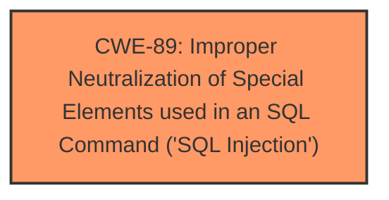

# Enhanced Analysis for CVE-2025-4813

# Summary
| CWE ID | CWE Name | Confidence | CWE Abstraction Level | CWE Vulnerability Mapping Label | CWE-Vulnerability Mapping Notes |
|---|---|---|---|---|---|
| CWE-89 | Improper Neutralization of Special Elements used in an SQL Command ('SQL Injection') | 1.0 | Base | Allowed | Primary CWE |

## Evidence and Confidence

*   **Confidence Score:** 1.0
*   **Evidence Strength:** HIGH

## Relationship Analysis
The primary relationship to consider is that CWE-89 is a Base level CWE, which is a preferred level of abstraction. There are no further child relationships to evaluate for increased specificity.



## Vulnerability Chain
The vulnerability chain consists of a single point: the **improper neutralization** of special elements leading to **SQL Injection**. The root cause is the lack of proper input validation or sanitization, directly resulting in the SQL Injection vulnerability.

## Summary of Analysis
The vulnerability description explicitly states that the **weakness** is **SQL Injection** due to the manipulation of the `mobilenumber` argument in the `/edit-phlebotomist.php` file.

The Retriever Results identify CWE-89 as the top candidate with a score of 1.0, and the CWE description aligns perfectly with the vulnerability: "The product constructs all or part of an SQL command using externally-influenced input...but it does not neutralize or incorrectly neutralizes special elements that could modify the intended SQL command".

Given the explicit mention of **SQL Injection**, the high score from the retriever, and the direct match between the vulnerability and CWE-89's description, I am confident in assigning CWE-89 as the primary CWE.

Other CWEs like CWE-79 (Cross-site Scripting) and CWE-434 (Unrestricted Upload of File with Dangerous Type) were considered but ultimately deemed irrelevant as they do not align with the **SQL Injection** **weakness** described.


## CWE Relationship Analysis

Current CWEs represent these abstraction levels: .


### Vulnerability Chain Analysis

**Chain starting from CWE-89:**
- 89 (Improper Neutralization of Special Elements used in an SQL Command ('SQL Injection')) - ROOT


**Chain starting from CWE-79:**
- 79 (Improper Neutralization of Input During Web Page Generation ('Cross-site Scripting')) - ROOT


### CWE Relationship Diagram

```mermaid
graph TD
    classDef primary fill:#f96,stroke:#333,stroke-width:2px
    classDef secondary fill:#69f,stroke:#333
    classDef tertiary fill:#9e9,stroke:#333
```