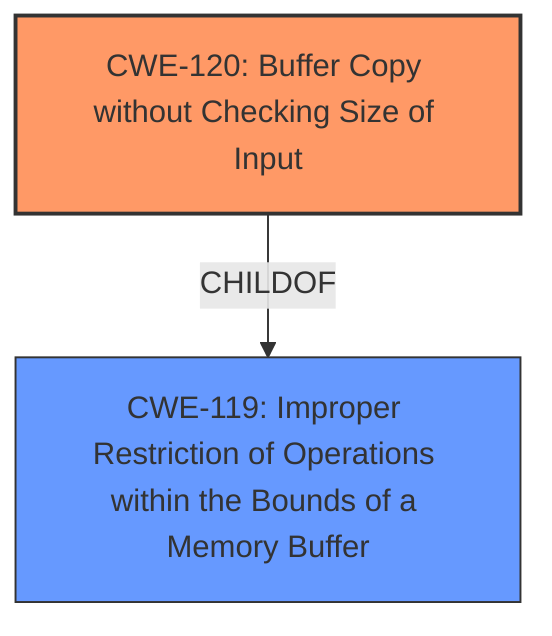

# Analysis for CVE-2025-4823

# Summary
| CWE ID | CWE Name | Confidence | CWE Abstraction Level | CWE Vulnerability Mapping Label | CWE-Vulnerability Mapping Notes |
|---|---|---|---|---|---|
| CWE-120 | Buffer Copy without Checking Size of Input ('Classic Buffer Overflow') | 0.9 | Base | Allowed-with-Review | Primary CWE. The vulnerability description explicitly states a **buffer overflow** due to manipulation of the `submit-url` function. |
| CWE-119 | Improper Restriction of Operations within the Bounds of a Memory Buffer | 0.5 | Class | Discouraged | Considered as a broader category encompassing buffer overflows, but CWE-120 is more specific. |

## Evidence and Confidence

*   **Confidence Score:** 0.9
*   **Evidence Strength:** HIGH

## Relationship Analysis
The primary relationship to consider is the parent-child relationship between CWE-119 and CWE-120. CWE-120 is a specific type of buffer overflow, making it a more precise classification than the broader CWE-119.

## Vulnerability Chain
The vulnerability chain consists of a **buffer overflow** due to the manipulation of the `submit-url` function, leading to potential remote code execution or denial of service.
  - Root Cause: CWE-120
  - Impact: Remote code execution or denial of service (not explicitly CWE-mapped due to lack of detail).

## Summary of Analysis
The analysis is primarily based on the explicit mention of "**buffer overflow**" in the vulnerability description. The choice of CWE-120 is based on its direct relevance to this term and its status as a Base-level CWE, offering a more precise classification than the broader Class-level CWE-119.

Evidence: "Affected by this issue is the function submit-url of the file /boafrm/formReflashClientTbl of the component HTTP POST Request Handler. The manipulation leads to **buffer overflow**."

CWE-120 is at the optimal level of specificity because it directly addresses the **buffer overflow** condition described in the vulnerability, as opposed to the more general CWE-119.

**CWEs Considered but Not Used:**
*   CWE-119: While related as a parent, it's too general for the specific **buffer overflow** detailed. The "Usage: Discouraged" mapping guidance further supports choosing a more specific CWE.
*   CWE-121: Stack-based Buffer Overflow: There's no evidence to suggest the overflow is specifically stack-based.
*   CWE-122: Heap-based Buffer Overflow: There's no evidence to suggest the overflow is specifically heap-based.
*   CWE-131: Incorrect Calculation of Buffer Size: There's no evidence to suggest the size calculation is incorrect.
*   CWE-190: Integer Overflow or Wraparound: Irrelevant as the issue is a **buffer overflow**, not an integer issue.
*   CWE-78: Improper Neutralization of Special Elements used in an OS Command ('OS Command Injection'): Not relevant as the issue is a **buffer overflow**, not command injection.
*   CWE-89: Improper Neutralization of Special Elements used in an SQL Command ('SQL Injection'): Not relevant as the issue is a **buffer overflow**, not SQL injection.
*   CWE-79: Improper Neutralization of Input During Web Page Generation ('Cross-site Scripting'): Not relevant as the issue is a **buffer overflow**, not XSS.