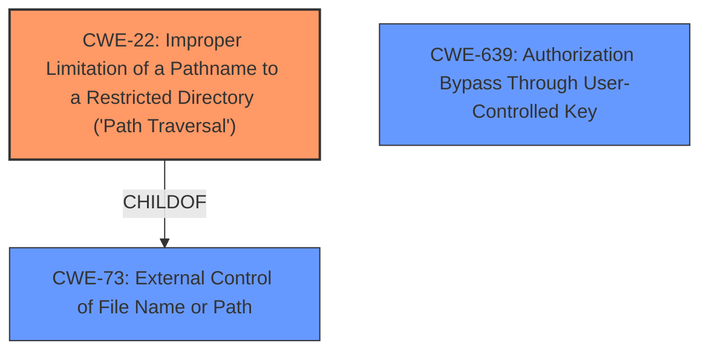

# Analysis Report for CVE-2025-48370

# Vulnerability Analysis Report: CVE-2025-48370

## Description

auth-js is an isomorphic Javascript library for Supabase Auth. Prior to version 2.69.1, the library functions getUserById, deleteUser, updateUserById, listFactors and deleteFactor did not require the user supplied values to be valid UUIDs. This could lead to a **URL path traversal**, resulting in the wrong API function being called. Implementations that follow security best practice and validate user controlled inputs, such as the userId are not affected by this. This issue has been patched in version 2.69.1.

## Vulnerability Description Key Phrases

- **Weakness:** URL path traversal
- **Impact:** wrong API function being called
- **Product:** Supabase Auth
- **Version:** Prior to version 2.69.1

## Analysis (with Relationship Data)

# Summary
| CWE ID | CWE Name | Confidence | CWE Abstraction Level | CWE Vulnerability Mapping Label | CWE-Vulnerability Mapping Notes |
|---|---|---|---|---|---|
| CWE-22 | Improper Limitation of a Pathname to a Restricted Directory ('Path Traversal') | 1.0 | Base | Allowed | Primary CWE: The library functions did not require the user supplied values to be valid UUIDs, leading to a **URL path traversal**, resulting in the wrong API function being called. |
| CWE-73 | External Control of File Name or Path | 0.5 | Base | Allowed | Secondary Candidate:  External input is used to construct a pathname. |
| CWE-639 | Authorization Bypass Through User-Controlled Key | 0.4 | Base | Allowed | Secondary Candidate:  The system's authorization functionality does not prevent one user from gaining access to another user's data or record by modifying the key value identifying the data. |

## Evidence and Confidence

*   **Confidence Score:** 0.9
*   **Evidence Strength:** HIGH

## Relationship Analysis
The primary CWE is CWE-22, which represents the **URL path traversal** vulnerability. CWE-73 is a parent of CWE-22 and represents external control of file name or path. CWE-639 represents authorization bypass through a user-controlled key. The **URL path traversal** occurs because the user can control the input that defines the path, leading to the execution of the wrong API function.



## Vulnerability Chain
The vulnerability chain starts with the **lack of validation** of user-supplied UUIDs. This leads to a **URL path traversal**, which results in the execution of the wrong API function.

1.  **Root Cause:** **Missing validation** of UUIDs
2.  **Weakness:** CWE-22 Improper Limitation of a Pathname to a Restricted Directory ('Path Traversal')
3.  **Impact:** Wrong API function being called

## Summary of Analysis
The primary weakness is CWE-22. The evidence is strong, as the vulnerability description clearly states that the lack of UUID validation leads to a **URL path traversal**. The retriever results also strongly suggest CWE-22.
The vulnerability description states, "the library functions getUserById, deleteUser, updateUserById, listFactors and deleteFactor did not require the user supplied values to be valid UUIDs. This could lead to a **URL path traversal**, resulting in the wrong API function being called."
CWE-73 was considered because it is a parent of CWE-22. It represents the external control of the file name or path. This is relevant because the user-supplied input is used to construct the path.
CWE-639 was considered because the **URL path traversal** could lead to one user accessing another user's data or record. However, the primary issue is the **URL path traversal**, so CWE-22 is the more appropriate choice.
All selected CWEs are at the optimal level of specificity.

Relevant CWE Information:


## CWE Relationship Analysis

Current CWEs represent these abstraction levels: .


### Vulnerability Chain Analysis

**Chain starting from CWE-639:**
- 639 (Authorization Bypass Through User-Controlled Key) - ROOT


**Chain starting from CWE-73:**
- 73 (External Control of File Name or Path) - ROOT


### CWE Relationship Diagram

```mermaid
graph TD
    classDef primary fill:#f96,stroke:#333,stroke-width:2px
    classDef secondary fill:#69f,stroke:#333
    classDef tertiary fill:#9e9,stroke:#333
```


*Report generated on 2025-07-15 02:34:38*
