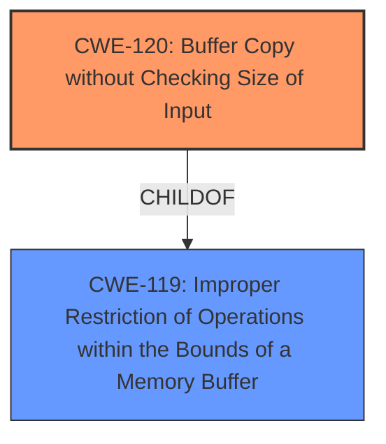

# Enhanced Analysis for CVE-2025-4846

# Summary
| CWE ID | CWE Name | Confidence | CWE Abstraction Level | CWE Vulnerability Mapping Label | CWE-Vulnerability Mapping Notes |
|---|---|---|---|---|---|
| CWE-120 | Buffer Copy without Checking Size of Input ('Classic Buffer Overflow') | 0.9 | Base | Allowed-with-Review | Primary CWE. The **buffer overflow** is directly caused by copying data into a buffer without proper size validation. |
| CWE-119 | Improper Restriction of Operations within the Bounds of a Memory Buffer | 0.7 | Class | Discouraged | Secondary. A more general class that encompasses buffer overflows, but CWE-120 is more specific in this case. |

## Evidence and Confidence

*   **Confidence Score:** 0.9
*   **Evidence Strength:** HIGH

## Relationship Analysis
The primary relationship that influenced the decision was the parent-child relationship between CWE-119 and CWE-120. CWE-120 is a more specific case of CWE-119, and the vulnerability description clearly indicates a buffer copy operation without size checking, making CWE-120 the more appropriate choice.



## Vulnerability Chain
The vulnerability chain starts with the **lack of input size validation** during the buffer copy operation (CWE-120). This leads directly to a **buffer overflow**, which allows an attacker to overwrite memory, including the instruction pointer (EIP), and ultimately achieve remote code execution.

## Summary of Analysis
The initial assessment focused on identifying the root cause of the vulnerability, which is the **buffer overflow** resulting from copying data without checking the input size. The evidence from the "CVE Reference Links Content Summary" section confirms that the `MPUT` command handler in FreeFloat FTP Server 1.0 does not properly validate the size of the input, leading to the overflow.

The retriever results suggested several candidate CWEs, including CWE-119, CWE-190, and CWE-120. While CWE-119 is a broader category that includes buffer overflows, CWE-120 is more specific and accurately describes the vulnerability. CWE-190 (Integer Overflow or Wraparound) was considered because buffer size calculations can sometimes involve integer overflows, but the primary issue here is the **absence of size checking**, not an incorrect calculation.

The selection of CWE-120 is based on the following evidence:

*   The vulnerability description explicitly mentions a **buffer overflow**.
*   The "CVE Reference Links Content Summary" states that the server "does not properly validate the size of the input provided through the `MPUT` command, leading to a buffer overflow."
*   The exploit involves overwriting the EIP, which is a typical consequence of a buffer overflow.

Therefore, CWE-120 is the most accurate and specific representation of the vulnerability's root cause. The decision is supported by the evidence, the hierarchical relationship between CWE-119 and CWE-120, and the mapping guidance that allows for CWE-120 with review.

CWEs considered but not used:

*   CWE-119: While related as a parent, it is a more general description. CWE-120 is more specific.
*   CWE-190: Integer Overflow or Wraparound: Not directly applicable as the primary issue isn't related to integer calculations but the **lack of size validation**.
*   CWE-89: Improper Neutralization of Special Elements used in an SQL Command ('SQL Injection'): This is specific to SQL injection vulnerabilities, which is not the case here.
*   CWE-79: Improper Neutralization of Input During Web Page Generation ('Cross-site Scripting'): This is specific to XSS vulnerabilities, not applicable here.
*   CWE-125: Out-of-bounds Read: While this could be related in some overflow scenarios, the primary action here is a write operation causing the overflow.
*   CWE-434: Unrestricted Upload of File with Dangerous Type: This is related to file uploads, but the core issue is the **buffer overflow** in the `MPUT` command.
*   CWE-131: Incorrect Calculation of Buffer Size: Similar to CWE-190, the issue is not the incorrect calculation of the buffer size, but the **absence of size validation** altogether.
*   CWE-787: Out-of-bounds Write: This is a result of the buffer overflow (CWE-120) and thus not the root cause.


## CWE Relationship Analysis

Current CWEs represent these abstraction levels: .


### Vulnerability Chain Analysis

**Chain starting from CWE-89:**
- 89 (Improper Neutralization of Special Elements used in an SQL Command ('SQL Injection')) - ROOT


**Chain starting from CWE-125:**
- 125 (Out-of-bounds Read) - ROOT


### CWE Relationship Diagram

```mermaid
graph TD
    classDef primary fill:#f96,stroke:#333,stroke-width:2px
    classDef secondary fill:#69f,stroke:#333
    classDef tertiary fill:#9e9,stroke:#333
```