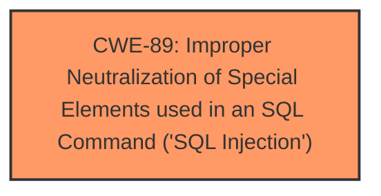

# Analysis for CVE-2025-4861

# Summary
| CWE ID | CWE Name | Confidence | CWE Abstraction Level | CWE Vulnerability Mapping Label | CWE-Vulnerability Mapping Notes |
|---|---|---|---|---|---|
| CWE-89 | Improper Neutralization of Special Elements used in an SQL Command ('SQL Injection') | 1.0 | Base | Primary | Allowed |

## Evidence and Confidence

*   **Confidence Score:** 1.0
*   **Evidence Strength:** HIGH

## Relationship Analysis
The primary relationship that influenced the decision was the direct match of the vulnerability description to the definition of CWE-89. The retriever results also heavily favored CWE-89. There weren't other relationships to consider as alternatives in this case. The abstraction level of Base is appropriate as it directly represents the **root cause** of the vulnerability.

## Vulnerability Chain
The vulnerability chain is straightforward:
1.  **Root Cause:** **Improper Neutralization of Special Elements used in an SQL Command ('SQL Injection')** (CWE-89) due to insufficient validation of the "contactnumber" parameter.
2.  **Impact:** Attackers can gain unauthorized access to the database, cause sensitive data leakage, tamper with data, gain complete control over the system, and disrupt services.

## Summary of Analysis
The analysis is based on the explicit statement in the vulnerability description that the manipulation of the "contactnumber" argument leads to **sql injection**. This is strongly supported by the "CVE Reference Links Content Summary" which states: "A SQL injection vulnerability exists in the "/admin/admin-profile.php" file. The vulnerability is due to insufficient validation of the "contactnumber" parameter, which allows attackers to inject malicious SQL queries." The retriever results also clearly pointed to CWE-89 as the most relevant CWE. Therefore, CWE-89 is the most appropriate and specific classification. The evidence provided directly supports the identification of CWE-89 as the primary weakness.

Relevant CWE Information:

# Enhanced Context (25 CWEs)
The following CWEs were identified as potentially relevant to this vulnerability:

## CWE-89: Improper Neutralization of Special Elements used in an SQL Command ('SQL Injection')
**Abstraction Level**: Base
**Similarity Score**: 0.79
**Source**: dense

**Description**:
The product constructs all or part of an SQL command using externally-influenced input from an upstream component, but it does not neutralize or incorrectly neutralizes special elements that could modify the intended SQL command when it is sent to a downstream component. Without sufficient removal or quoting of SQL syntax in user-controllable inputs, the generated SQL query can cause those inputs to be interpreted as SQL instead of ordinary user data.

**Mapping Guidance**:
- Usage: Allowed
- Rationale: This CWE entry is at the Base level of abstraction, which is a preferred level of abstraction for mapping to the root causes of vulnerabilities.