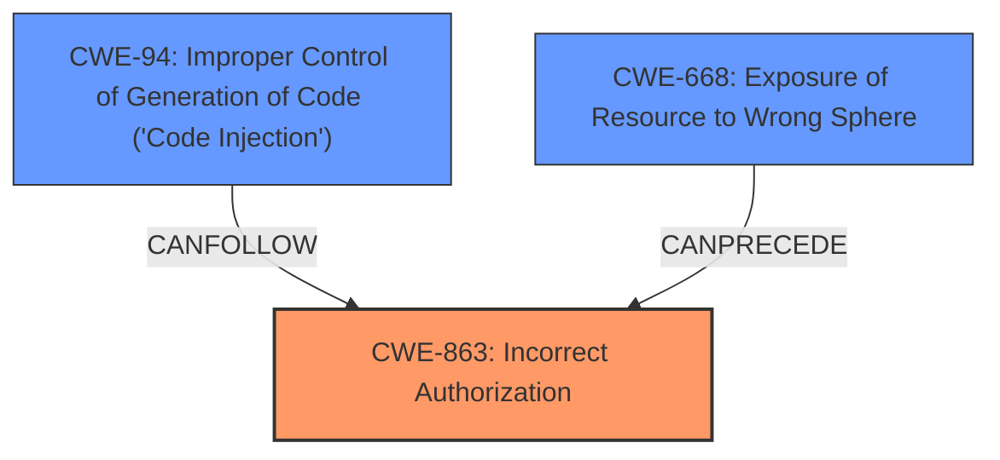

# Raw Analyzer Response for CVE-2025-48734

# Summary
| CWE ID | CWE Name | Confidence | CWE Abstraction Level | CWE Vulnerability Mapping Label | CWE-Vulnerability Mapping Notes |
|---|---|---|---|---|---|
| **CWE-863** | **Incorrect Authorization** | 0.9 | Class | Allowed-with-Review | Primary CWE. The application performs authorization checks but does so incorrectly, allowing unauthorized access. |
| CWE-668 | Exposure of Resource to Wrong Sphere | 0.6 | Class | Discouraged | Secondary candidate. The application exposes resources (the classloader) to an unintended actor, which is a remote attacker. |
| CWE-94 | Improper Control of Generation of Code ('Code Injection') | 0.5 | Base | Allowed-with-Review | Secondary candidate. The vulnerability allows for the execution of arbitrary code. |

## Evidence and Confidence

*   **Confidence Score:** 0.8
*   **Evidence Strength:** MEDIUM

## Relationship Analysis
The primary relationship influencing the decision is the hierarchical relationship between CWE-863 (Incorrect Authorization), and its potential Base-level children. Given the information available, it's not clear which specific authorization mechanism is failing, making CWE-863 the most appropriate choice.
CWE-668 can precede CWE-863.
CWE-94 can follow CWE-863

## Vulnerability Chain
The vulnerability chain starts with **improper access control** (**CWE-863**), allowing attackers to access the classloader, leading to the ability to execute arbitrary code (**CWE-94**).

## Summary of Analysis
The primary CWE is CWE-863 (Incorrect Authorization) because the core issue is that the application isn't correctly authorizing access to the `declaredClass` property, which leads to unauthorized access to the classloader. This is supported by the vulnerability description stating "**improper access control**" and "**accessing the enums declaredClass allows remote attackers to access the ClassLoader and execute arbitrary code**". While CWE-668 (Exposure of Resource to Wrong Sphere) could be considered, it's a higher-level class and less specific than CWE-863. The final impact is arbitrary code execution, which could be linked to CWE-94 (Improper Control of Generation of Code ('Code Injection')), as a secondary effect. The final conclusion depends on whether the application had authorization checks, albeit implemented incorrectly. The guidance for Authentication vs Authorization vs Access Control was used.

# Enhanced Context (25 CWEs)
The following CWEs were identified as potentially relevant to this vulnerability:

## CWE-668: Exposure of Resource to Wrong Sphere
**Abstraction Level**: Class
**Similarity Score**: 0.77
**Source**: dense

**Description**:
The product exposes a resource to the wrong control sphere, providing unintended actors with inappropriate access to the resource.

**Mapping Guidance**:
- Usage: Discouraged
- Rationale: CWE-668 is high-level and is often misused as a catch-all when lower-level CWE IDs might be applicable. It is sometimes used for low-information vulnerability reports [REF-1287]. It is a level-1 Class (i.e., a child of a Pillar). It is not useful for trend analysis.
*   **Rationale for not selecting:** While the vulnerability does expose the classloader (a resource) to the wrong sphere (remote attackers), CWE-863 more directly addresses the **incorrect authorization** aspect that enables this exposure. CWE-668 is also discouraged because it's high-level.

## CWE-41: Improper Resolution of Path Equivalence
**Abstraction Level**: Base
**Similarity Score**: 0.77
**Source**: dense

**Description**:
The product is vulnerable to file system contents disclosure through path equivalence. Path equivalence involves the use of special characters in file and directory names. The associated manipulations are intended to generate multiple names for the same object.

**Mapping Guidance**:
- Usage: Allowed
- Rationale: This CWE entry is at the Base level of abstraction, which is a preferred level of abstraction for mapping to the root causes of vulnerabilities.
*   **Rationale for not selecting:** This CWE is not relevant because the vulnerability is not related to file system path manipulation.

## CWE-497: Exposure of Sensitive System Information to an Unauthorized Control Sphere
**Abstraction Level**: Base
**Similarity Score**: 0.77
**Source**: dense

**Description**:
The product does not properly prevent sensitive system-level information from being accessed by unauthorized actors who do not have the same level of access to the underlying system as the product does.

**Mapping Guidance**:
- Usage: Allowed
- Rationale: This CWE entry is at the Base level of abstraction, which is a preferred level of abstraction for mapping to the root causes of vulnerabilities.
*   **Rationale for not selecting:** This CWE is related to exposure of sensitive system information, but is not as precise as **incorrect authorization**.

## CWE-917: Improper Neutralization of Special Elements used in an Expression Language Statement ('Expression Language Injection')
**Abstraction Level**: Base
**Similarity Score**: 0.77
**Source**: dense

**Description**:
The product constructs all or part of an expression language (EL) statement in a framework such as a Java Server Page (JSP) using externally-influenced input from an upstream component, but it does not neutralize or incorrectly neutralizes special elements that could modify the intended EL statement before it is executed.

**Mapping Guidance**:
- Usage: Allowed
- Rationale: This CWE entry is at the Base level of abstraction, which is a preferred level of abstraction for mapping to the root causes of vulnerabilities.
*   **Rationale for not selecting:** The vulnerability is not related to Expression Language Injection.

## CWE-74: Improper Neutralization of Special Elements in Output Used by a Downstream Component ('Injection')
**Abstraction Level**: Class
**Similarity Score**: 0.76
**Source**: dense

**Description**:
The product constructs all or part of a command, data structure, or record using externally-influenced input from an upstream component, but it does not neutralize or incorrectly neutralizes special elements that could modify how it is parsed or interpreted when it is sent to a downstream component.

**Mapping Guidance**:
- Usage: Discouraged
- Rationale: CWE-74 is high-level and often misused when lower-level weaknesses are more appropriate.
*   **Rationale for not selecting:** While the vulnerability leads to code execution (related to injection), the root cause is not improper neutralization of special elements.

## CWE-267: Privilege Defined With Unsafe Actions
**Abstraction Level**: Base
**Similarity Score**: 0.76
**Source**: dense

**Description**:
A particular privilege, role, capability, or right can be used to perform unsafe actions that were not intended, even when it is assigned to the correct entity.

**Mapping Guidance**:
- Usage: Allowed
- Rationale: This CWE entry is at the Base level of abstraction, which is a preferred level of abstraction for mapping to the root causes of vulnerabilities.
*   **Rationale for not selecting:** This CWE is related to privilege abuse, but is not a direct fit for the described vulnerability.

## CWE-923: Improper Restriction of Communication Channel to Intended Endpoints
**Abstraction Level**: Class
**Similarity Score**: 0.76
**Source**: dense

**Description**:
The product establishes a communication channel to (or from) an endpoint for privileged or protected operations, but it does not properly ensure that it is communicating with the correct endpoint.

**Mapping Guidance**:
- Usage: Allowed-with-Review
- Rationale: This CWE entry is a Class and might have Base-level children that would be more appropriate
*   **Rationale for not selecting:** The vulnerability is not related to improper restriction of communication channels.

## CWE-807: Reliance on Untrusted Inputs in a Security Decision
**Abstraction Level**: Base
**Similarity Score**: 0.76
**Source**: dense

**Description**:
The product uses a protection mechanism that relies on the existence or values of an input, but the input can be modified by an untrusted actor in a way that bypasses the protection mechanism.

**Mapping Guidance**:
- Usage: Allowed
- Rationale: This CWE entry is at the Base level of abstraction, which is a preferred level of abstraction for mapping to the root causes of vulnerabilities.
*   **Rationale for not selecting:** This CWE is about relying on untrusted inputs, but there's no evidence of security decision based on untrusted inputs.

## CWE-212: Improper Removal of Sensitive Information Before Storage or Transfer
**