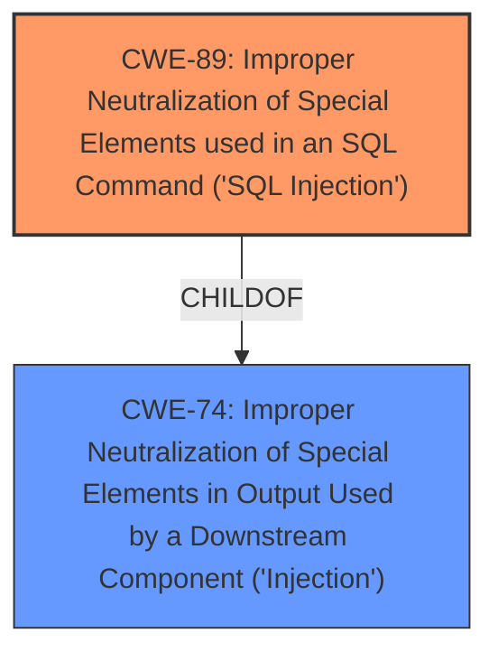

# Analysis for CVE-2025-4881

# Summary
| CWE ID | CWE Name | Confidence | CWE Abstraction Level | CWE Vulnerability Mapping Label | CWE-Vulnerability Mapping Notes |
|---|---|---|---|---|---|
| CWE-89 | Improper Neutralization of Special Elements used in an SQL Command ('SQL Injection') | 1.0 | Base | Primary | Allowed |

## Evidence and Confidence

*   **Confidence Score:** 1.0
*   **Evidence Strength:** HIGH

## Relationship Analysis
The primary relationship to consider here is the hierarchical one. While CWE-74 (Improper Neutralization of Special Elements in Output Used by a Downstream Component ('Injection')) is a class-level CWE, CWE-89 is a base-level CWE that is a specific type of injection related to SQL. Therefore, CWE-89 is a more specific and appropriate choice.

## Vulnerability Chain
The vulnerability chain is quite simple in this case:

1.  **Root Cause:** Improper neutralization of special elements used in an SQL command (**CWE-89**)
2.  **Impact:** Unauthorized database access, sensitive data leakage, data tampering, comprehensive system control, and even service interruption.

## Summary of Analysis
The vulnerability description clearly indicates an **SQL injection** vulnerability in the Restaurant Management System 1.0. The manipulation of the `username` and `name` arguments in the `/admin/user_save.php` file allows for the injection of malicious SQL code. The CVE reference confirms this, stating that the **root cause** is the direct use of the 'username' parameter in SQL queries without proper sanitization.

The Retriever Results strongly suggest CWE-89 as the primary candidate, with a score of 1.0. The description of CWE-89 perfectly matches the vulnerability: "The product constructs all or part of an SQL command using externally-influenced input from an upstream component, but it does not neutralize or incorrectly neutralizes special elements that could modify the intended SQL command."

The provided evidence, combined with the high confidence score from the Retriever Results and the clear match with the CWE description, justifies the selection of CWE-89 as the primary weakness. The other CWEs were considered but deemed less relevant as they represent different types of vulnerabilities (e.g., XSS, file upload issues) or higher-level categories.

Relevant CWE Information:

# Enhanced Context (25 CWEs)
The following CWEs were identified as potentially relevant to this vulnerability:

## CWE-89: Improper Neutralization of Special Elements used in an SQL Command ('SQL Injection')
**Abstraction Level**: Base
**Similarity Score**: 0.81
**Source**: dense

**Description**:
The product constructs all or part of an SQL command using externally-influenced input from an upstream component, but it does not neutralize or incorrectly neutralizes special elements that could modify the intended SQL command when it is sent to a downstream component. Without sufficient removal or quoting of SQL syntax in user-controllable inputs, the generated SQL query can cause those inputs to be interpreted as SQL instead of ordinary user data.

**Mapping Guidance**:
- Usage: Allowed
- Rationale: This CWE entry is at the Base level of abstraction, which is a preferred level of abstraction for mapping to the root causes of vulnerabilities.

## CWE-89: Improper Neutralization of Special Elements used in an SQL Command ('SQL Injection')
**Abstraction Level**: Base
**Similarity Score**: 1114.06
**Source**: sparse

**Description**:
The product constructs all or part of an SQL command using externally-influenced input from an upstream component, but it does not neutralize or incorrectly neutralizes special elements that could modify the intended SQL command when it is sent to a downstream component. Without sufficient removal or quoting of SQL syntax in user-controllable inputs, the generated SQL query can cause those inputs to be interpreted as SQL instead of ordinary user data.

**Mapping Guidance**:
- Usage: Allowed
- Rationale: This CWE entry is at the Base level of abstraction, which is a preferred level of abstraction for mapping to the root causes of vulnerabilities.