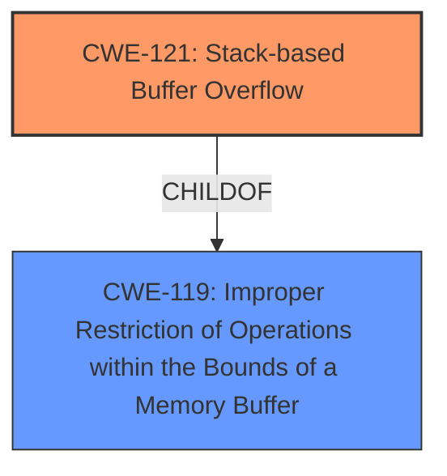

# Raw Analyzer Response for CVE-2025-4883

# Summary

| CWE ID | CWE Name | Confidence | CWE Abstraction Level | CWE Vulnerability Mapping Label | CWE-Vulnerability Mapping Notes |
|---|---|---|---|---|---|
| CWE-121 | Stack-based Buffer Overflow | 1.0 | Variant | Allowed | Primary CWE |

## Evidence and Confidence

*   **Confidence Score:** 1.0
*   **Evidence Strength:** HIGH

## Relationship Analysis
The primary relationship is that CWE-121 is a variant of the more general CWE-119. Since the vulnerability description specifically mentions a stack-based buffer overflow, using the more specific CWE-121 is the appropriate choice.

## Vulnerability Chain
The vulnerability chain starts with the **stack-based buffer overflow** (CWE-121) due to the manipulation of specific arguments. The impact is likely code execution or denial of service.

## Summary of Analysis
The vulnerability description explicitly states "**stack-based buffer overflow**". This directly corresponds to CWE-121: Stack-based Buffer Overflow. The vulnerability occurs in the `ctxz_asp` function of the `/ctxz.asp` file, where the manipulation of arguments `def/defTcp/defUdp/defIcmp/defOther` leads to the overflow.
This clear and direct evidence makes CWE-121 the most appropriate and specific classification.

Relevant CWE Information:

# Enhanced Context (25 CWEs)
The following CWEs were identified as potentially relevant to this vulnerability:

## CWE-121: Stack-based Buffer Overflow
**Abstraction Level**: Variant
**Similarity Score**: 0.74
**Source**: dense

**Description**:
A stack-based buffer overflow condition is a condition where the buffer being overwritten is allocated on the stack (i.e., is a local variable or, rarely, a parameter to a function).

**Mapping Guidance**:
- Usage: Allowed
- Rationale: This CWE entry is at the Variant level of abstraction, which is a preferred level of abstraction for mapping to the root causes of vulnerabilities.

## CWE-119: Improper Restriction of Operations within the Bounds of a Memory Buffer
**Abstraction Level**: Class
**Similarity Score**: 0.72
**Source**: dense

**Description**:
The product performs operations on a memory buffer, but it reads from or writes to a memory location outside the buffer's intended boundary. This may result in read or write operations on unexpected memory locations that could be linked to other variables, data structures, or internal program data.

**Mapping Guidance**:
- Usage: Discouraged
- Rationale: CWE-119 is commonly misused in low-information vulnerability reports when lower-level CWEs could be used instead, or when more details about the vulnerability are available.

### CWE Considerations:

*   **CWE-119: Improper Restriction of Operations within the Bounds of a Memory Buffer:** While this is a general buffer overflow class, CWE-121 is more specific because the overflow is stack-based. The mapping guidance discourages using CWE-119 when a more specific CWE is available.
*   **CWE-190: Integer Overflow or Wraparound:** This CWE is not directly related to the **buffer overflow** described in the vulnerability.
*   **CWE-89: Improper Neutralization of Special Elements used in an SQL Command ('SQL Injection'):** This CWE is irrelevant as the vulnerability is a **buffer overflow**, not an SQL injection.
*   **CWE-79: Improper Neutralization of Input During Web Page Generation ('Cross-site Scripting'):** This CWE is also irrelevant because it deals with XSS, not a **buffer overflow**.
*   **CWE-125: Out-of-bounds Read:** This CWE is related to reading memory out of bounds. The vulnerability description describes a **stack-based buffer overflow**, which is about writing out of bounds.
*   **CWE-1284: Improper Validation of Specified Quantity in Input:** While input is being manipulated, the core issue is the **buffer overflow** itself and not the validation of quantity.
*   **CWE-78: Improper Neutralization of Special Elements used in an OS Command ('OS Command Injection'):** This CWE is not relevant as the vulnerability is a **buffer overflow**, not an OS command injection.
*   **CWE-128: Wrap-around Error:** This CWE is not directly related to the **buffer overflow** described in the vulnerability.