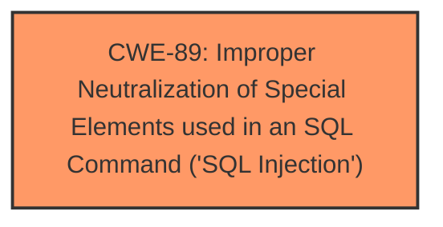

# Analysis for CVE-2025-4886

# Summary

| CWE ID | CWE Name | Confidence | CWE Abstraction Level | CWE Vulnerability Mapping Label | CWE-Vulnerability Mapping Notes |
|---|---|---|---|---|---|
| CWE-89 | Improper Neutralization of Special Elements used in an SQL Command ('SQL Injection') | 1.0 | Base | Allowed | Primary CWE |

## Evidence and Confidence

*   **Confidence Score:** 1.0
*   **Evidence Strength:** HIGH

## Relationship Analysis
The primary relationship that influenced the decision was the direct match of the vulnerability description to the definition of CWE-89. While other CWEs were considered, none provided as precise a fit. The lack of further details limits the ability to establish other relationships in the vulnerability chain.

## Vulnerability Chain
The vulnerability chain is relatively simple:
1.  **Root Cause:** Improper neutralization of special elements used in an SQL command (**SQL Injection**).

## Summary of Analysis
The primary CWE is CWE-89 because the vulnerability description explicitly states that the manipulation of the 'serial' argument leads to **SQL injection**. This directly aligns with the definition of CWE-89, which involves the improper neutralization of special elements used in an SQL command. The confidence level is high because the description clearly indicates the presence of **SQL injection**. The other CWEs were considered but ultimately deemed less relevant due to the explicit mention of **SQL injection** as the **weakness**. The description explicitly mentions **SQL injection**, making CWE-89 the most accurate and specific classification.