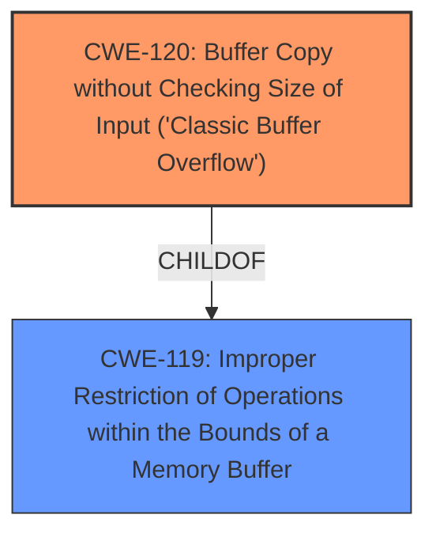

# Analysis Report for CVE-2025-4897

# Vulnerability Analysis Report: CVE-2025-4897

## Description

A vulnerability was found in Tenda A15 15.13.07.09/15.13.07.13. It has been classified as critical. This affects an unknown part of the file /goform/multimodalAdd of the component HTTP POST Request Handler. The manipulation leads to **buffer overflow**. It is possible to initiate the attack remotely. The exploit has been disclosed to the public and may be used.

## Vulnerability Description Key Phrases

- **Weakness:** buffer overflow
- **Product:** Tenda A15
- **Version:** 15.13.07.09/15.13.07.13
- **Component:** /goform/multimodalAdd HTTP POST Request Handler

## Analysis (with Relationship Data)

# Summary
| CWE ID | CWE Name | Confidence | CWE Abstraction Level | CWE Vulnerability Mapping Label | CWE-Vulnerability Mapping Notes |
|---|---|---|---|---|---|
| CWE-120 | Buffer Copy without Checking Size of Input ('Classic Buffer Overflow') | 0.85 | Base | Allowed-with-Review | Primary CWE |
| CWE-119 | Improper Restriction of Operations within the Bounds of a Memory Buffer | 0.65 | Class | Discouraged | Secondary Candidate |

## Evidence and Confidence

*   **Confidence Score:** 0.75
*   **Evidence Strength:** MEDIUM

## Relationship Analysis
The primary relationship considered was the child-of relationship between CWE-120 and CWE-119. Although CWE-119 was a top retriever result, the description explicitly mentions a "**buffer overflow**" condition, which aligns more directly with CWE-120, which is a more specific type of buffer overflow related to copying without checking size. CWE-120 is a child of CWE-119, indicating a more specific case of the broader buffer handling issue.



## Vulnerability Chain
The vulnerability chain starts with the **buffer overflow** due to a buffer copy operation that lacks proper size checking (CWE-120). This leads to writing beyond the buffer's boundaries, potentially causing a crash or allowing arbitrary code execution.

## Summary of Analysis
The initial analysis focused on identifying the root cause of the vulnerability. The description clearly states that the vulnerability is a "**buffer overflow**" in the `/goform/multimodalAdd` component when handling an HTTP POST request. Given this context, CWE-120, "Buffer Copy without Checking Size of Input ('Classic Buffer Overflow')", was chosen as the primary CWE. It is more specific than CWE-119, which is a more general case of improper memory buffer handling.

CWE-119 was considered because it is a parent of CWE-120 and also a top retriever result; however, the description explicitly mentions a "buffer overflow" condition due to a copy operation without checking size which aligns more directly with CWE-120.

The evidence is sufficient to classify this vulnerability as CWE-120. The description explicitly mentions a **buffer overflow**, indicating that data is being written beyond the intended buffer boundary. The reference to the HTTP POST request handler suggests that the size of the input might not be adequately validated before being copied into a buffer.

Relevant CWE Information:

# Enhanced Context (25 CWEs)
The following CWEs were identified as potentially relevant to this vulnerability:

## CWE-121: Stack-based Buffer Overflow
**Abstraction Level**: Variant
**Similarity Score**: 0.73
**Source**: dense

**Description**:
A stack-based buffer overflow condition is a condition where the buffer being overwritten is allocated on the stack (i.e., is a local variable or, rarely, a parameter to a function).

**Mapping Guidance**:
- Usage: Allowed
- Rationale: This CWE entry is at the Variant level of abstraction, which is a preferred level of abstraction for mapping to the root causes of vulnerabilities.

## CWE-120: Buffer Copy without Checking Size of Input ('Classic Buffer Overflow')
**CWE-120**: Buffer Copy without Checking Size of Input ('Classic Buffer Overflow') is the most accurate representation of the described vulnerability. The vulnerability description explicitly mentions "**buffer overflow**" which aligns directly with CWE-120. The phrase "HTTP POST Request Handler" suggests a scenario where input is being copied into a buffer without adequate size checks. This aligns with the description of CWE-120, which involves copying data into a buffer without validating the size of the input.

## CWE-119: Improper Restriction of Operations within the Bounds of a Memory Buffer
**CWE-119**: Improper Restriction of Operations within the Bounds of a Memory Buffer is a more general case of buffer overflow. While the description mentions a **buffer overflow**, CWE-119 is too broad and doesn't capture the specific nature of the vulnerability which involves a buffer copy without size checking. The MITRE mapping guidance discourages using CWE-119 when more specific CWEs are available.

## CWE-131: Incorrect Calculation of Buffer Size
**CWE-131**: Incorrect Calculation of Buffer Size - This CWE could be relevant if the size calculation was the root cause of the buffer overflow. However, the vulnerability description doesn't provide any details that support the claim that there was an incorrect size calculation. The retriever only lists it as a secondary candidate.

## CWE-190: Integer Overflow or Wraparound
**CWE-190**: Integer Overflow or Wraparound - This is not related because the description doesn't have to do with integer overflows.

## CWE-89: Improper Neutralization of Special Elements used in an SQL Command ('SQL Injection')
**CWE-89**: Improper Neutralization of Special Elements used in an SQL Command ('SQL Injection') - This is not related because the description doesn't have to do with SQL injections.

## CWE-79: Improper Neutralization of Input During Web Page Generation ('Cross-site Scripting')
**CWE-79**: Improper Neutralization of Input During Web Page Generation ('Cross-site Scripting') - This is not related because the description doesn't have to do with Cross-Site Scripting.

## CWE-125: Out-of-bounds Read
**CWE-125**: Out-of-bounds Read - This is not related because the description specifies a **buffer overflow**, meaning a write out-of-bounds.


## CWE Relationship Analysis

Current CWEs represent these abstraction levels: .


### Vulnerability Chain Analysis

**Chain starting from CWE-89:**
- 89 (Improper Neutralization of Special Elements used in an SQL Command ('SQL Injection')) - ROOT


**Chain starting from CWE-121:**
- 121 (Stack-based Buffer Overflow) - ROOT


### CWE Relationship Diagram

```mermaid
graph TD
    classDef primary fill:#f96,stroke:#333,stroke-width:2px
    classDef secondary fill:#69f,stroke:#333
    classDef tertiary fill:#9e9,stroke:#333
```


*Report generated on 2025-07-15 02:53:11*
