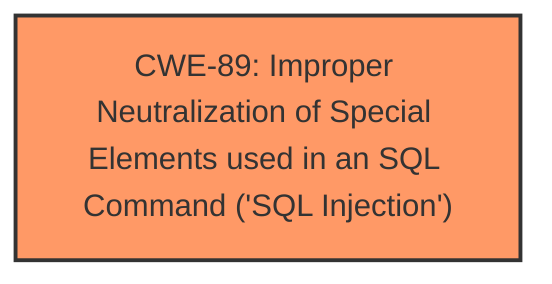

# Raw Analyzer Response for CVE-2025-4899

# Summary
| CWE ID | CWE Name | Confidence | CWE Abstraction Level | CWE Vulnerability Mapping Label | CWE-Vulnerability Mapping Notes |
|---|---|---|---|---|---|
| CWE-89 | Improper Neutralization of Special Elements used in an SQL Command ('SQL Injection') | 1.0 | Base | Allowed | Primary CWE. The root cause is the **lack of proper neutralization** leading to SQL injection. |

## Evidence and Confidence

*   **Confidence Score:** 1.0
*   **Evidence Strength:** HIGH

## Relationship Analysis
The primary relationship influencing the decision is the direct match of the vulnerability description to the characteristics of CWE-89. The vulnerability involves the manipulation of an argument leading to **SQL injection**, which aligns perfectly with the description of CWE-89. No other CWEs are required to fully describe the vulnerability.

## Vulnerability Chain
The vulnerability chain is direct:

1.  **Root Cause:** Improper Neutralization of Special Elements used in an SQL Command (**CWE-89**) due to the **lack of input validation** on the 'id' parameter.
2.  **Impact:** Unauthorized database access, sensitive data leakage, data tampering, comprehensive system control, and service interruption.

## Summary of Analysis
The primary CWE, CWE-89, was chosen because the vulnerability description explicitly mentions **SQL injection** due to the manipulation of the ID argument. The "CVE Reference Links Content Summary" confirms this by stating that attackers inject malicious code from the 'id' parameter directly into SQL queries without proper validation. This aligns directly with the definition of CWE-89, which involves the improper neutralization of special elements used in an SQL command. The suggested mitigations, such as using prepared statements and input validation, also align with addressing SQL injection vulnerabilities.

The retriever results also list CWE-89 as the top match with a score of 1.0. This further supports the selection of CWE-89 as the primary weakness. The abstraction level is Base, which is the preferred level.

Other CWEs were considered but ultimately deemed less relevant:

*   CWE-79 (Improper Neutralization of Input During Web Page Generation ('Cross-site Scripting')): While input neutralization is a factor, the core issue is specific to SQL commands, making CWE-89 a more precise fit.
*   CWE-117 (Improper Output Neutralization for Logs): Not relevant as the vulnerability doesn't involve improper neutralization of logs.
*   CWE-1336 (Improper Neutralization of Special Elements Used in a Template Engine): Not relevant as the vulnerability doesn't involve a template engine.
*   CWE-434 (Unrestricted Upload of File with Dangerous Type): Not relevant as the vulnerability doesn't involve file uploads.
* CWE-74 (Improper Neutralization of Special Elements in Output Used by a Downstream Component ('Injection')): While this is a more generic injection CWE, CWE-89 is more specific and thus a better choice.

The decision to use CWE-89 is based on the explicit mention of SQL injection in both the vulnerability description and the CVE reference summary, as well as the retriever results.