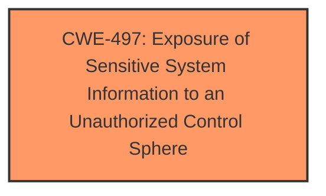

# Raw Analyzer Response for CVE-2025-4902

# Summary
| CWE ID  | CWE Name                                                                    | Confidence | CWE Abstraction Level | CWE Vulnerability Mapping Label | CWE-Vulnerability Mapping Notes |
| :-------- | :-------------------------------------------------------------------------- | :---------- | :----------------------- | :------------------------------ | :------------------------------ |
| CWE-497 | Exposure of Sensitive System Information to an Unauthorized Control Sphere | 0.6       | Base                     | Primary                         | Allowed                       |

## Evidence and Confidence

*   **Confidence Score:** 0.6
*   **Evidence Strength:** LOW

## Relationship Analysis
The primary relationship to consider is that CWE-497 is a Base level CWE which is the preferred level of abstraction. The retriever results did not have a strong confidence match, so I am relying primarily on the description of the vulnerability.

## Vulnerability Chain
The vulnerability chain starts with the function sub_48F4F0 of the file /H5/versionupdate.data and then results in information disclosure.

## Summary of Analysis
The initial analysis identified that the vulnerability resulted in information disclosure from the specified function. Based on the provided information, CWE-497 (Exposure of Sensitive System Information to an Unauthorized Control Sphere) seems to be the most appropriate mapping.

The **Vulnerability Description Key Phrases** section includes the phrase "**impact:** information disclosure" which aligns with CWE-497's description: "The product does not properly prevent sensitive system-level information from being accessed by unauthorized actors who do not have the same level of access to the underlying system as the product does."

The other CWEs were considered, but didn't fit as well. For example, CWE-79, CWE-89 and CWE-78 relate to improper neutralization of inputs, which is not described in the vulnerability.

Relevant CWE Information:

# Enhanced Context (25 CWEs)
The following CWEs were identified as potentially relevant to this vulnerability:

## CWE-497: Exposure of Sensitive System Information to an Unauthorized Control Sphere
**Abstraction Level**: Base
**Similarity Score**: 0.76
**Source**: dense

**Description**:
The product does not properly prevent sensitive system-level information from being accessed by unauthorized actors who do not have the same level of access to the underlying system as the product does.

**Mapping Guidance**:
- Usage: Allowed
- Rationale: This CWE entry is at the Base level of abstraction, which is a preferred level of abstraction for mapping to the root causes of vulnerabilities.