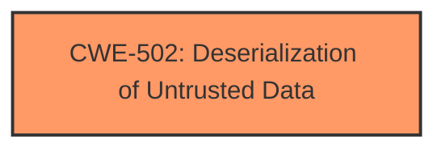

# Analysis Report for CVE-2025-4905

# Vulnerability Analysis Report: CVE-2025-4905

## Description

A vulnerability was found in iop-apl-uw basestation3 up to 3.0.4 and classified as problematic. This issue affects the function load_qc_pickl of the file basestation3/QC.py. The manipulation of the argument qc_file leads to deserialization. An attack has to be approached locally. The exploit has been disclosed to the public and may be used. The code maintainer tagged the issue as closed. But there is no new commit nor release in the GitHub repository available so far.

## Vulnerability Description Key Phrases

- **Component:** basestation3/QC.py
- **Vector:** manipulation of qc_file argument
- **Weakness:** ['improper deserialization', 'deserialization']
- **Product:** iop-apl-uw basestation3
- **Version:** up to 3.0.4

## Analysis (with Relationship Data)

# Summary
| CWE ID | CWE Name | Confidence | CWE Abstraction Level | CWE Vulnerability Mapping Label | CWE-Vulnerability Mapping Notes |
|---|---|---|---|---|---|
| CWE-502 | Deserialization of Untrusted Data | 1.0 | Base | Allowed | Primary CWE. The vulnerability is caused by deserializing untrusted data without proper validation. |

## Evidence and Confidence

*   **Confidence Score:** 1.0
*   **Evidence Strength:** HIGH

## Relationship Analysis
The primary relationship that influenced my decision was the direct match of the vulnerability description to the CWE-502 description. Specifically, the use of `pickle.load()` on untrusted data without validation directly aligns with the core concept of CWE-502. No other relationships were deemed as relevant as the direct cause of the vulnerability is clearly **deserialization** of untrusted data.



## Vulnerability Chain
The vulnerability chain is straightforward:

1.  **Root Cause:** CWE-502 - Deserialization of Untrusted Data. The `load_qc_pickl` function uses `pickle.load` on a file specified by the `qc_file` argument, without validating the data.
2.  **Impact:** Arbitrary code execution due to the insecure deserialization.

## Summary of Analysis
The analysis centers on the **weakness** present in the `load_qc_pickl` function of the `basestation3/QC.py` file, where `pickle.load` is used to deserialize data from a file without prior validation. This directly corresponds to CWE-502, "Deserialization of Untrusted Data." The CVE Reference Links Content Summary explicitly mentions "**Insecure Deserialization:** Using `pickle.load()` on untrusted data allows an attacker to execute arbitrary code." and "**Lack of Input Validation:** The code does not validate or sanitize the data being deserialized."

The retriever results also list CWE-502 with a good similarity score.

CWE-79, CWE-89, CWE-1336, CWE-78, and CWE-94 were considered but deemed less applicable. These CWEs relate to input neutralization and injection vulnerabilities, which are not the direct cause in this scenario. The root cause is the **deserialization** of untrusted data, not the injection of malicious code into another context.

The selected CWE, CWE-502, is at the Base level of abstraction, which is appropriate for mapping to the root causes of vulnerabilities as suggested in the CWE specification. This provides a specific and accurate representation of the vulnerability.


## CWE Relationship Analysis

Current CWEs represent these abstraction levels: .


### Vulnerability Chain Analysis

**Chain starting from CWE-502:**
- 502 (Deserialization of Untrusted Data) - ROOT


**Chain starting from CWE-89:**
- 89 (Improper Neutralization of Special Elements used in an SQL Command ('SQL Injection')) - ROOT


### CWE Relationship Diagram

```mermaid
graph TD
    classDef primary fill:#f96,stroke:#333,stroke-width:2px
    classDef secondary fill:#69f,stroke:#333
    classDef tertiary fill:#9e9,stroke:#333
```


*Report generated on 2025-07-15 02:54:50*
