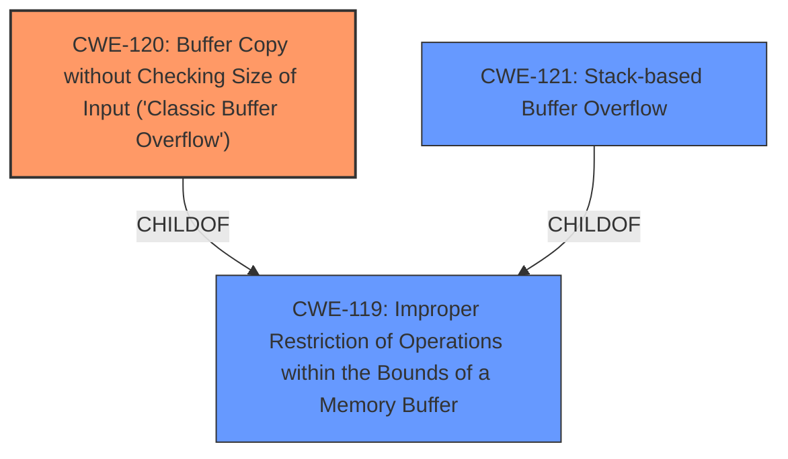

# Raw Analyzer Response for CVE-2025-5050

# Summary

| CWE ID  | CWE Name                                                                                                 | Confidence | CWE Abstraction Level | CWE Vulnerability Mapping Label | CWE-Vulnerability Mapping Notes |
| :-------- | :--------------------------------------------------------------------------------------------------------- | :--------- | :---------------------- | :-------------------------------- | :-------------------------------- |
| CWE-120   | Buffer Copy without Checking Size of Input ('Classic Buffer Overflow')                                    | 1          | Base                    | Primary CWE                       | Allowed-with-Review               |
| CWE-121   | Stack-based Buffer Overflow                                                                               | 0.7        | Variant                 | Secondary Candidate               | Allowed                           |
| CWE-119   | Improper Restriction of Operations within the Bounds of a Memory Buffer                                    | 0.6        | Class                 | Secondary Candidate               | Discouraged                           |

## Evidence and Confidence

*   **Confidence Score:** 0.9
*   **Evidence Strength:** HIGH

## Relationship Analysis

The primary CWE, CWE-120 [Buffer Copy without Checking Size of Input ('Classic Buffer Overflow')], is a base-level CWE. CWE-121 [Stack-based Buffer Overflow] is a more specific variant, and CWE-119 [Improper Restriction of Operations within the Bounds of a Memory Buffer] is a broader class. Given that the exploit overwrites the instruction pointer (EIP) on the stack, CWE-121 would be a more precise mapping; however, the description does not give details about the buffer's location (stack vs heap), so CWE-120 is the most accurate. CWE-120 is a child of CWE-119.

## Vulnerability Chain

The vulnerability chain begins with the **improper handling of the BELL command**, leading to a **buffer overflow**, which allows an attacker to overwrite the instruction pointer (EIP) and execute arbitrary code.

## Summary of Analysis

The vulnerability description indicates a **buffer overflow** in the BELL Command Handler of FreeFloat FTP Server 1.0. The analysis of CVE-2025-5050 content confirms that the **BELL command does not properly validate the size of the input**, allowing an attacker to send a buffer larger than the allocated memory. This leads to overwriting the instruction pointer and executing arbitrary code.

CWE-120 [Buffer Copy without Checking Size of Input ('Classic Buffer Overflow')] is the most appropriate primary CWE because it directly reflects the **root cause** of the vulnerability: a buffer copy operation without proper size validation. The "CVE Reference Links Content Summary" section includes the following evidence: "The `BELL` command does not properly validate the size of the input, allowing an attacker to send a buffer larger than the allocated memory."

CWE-121 [Stack-based Buffer Overflow] could be considered since the EIP overwrite suggests a stack-based overflow; however, without explicit confirmation, CWE-120 is more accurate.

CWE-119 [Improper Restriction of Operations within the Bounds of a Memory Buffer] is a more general class that encompasses buffer overflows, but CWE-120 provides a more specific description of the vulnerability.

Other CWEs considered:

*   CWE-190 [Integer Overflow or Wraparound], CWE-193 [Off-by-one Error], CWE-131 [Incorrect Calculation of Buffer Size], CWE-1284 [Improper Validation of Specified Quantity in Input]: While these CWEs relate to size and quantity handling, they are not the primary issue. The core problem is the missing size check during the buffer copy operation.
*   CWE-125 [Out-of-bounds Read]: This CWE is not applicable as the issue is a write, not a read.
*   CWE-89 [Improper Neutralization of Special Elements used in an SQL Command ('SQL Injection')], CWE-79 [Improper Neutralization of Input During Web Page Generation ('Cross-site Scripting')], CWE-117 [Improper Output Neutralization for Logs]: These CWEs are not applicable as they relate to injection and neutralization issues in different contexts.
*   CWE-434 [Unrestricted Upload of File with Dangerous Type]: This CWE is not applicable as the vulnerability is not related to file uploads.
*   CWE-918 [Server-Side Request Forgery (SSRF)], CWE-134 [Use of Externally-Controlled Format String], CWE-346 [Origin Validation Error]: These are not applicable, as they are unrelated to buffer overflows.
*   CWE-124 [Buffer Underwrite ('Buffer Underflow')]: This is not applicable as the issue is an overflow, not an underflow.
*   CWE-1339 [Insufficient Precision or Accuracy of a Real Number]: This CWE is not applicable as the vulnerability is not related to real number accuracy.
*   CWE-123 [Write-what-where Condition], CWE-822 [Untrusted Pointer Dereference]: These CWEs describe effects of buffer overflows and other memory corruption issues, not the root cause.