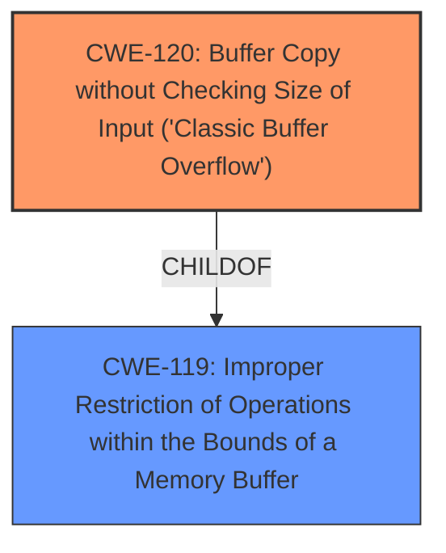

# Analysis Report for CVE-2025-5074

# Vulnerability Analysis Report: CVE-2025-5074

## Description

A vulnerability, which was classified as critical, was found in FreeFloat FTP Server 1.0. Affected is an unknown function of the component PROMPT Command Handler. The manipulation leads to **buffer overflow**. It is possible to launch the attack remotely. The exploit has been disclosed to the public and may be used.

## Vulnerability Description Key Phrases

- **Weakness:** buffer overflow
- **Product:** FreeFloat FTP Server
- **Version:** 1.0
- **Component:** PROMPT Command Handler

## Analysis (with Relationship Data)

# Summary
| CWE ID | CWE Name | Confidence | CWE Abstraction Level | CWE Vulnerability Mapping Label | CWE-Vulnerability Mapping Notes |
|---|---|---|---|---|---|
| CWE-120 | Buffer Copy without Checking Size of Input ('Classic Buffer Overflow') | 1.0 | Base | Allowed-with-Review | Primary CWE. The **buffer overflow** occurs because the size of the input is not checked before copying it to a buffer. |
| CWE-119 | Improper Restriction of Operations within the Bounds of a Memory Buffer | 0.7 | Class | Discouraged | Secondary CWE. This is a more general class of vulnerability that includes buffer overflows. |

## Evidence and Confidence

*   **Confidence Score:** 1.0
*   **Evidence Strength:** HIGH

## Relationship Analysis
The primary weakness is CWE-120 [Buffer Copy without Checking Size of Input ('Classic Buffer Overflow')], which is a base-level CWE. CWE-119 [Improper Restriction of Operations within the Bounds of a Memory Buffer] is a class-level CWE and a parent of CWE-120. The exploit occurs because the software copies data into a buffer without validating the size of the input, leading to a buffer overflow.



## Vulnerability Chain
The vulnerability chain starts with the **lack of input validation**, leading to a **buffer overflow**, which allows an attacker to overwrite memory and potentially execute arbitrary code.

## Summary of Analysis
The analysis is based on the provided evidence, which includes the vulnerability description and the CVE reference links content summary. The vulnerability is a **buffer overflow** in FreeFloat FTP Server 1.0, which is triggered by the PROMPT command. The server does not properly validate the length of the input provided with the PROMPT command, allowing an attacker to overwrite memory beyond the allocated buffer. This leads to the ability to overwrite the instruction pointer (EIP) and potentially execute arbitrary code on the target system.

The primary CWE is CWE-120 [Buffer Copy without Checking Size of Input ('Classic Buffer Overflow')], which is a base-level CWE. This CWE is the most specific and accurate representation of the vulnerability. The CVE reference content explicitly states that the server fails to validate the size of the input received, which directly relates to the root cause described by CWE-120.

CWE-119 [Improper Restriction of Operations within the Bounds of a Memory Buffer] was considered as a broader classification but was deemed less specific than CWE-120. While CWE-119 is a parent of CWE-120, choosing the more specific CWE-120 provides a better understanding of the vulnerability's root cause.

The selection of CWE-120 is supported by the MITRE mapping guidance, which allows for the selection of base-level CWEs when they accurately represent the vulnerability. The CVE description and reference links content summary provide sufficient evidence to support this selection.

Other CWEs considered but not used:

*   CWE-131 [Incorrect Calculation of Buffer Size]: This was not selected as the issue is not an incorrect calculation, but a complete lack of checking.
*   CWE-193 [Off-by-one Error]: This was not selected as the vulnerability is not an off-by-one error.
*   CWE-125 [Out-of-bounds Read]: This was not selected as the vulnerability is a write, not a read.
*   CWE-190 [Integer Overflow or Wraparound]: This was not selected as the vulnerability is not related to integer overflows.
* CWE-89 [Improper Neutralization of Special Elements used in an SQL Command ('SQL Injection')]: This was not selected as the vulnerability is not related to SQL injection.
* CWE-79 [Improper Neutralization of Input During Web Page Generation ('Cross-site Scripting')]: This was not selected as the vulnerability is not related to Cross-site Scripting.


## CWE Relationship Analysis

Current CWEs represent these abstraction levels: .


### Vulnerability Chain Analysis

**Chain starting from CWE-89:**
- 89 (Improper Neutralization of Special Elements used in an SQL Command ('SQL Injection')) - ROOT


**Chain starting from CWE-125:**
- 125 (Out-of-bounds Read) - ROOT


### CWE Relationship Diagram

```mermaid
graph TD
    classDef primary fill:#f96,stroke:#333,stroke-width:2px
    classDef secondary fill:#69f,stroke:#333
    classDef tertiary fill:#9e9,stroke:#333
```


*Report generated on 2025-07-15 03:14:04*
