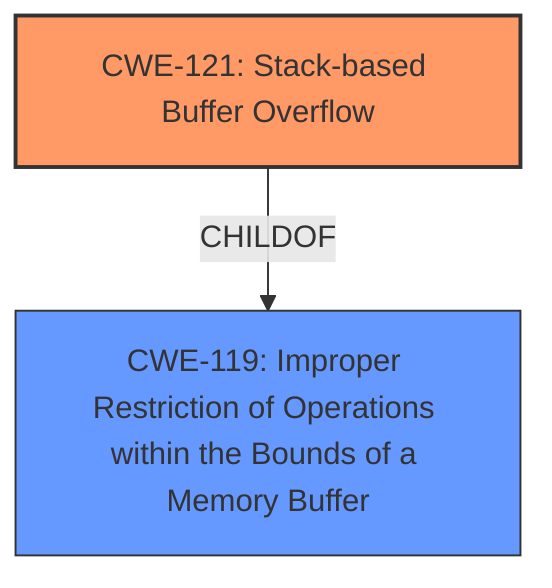

# Enhanced Analysis for CVE-2025-5080

# Summary

| CWE ID  | CWE Name  | Confidence | CWE Abstraction Level | CWE Vulnerability Mapping Label | CWE-Vulnerability Mapping Notes |
|-----------------|-----------------------------------------------------------------------------------------|----------------|---------------------------|-----------------------------------|------------------------------------|
| CWE-121 | Stack-based Buffer Overflow | 1 | Variant | Allowed | Primary CWE |
| CWE-119 | Improper Restriction of Operations within the Bounds of a Memory Buffer | 0.7 | Class | Discouraged | Secondary Candidate |

## Evidence and Confidence

*   **Confidence Score:** 0.9
*   **Evidence Strength:** HIGH

## Relationship Analysis

The primary CWE is CWE-121, which is a variant of the class-level CWE-119. The relationship between CWE-121 and CWE-119 is ChildOf. This means CWE-121 is a more specific type of CWE-119. Since the description mentions specifically a "stack-based buffer overflow", it is more appropriate to use the variant CWE-121 rather than the more general class CWE-119.



## Vulnerability Chain

The vulnerability chain starts with the **stack-based buffer overflow** (CWE-121) due to manipulation of the 'page' argument. The root cause is the **improper restriction of operations within the bounds of a memory buffer**.

## Summary of Analysis

The initial analysis identified CWE-121 as the primary candidate due to the explicit mention of "stack-based buffer overflow" in the vulnerability description. This aligns with the description of CWE-121 as a condition where the buffer being overwritten is allocated on the stack.

The retriever results also listed CWE-119, Improper Restriction of Operations within the Bounds of a Memory Buffer, as the top combined result. However, since the description provides specific information about the overflow occurring on the stack, CWE-121 is a more precise classification.

The relationship analysis confirmed that CWE-121 is a child of CWE-119, further supporting the selection of the more specific variant.

The confidence in the selection of CWE-121 is high due to the clear and direct evidence in the vulnerability description.

Relevant CWE Information:

# Enhanced Context (25 CWEs)
The following CWEs were identified as potentially relevant to this vulnerability:

## CWE-121: Stack-based Buffer Overflow
**Abstraction Level**: Variant
**Similarity Score**: 0.73
**Source**: dense

**Description**:
A stack-based buffer overflow condition is a condition where the buffer being overwritten is allocated on the stack (i.e., is a local variable or, rarely, a parameter to a function).

**Mapping Guidance**:
- Usage: Allowed
- Rationale: This CWE entry is at the Variant level of abstraction, which is a preferred level of abstraction for mapping to the root causes of vulnerabilities.

## CWE-119: Improper Restriction of Operations within the Bounds of a Memory Buffer
**Abstraction Level**: Class
**Similarity Score**: 0.80
**Source**: alternate_terms

**Description**: The software performs an operation on a memory buffer, but it does not correctly perform checks to ensure that the operation is within the bounds of the buffer.

**Mapping Guidance**
Usage: Discouraged
Rationale: This CWE entry is a Class and might have Base-level or Variant-level children that would be more appropriate

### CWEs Considered but Not Used:

*   **CWE-119:** While relevant as a parent class of CWE-121, it is less specific and therefore less appropriate. The vulnerability description clearly indicates a stack-based buffer overflow, making CWE-121 the better choice. The mapping guidance also discourages usage of Class level CWEs, recommending children that are Base or Variant level.
*   **CWE-190:** Integer Overflow or Wraparound was not selected because the vulnerability description clearly states a stack-based buffer overflow, not an integer overflow.
*   **CWE-89, CWE-79, CWE-78:** These CWEs relate to injection vulnerabilities, which are not indicated in the provided vulnerability description.
*   **CWE-125:** Out-of-bounds Read was not selected because the vulnerability description indicates a buffer overflow (write), not a read.
*   **CWE-122:** Heap-based Buffer Overflow was not selected because the vulnerability description explicitly states a stack-based buffer overflow.


## CWE Relationship Analysis

Current CWEs represent these abstraction levels: .


### Vulnerability Chain Analysis

**Chain starting from CWE-89:**
- 89 (Improper Neutralization of Special Elements used in an SQL Command ('SQL Injection')) - ROOT


**Chain starting from CWE-121:**
- 121 (Stack-based Buffer Overflow) - ROOT


### CWE Relationship Diagram

```mermaid
graph TD
    classDef primary fill:#f96,stroke:#333,stroke-width:2px
    classDef secondary fill:#69f,stroke:#333
    classDef tertiary fill:#9e9,stroke:#333
```