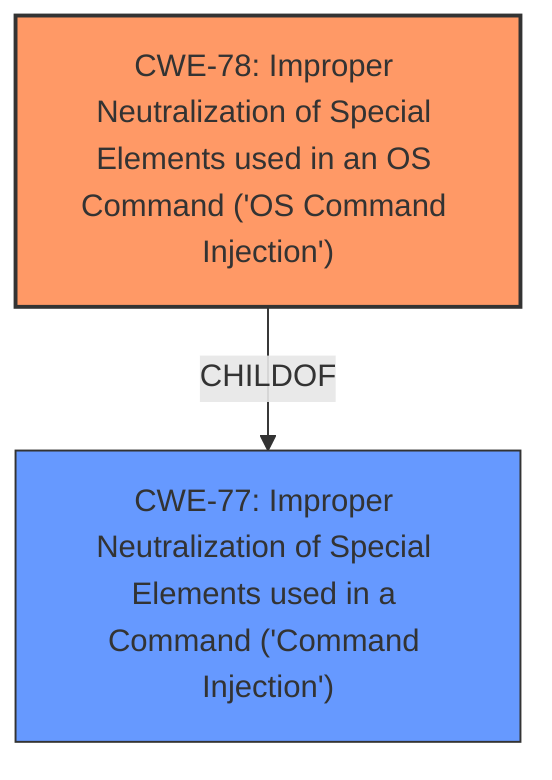

# Analysis for CVE-2025-5126

# Summary
| CWE ID | CWE Name | Confidence | CWE Abstraction Level | CWE Vulnerability Mapping Label | CWE-Vulnerability Mapping Notes |
|---|---|---|---|---|---|
| CWE-78 | Improper Neutralization of Special Elements used in an OS Command ('OS Command Injection') | 1.0 | Base | Primary | Allowed |
| CWE-77 | Improper Neutralization of Special Elements used in a Command ('Command Injection') | 0.7 | Class | Secondary | Allowed-with-Review |

## Evidence and Confidence

*   **Confidence Score:** 1.0
*   **Evidence Strength:** HIGH

## Relationship Analysis
The primary selection is CWE-78, a Base level CWE, which is a child of CWE-77. CWE-77 is a Class level CWE. While the description refers to "command injection," the context implies OS command injection, making CWE-78 a more specific and appropriate choice.

## Vulnerability Chain
The vulnerability chain begins with **improper neutralization** of input, leading to OS command injection, and ultimately remote code execution.
  - Input: year/month/day/hour/minute
  - Weakness: Improper Neutralization of Special Elements used in an OS Command
  - Impact: Remote Code Execution

## Summary of Analysis
The vulnerability description explicitly states that the manipulation of arguments leads to **command injection**. The Retriever Results list CWE-77 and CWE-78 as the top candidates. Given that the device is a FLIR AX8 (likely running an operating system), and the file path is \\usr\\www\\application\\models\\settingsregional.php, the injected command is highly likely to be an OS command. Therefore, CWE-78 is the most accurate and specific classification.

The evidence from the Vulnerability Description: "The manipulation of the argument year/month/day/hour/minute leads to **command injection**." This directly supports the selection of CWE-78.

CWE-77 was considered, but the OS context makes CWE-78 a more precise fit. Other CWEs like SQL Injection (CWE-89) and Cross-Site Scripting (CWE-79) were not relevant given the nature of the vulnerability.

Relevant CWE Information:

# Enhanced Context (25 CWEs)
The following CWEs were identified as potentially relevant to this vulnerability:

## CWE-78: Improper Neutralization of Special Elements used in an OS Command ('OS Command Injection')
**Abstraction Level**: base
**Similarity Score**: 4.33
**Source**: graph

**Description**:
CWE-78: Improper Neutralization of Special Elements used in an OS Command ('OS Command Injection')

**Mapping Guidance**:
- Usage: Allowed
- Rationale: This CWE entry is at the Base level of abstraction, which is a preferred level of abstraction for mapping to the root causes of vulnerabilities.

**Relationships**:
- CANFOLLOW -> CWE-184
- CANALSOBE -> CWE-88
- CHILDOF -> CWE-77
- CHILDOF -> CWE-77
- CHILDOF -> CWE-74