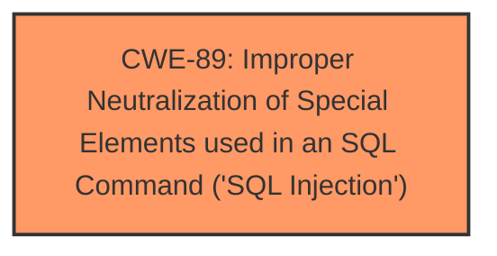

# Raw Analyzer Response for CVE-2025-5128

# Summary
| CWE ID | CWE Name | Confidence | CWE Abstraction Level | CWE Vulnerability Mapping Label | CWE-Vulnerability Mapping Notes |
|---|---|---|---|---|---|
| CWE-89 | Improper Neutralization of Special Elements used in an SQL Command ('SQL Injection') | 1.0 | Base | Allowed | Primary CWE |

## Evidence and Confidence

*   **Confidence Score:** 1.0
*   **Evidence Strength:** HIGH

## Relationship Analysis
The primary identified CWE is CWE-89, which is a Base level CWE. There are no direct parent-child relationships or chain relationships to analyze in this particular case, as the description clearly points to **SQL Injection** as the root cause.

## Vulnerability Chain
The vulnerability chain is straightforward:
1.  **Root Cause:** CWE-89 - Improper Neutralization of Special Elements used in an SQL Command ('SQL Injection') due to the **improper handling of the Password argument**.
2.  **Impact:** Remote attack leading to unauthorized access or data manipulation.

## Summary of Analysis
The vulnerability description explicitly states that the manipulation of the 'Password' argument leads to **SQL injection**. The Retriever Results also strongly suggest CWE-89 as the primary candidate. Therefore, CWE-89 is the most appropriate CWE. All the information points to SQL Injection so the confidence is high.

Relevant CWE Information:

# Enhanced Context (25 CWEs)
The following CWEs were identified as potentially relevant to this vulnerability:

## CWE-89: Improper Neutralization of Special Elements used in an SQL Command ('SQL Injection')
**Abstraction Level**: Base
**Similarity Score**: 1.00
**Source**: alternate_terms

**Description**:
The product constructs all or part of an SQL command using externally-influenced input from an upstream component, but it does not neutralize or incorrectly neutralizes special elements that could modify the intended SQL command when it is sent to a downstream component. Without sufficient removal or quoting of SQL syntax in user-controllable inputs, the generated SQL query can cause those inputs to be interpreted as SQL instead of ordinary user data.

**Mapping Guidance**:
- Usage: Allowed
- Rationale: This CWE entry is at the Base level of abstraction, which is a preferred level of abstraction for mapping to the root causes of vulnerabilities.

## Technical Explanation for CWE-89
*   **How the vulnerability's details match the CWE's characteristics:** The vulnerability description clearly states that manipulation of the `Password` argument leads to **SQL injection**. This aligns perfectly with CWE-89, which describes situations where externally-influenced input is used to construct an SQL command without proper neutralization of special elements.
*   **The security implications and potential impact:** **SQL injection** can allow attackers to bypass authentication, access sensitive data, modify data, or even execute arbitrary commands on the database server.
*   **Any parent-child relationships or chain patterns that influenced your mapping:** There are no specific parent-child or chain relationships that influenced the mapping in this case, as the description directly points to **SQL injection**.
*   **Whether the weakness is primary or secondary in the vulnerability:** This is the primary weakness.
*   **How the official MITRE mapping guidance influenced your decision:** The MITRE mapping guidance for CWE-89 allows its usage and states that it is at the Base level of abstraction, which is preferred for mapping root causes.

## Other CWEs Considered and Rejected
*   CWE-79 (Improper Neutralization of Input During Web Page Generation ('Cross-site Scripting')): While the application is a web application, the **SQL injection** vulnerability is a more direct and accurate representation of the root cause than **Cross-site Scripting**.
*   CWE-1336 (Improper Neutralization of Special Elements Used in a Template Engine): This is not a template engine issue.
*   CWE-352 (Cross-Site Request Forgery (CSRF)): This is unrelated to the **SQL injection** vulnerability.
*   CWE-434 (Unrestricted Upload of File with Dangerous Type): This is unrelated to the **SQL injection** vulnerability.
*   CWE-306 (Missing Authentication for Critical Function): While authentication is bypassed via **SQL injection**, the root cause is the **improper neutralization** and not the missing authentication itself.
*   CWE-96 (Improper Neutralization of Directives in Statically Saved Code ('Static Code Injection')): This is unrelated to the **SQL injection** vulnerability.
*   CWE-425 (Direct Request ('Forced Browsing')): This is unrelated to the **SQL injection** vulnerability.