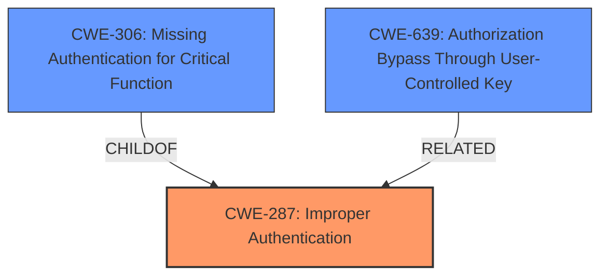

# Raw Analyzer Response for CVE-2025-5149

# Summary
| CWE ID  | CWE Name                                                                         | Confidence | CWE Abstraction Level | CWE Vulnerability Mapping Label | CWE-Vulnerability Mapping Notes |
| :-------- | :------------------------------------------------------------------------------- | :--------- | :---------------------- | :------------------------------ | :-------------------------------- |
| CWE-287 | Improper Authentication                                                        | 0.95       | Class                     | Primary                         | Discouraged                       |
| CWE-306 | Missing Authentication for Critical Function                                   | 0.85       | Base                      | Secondary                       | Allowed                           |
| CWE-639 | Authorization Bypass Through User-Controlled Key                               | 0.75       | Base                      | Secondary                       | Allowed                           |

## Evidence and Confidence

*   **Confidence Score:** 0.9
*   **Evidence Strength:** HIGH

## Relationship Analysis
The primary CWE is CWE-287, Improper Authentication, because the core issue revolves around the system failing to properly prove a user's claimed identity. However, due to weak encryption of the 'openid' cookie (RC4) and insufficient input validation, an attacker can forge a valid cookie and bypass authentication checks, suggesting CWE-306, Missing Authentication for Critical Function, as a contributing factor. Further, the ability to manipulate the key (UID) to access another user's data brings CWE-639, Authorization Bypass Through User-Controlled Key, into consideration. CWE-287 is a Class, while CWE-306 and CWE-639 are Base, providing more specific classifications. The relationship between these CWEs is complex, with CWE-287 being a higher-level category encompassing potential issues with authentication.

## Vulnerability Chain
The vulnerability chain begins with the **weak encryption** of the `openid` cookie (RC4), compounded by **insufficient input validation** of the decrypted `openid` and the extracted UID. This allows for the **forging of a valid cookie** with a manipulated UID. Consequently, an attacker can **bypass authentication** and gain unauthorized access. The root cause is the **improper authentication**, as the system fails to adequately verify the user's identity.

## Summary of Analysis
The initial assessment, based on the vulnerability description alone, pointed towards CWE-287 (Improper Authentication), driven by the key phrase "**improper authentication**". The CVE Reference Links Content Summary provides substantial evidence of the authentication bypass due to weak encryption and insufficient validation, reinforcing this choice. The retriever results list CWE-287 as a potential candidate, though it's a Class-level CWE. Considering the detailed context, CWE-306 (Missing Authentication for Critical Function) and CWE-639 (Authorization Bypass Through User-Controlled Key) are added as secondary CWEs to reflect more specific aspects of the vulnerability.

The selection of CWE-287 as the primary CWE is supported by the vulnerability description's focus on the failure to properly prove a user's identity. The addition of CWE-306 and CWE-639 provides a more complete picture, capturing the nuances of the bypass mechanism and the ability to manipulate user keys for unauthorized access. The decision to include these additional CWEs is based on the principle of specificity, aiming to provide a more granular representation of the vulnerability's root causes. The mitigations suggested in the CVE content, such as stronger authentication, secure encryption, and input validation, further support the selected CWEs.

Relevant CWE Information:

**CWE-287: Improper Authentication**
*Technical Explanation:* The WCMS application does not properly prove that a user's claimed identity is correct. Specifically, it relies on a weakly encrypted cookie (`openid`) and insufficiently validates the extracted user ID (UID). An attacker can forge a valid cookie with a manipulated UID to bypass authentication.
*Security Implications:* Unauthorized access to administrative functionalities.
*Relationship Analysis:* A Class-level CWE, encompassing more specific authentication weaknesses.
*Mapping Guidance Influence:* The initial vulnerability description pointed to **improper authentication**, making CWE-287 a natural fit.

**CWE-306: Missing Authentication for Critical Function**
*Technical Explanation:* The application is missing proper authentication checks for critical functions, allowing attackers to bypass authentication by forging 'openid' cookie.
*Security Implications:* Allows attackers to bypass authentication mechanisms and access critical functionalities.
*Relationship Analysis:* Child of CWE-287, providing more specific details on how the authentication is missing.
*Mapping Guidance Influence:* Allowed usage.

**CWE-639: Authorization Bypass Through User-Controlled Key**
*Technical Explanation:* By manipulating the UID within the 'openid' cookie, an attacker can potentially access another user's data or record, bypassing authorization checks.
*Security Implications:* Unauthorized access to sensitive data and functionalities associated with other users.
*Relationship Analysis:* A base level CWE
*Mapping Guidance Influence:* Allowed usage.

CWEs Considered but Not Used:
CWE-89 (SQL Injection), CWE-79 (Cross-Site Scripting), CWE-434 (Unrestricted Upload of File with Dangerous Type), and CWE-425 (Direct Request ('Forced Browsing')) were considered but ultimately deemed less relevant as they do not directly address the root cause of the authentication bypass. While input validation is a factor, the primary issue is the **improper authentication** and the reliance on a weak authentication mechanism.