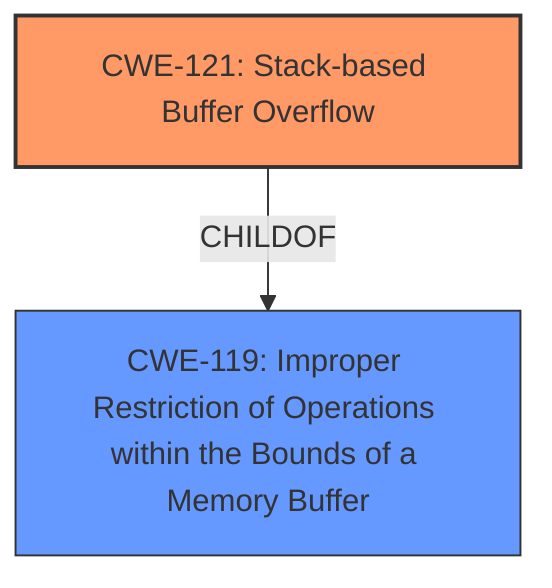

# Analysis Report for CVE-2025-5156

# Vulnerability Analysis Report: CVE-2025-5156

## Description

A vulnerability was found in H3C GR-5400AX up to 100R008 and classified as critical. Affected by this issue is the function EditWlanMacList of the file /routing/goform/aspForm. The manipulation of the argument param leads to buffer overflow. The attack may be launched remotely. The exploit has been disclosed to the public and may be used. The vendor was contacted early about this disclosure but did not respond in any way.

## Vulnerability Description Key Phrases

- **Component:** /routing/goform/aspForm/EditWlanMacList function
- **Vector:** manipulation of argument param
- **Weakness:** buffer overflow, stack overflow
- **Product:** H3C GR-5400AX
- **Version:** up to 100R008

## Analysis (with Relationship Data)

# Summary
| CWE ID | CWE Name | Confidence | CWE Abstraction Level | CWE Vulnerability Mapping Label | CWE-Vulnerability Mapping Notes |
|---|---|---|---|---|---|
| CWE-121 | Stack-based Buffer Overflow | 1.0 | Variant | Allowed | Primary CWE. The vulnerability involves a buffer overflow on the stack. |
| CWE-119 | Improper Restriction of Operations within the Bounds of a Memory Buffer | 0.7 | Class | Discouraged | Secondary CWE. A more general case of buffer overflows. |

## Evidence and Confidence

*   **Confidence Score:** 1.0
*   **Evidence Strength:** HIGH

## Relationship Analysis
The primary CWE is CWE-121, Stack-based Buffer Overflow, which is a variant of the more general CWE-119, Improper Restriction of Operations within the Bounds of a Memory Buffer. The vulnerability description explicitly mentions a **buffer overflow** and **stack overflow**, thus justifying the selection of CWE-121 as the primary cause.



## Vulnerability Chain
The vulnerability chain starts with the manipulation of the 'param' argument in the EditWlanMacList function, leading to a **buffer overflow** on the stack. This allows an attacker to potentially overwrite memory, leading to arbitrary code execution.

## Summary of Analysis
The vulnerability description clearly states that manipulating the argument "param" leads to a **buffer overflow** in the EditWlanMacList function, affecting the H3C GR-5400AX router. The vulnerability is located on the stack, making CWE-121 (Stack-based Buffer Overflow) the most appropriate primary CWE. CWE-119 (Improper Restriction of Operations within the Bounds of a Memory Buffer) is a more general class that encompasses buffer overflows, but CWE-121 is more specific and accurate given the stack location.

The retriever results also list CWE-121 with a high score, further supporting this decision. The mapping guidance for CWE-121 allows its usage, while CWE-119 is discouraged, because more specific CWEs should be considered.

Other CWEs considered but not used:

*   CWE-120 (Buffer Copy without Checking Size of Input): While this could be relevant, the description does not explicitly mention a buffer copy operation.
*   CWE-190 (Integer Overflow or Wraparound): Not relevant as the issue is not related to integer overflows.
*   CWE-89 (Improper Neutralization of Special Elements used in an SQL Command ('SQL Injection')): Not relevant as the issue is not related to SQL injection.
*   CWE-79 (Improper Neutralization of Input During Web Page Generation ('Cross-site Scripting')): Not relevant as the issue is not related to XSS.
*   CWE-125 (Out-of-bounds Read): The vulnerability is a write, not a read.
*   CWE-78 (Improper Neutralization of Special Elements used in an OS Command ('OS Command Injection')): Not relevant as the issue is not related to OS command injection.


## CWE Relationship Analysis

Current CWEs represent these abstraction levels: .


### Vulnerability Chain Analysis

**Chain starting from CWE-89:**
- 89 (Improper Neutralization of Special Elements used in an SQL Command ('SQL Injection')) - ROOT


**Chain starting from CWE-121:**
- 121 (Stack-based Buffer Overflow) - ROOT


### CWE Relationship Diagram

```mermaid
graph TD
    classDef primary fill:#f96,stroke:#333,stroke-width:2px
    classDef secondary fill:#69f,stroke:#333
    classDef tertiary fill:#9e9,stroke:#333
```


*Report generated on 2025-07-15 03:25:44*
