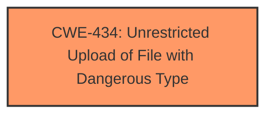

# Enhanced Analysis for CVE-2025-5162

# Summary

| CWE ID | CWE Name | Confidence | CWE Abstraction Level | CWE Vulnerability Mapping Label | CWE-Vulnerability Mapping Notes |
|---|---|---|---|---|---|
| CWE-434 | Unrestricted Upload of File with Dangerous Type | 1.0 | Base | Primary | Allowed |

## Evidence and Confidence

*   **Confidence Score:** 1.0
*   **Evidence Strength:** HIGH

## Relationship Analysis
The primary relationship considered was the direct match of the vulnerability description to the definition of CWE-434. While other CWEs were considered, none aligned as directly with the **unrestricted upload** aspect of the vulnerability. There were no relevant parent-child, chain, or peer relationships that influenced the final decision, because there wasn't enough information provided.



## Vulnerability Chain
The vulnerability chain consists of a single step: **unrestricted upload**, directly leading to potential exploitation. The root cause is the **lack of restrictions** on file uploads, and the impact is the ability to upload and potentially execute dangerous files.

## Summary of Analysis
The initial analysis focused on identifying the root cause of the vulnerability, which was the **unrestricted upload** functionality. The vulnerability description explicitly mentions the term "**unrestricted upload**," which strongly aligns with CWE-434: Unrestricted Upload of File with Dangerous Type. The absence of any information about neutralization or escaping techniques rules out CWEs related to improper neutralization or injection.

The decision is primarily based on the explicit mention of "**unrestricted upload**" in the vulnerability description, which is a clear indicator of CWE-434. The relationship analysis didn't significantly influence the decision, as the vulnerability description is quite direct and doesn't suggest any complex interactions or dependencies. The selected CWE is at the optimal level of specificity, as it directly addresses the core weakness.

Relevant CWE Information:

# Enhanced Context (25 CWEs)
The following CWEs were identified as potentially relevant to this vulnerability:

## CWE-434: Unrestricted Upload of File with Dangerous Type
**Abstraction Level**: Base
**Similarity Score**: 0.80
**Source**: dense

**Description**:
The product allows the upload or transfer of dangerous file types that are automatically processed within its environment.

**Mapping Guidance**:
- Usage: Allowed
- Rationale: This CWE entry is at the Base level of abstraction, which is a preferred level of abstraction for mapping to the root causes of vulnerabilities.

## CWE-434: Unrestricted Upload of File with Dangerous Type
**Abstraction Level**: Base
**Similarity Score**: 520.57
**Source**: sparse

**Description**:
The product allows the upload or transfer of dangerous file types that are automatically processed within its environment.

**Mapping Guidance**:
- Usage: Allowed
- Rationale: This CWE entry is at the Base level of abstraction, which is a preferred level of abstraction for mapping to the root causes of vulnerabilities.

## CWE-434: Unrestricted Upload of File with Dangerous Type
**Abstraction Level**: Base
**Similarity Score**: 2.92
**Source**: graph

**Description**:
The product allows the upload or transfer of dangerous file types that are automatically processed within its environment.

**Mapping Guidance**:
- Usage: Allowed
- Rationale: This CWE entry is at the Base level of abstraction, which is a preferred level of abstraction for mapping to the root causes of vulnerabilities.

**CWE-434**: Unrestricted Upload of File with Dangerous Type
The product allows the upload or transfer of dangerous file types that are automatically processed within its environment. This aligns directly with the **unrestricted upload** mentioned in the vulnerability description, making it the most appropriate CWE. The security implication is that an attacker can upload malicious files and potentially execute arbitrary code on the server.

Other CWEs considered but not used:

*   CWE-79 (Improper Neutralization of Input During Web Page Generation ('Cross-site Scripting')): This CWE was considered but rejected because the vulnerability description doesn't mention anything about web page generation or the improper handling of input in that context.
*   CWE-78 (Improper Neutralization of Special Elements used in an OS Command ('OS Command Injection')): This CWE was considered but rejected because there's no mention of OS command injection in the vulnerability description.
*   CWE-89 (Improper Neutralization of Special Elements used in an SQL Command ('SQL Injection')): This CWE was considered but rejected as there is no mention of SQL commands or databases in the vulnerability description.
*   CWE-306 (Missing Authentication for Critical Function): This was a possible candidate, but the vulnerability description doesn't explicitly state that authentication is missing. It only focuses on the upload functionality itself.
*   CWE-1336 (Improper Neutralization of Special Elements Used in a Template Engine): This was rejected as there is no mention of a template engine.
*   CWE-184 (Incomplete List of Disallowed Inputs): This was rejected as the problem is not an incomplete list, but a complete lack of restriction.


## CWE Relationship Analysis

Current CWEs represent these abstraction levels: .


### Vulnerability Chain Analysis

**Chain starting from CWE-89:**
- 89 (Improper Neutralization of Special Elements used in an SQL Command ('SQL Injection')) - ROOT


**Chain starting from CWE-79:**
- 79 (Improper Neutralization of Input During Web Page Generation ('Cross-site Scripting')) - ROOT


### CWE Relationship Diagram

```mermaid
graph TD
    classDef primary fill:#f96,stroke:#333,stroke-width:2px
    classDef secondary fill:#69f,stroke:#333
    classDef tertiary fill:#9e9,stroke:#333
```