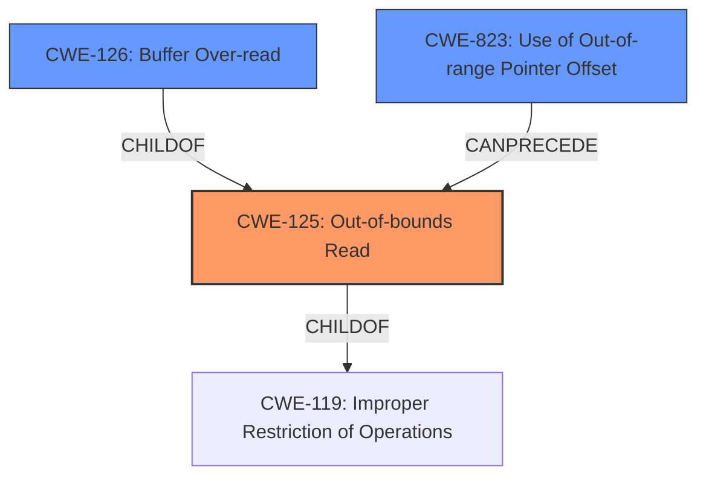

# Analysis Report for CVE-2025-5165

# Vulnerability Analysis Report: CVE-2025-5165

## Description

A vulnerability was found in Open Asset Import Library Assimp 5.4.3 and classified as problematic. This issue affects the function MDCImporterValidateSurfaceHeader of the file assimp/code/AssetLib/MDC/MDCLoader.cpp. The manipulation of the argument pcSurface2 leads to **out-of-bounds read**. Attacking locally is a requirement. The exploit has been disclosed to the public and may be used. The project decided to collect all Fuzzer bugs in a main-issue to address them in the future.

## Vulnerability Description Key Phrases

- **Weakness:** out-of-bounds read
- **Product:** Open Asset Import Library Assimp
- **Version:** 5.4.3
- **Component:** MDCImporterValidateSurfaceHeader of the file assimp/code/AssetLib/MDC/MDCLoader.cpp

## Analysis (with Relationship Data)

# Summary
| CWE ID | CWE Name | Confidence | CWE Abstraction Level | CWE Vulnerability Mapping Label | CWE-Vulnerability Mapping Notes |
|---|---|---|---|---|---|
| CWE-125 | Out-of-bounds Read | 1.0 | Base | Primary CWE | Allowed |
| CWE-126 | Buffer Over-read | 0.7 | Variant | Secondary Candidate | Allowed |
| CWE-823 | Use of Out-of-range Pointer Offset | 0.6 | Base | Secondary Candidate | Allowed |

## Evidence and Confidence

*   **Confidence Score:** 1.0
*   **Evidence Strength:** HIGH

## Relationship Analysis
The primary weakness is CWE-125 [Out-of-bounds Read]. Several other CWEs are related, reflecting different aspects of the vulnerability.

CWE-125 [Out-of-bounds Read] is a base CWE. CWE-126 [Buffer Over-read] is a variant of out-of-bounds read, suggesting a more specific case. CWE-823 [Use of Out-of-range Pointer Offset] describes a specific mechanism that could lead to an out-of-bounds read.



## Vulnerability Chain
The vulnerability chain starts with the **improper validation** of the `pcSurface2` argument, leading to an **out-of-bounds read** (CWE-125). The impact is a potential denial of service or information disclosure.

## Summary of Analysis
The primary weakness is clearly an **out-of-bounds read**, as explicitly stated in the vulnerability description: "The manipulation of the argument pcSurface2 leads to **out-of-bounds read**." The CVE reference content summary reinforces this, stating "Heap out-of-bounds read" and "Incomplete header validation in `MDCImporter::ValidateSurfaceHeader`. Specifically, it lacks a check to ensure `pcSurf->ulOffsetEnd` is within bounds."

CWE-125 [Out-of-bounds Read] is the most accurate and specific representation of the vulnerability. The other CWEs considered either describe a more general class of errors (e.g., CWE-119 [Improper Restriction of Operations within the Bounds of a Memory Buffer]) or are less directly related to the specific vulnerability.

The choice of CWE-125 is supported by the evidence and the CWE specifications. It is at the Base level of abstraction, which is a preferred level.

Relevant CWE Information:

# Enhanced Context (25 CWEs)
The following CWEs were identified as potentially relevant to this vulnerability:

## CWE-125: Out-of-bounds Read
**Abstraction Level**: Base
**Similarity Score**: 0.76
**Source**: dense

**Description**:
The product reads data past the end, or before the beginning, of the intended buffer.

**Mapping Guidance**:
- Usage: Allowed
- Rationale: This CWE entry is at the Base level of abstraction, which is a preferred level of abstraction for mapping to the root causes of vulnerabilities.

**Technical Explanation:**
The vulnerability description explicitly states "**out-of-bounds read**" as the weakness. The description of CWE-125 directly matches this, making it the primary candidate.

## CWE-129: Improper Validation of Array Index
**Abstraction Level**: Variant
**Similarity Score**: 0.75
**Source**: dense

**Description**:
The product uses untrusted input when calculating or using an array index, but the product does not validate or incorrectly validates the index to ensure the index references a valid position within the array.

**Mapping Guidance**:
- Usage: Allowed
- Rationale: This CWE entry is at the Variant level of abstraction, which is a preferred level of abstraction for mapping to the root causes of vulnerabilities.

**Explanation for Exclusion:** Although relevant, the description doesn't explicitly mention an array index. The vulnerability could be related to other types of offsets.

## CWE-131: Incorrect Calculation of Buffer Size
**Abstraction Level**: Base
**Similarity Score**: 0.74
**Source**: dense

**Description**:
The product does not correctly calculate the size to be used when allocating a buffer, which could lead to a buffer overflow.

**Mapping Guidance**:
- Usage: Allowed
- Rationale: This CWE entry is at the Base level of abstraction, which is a preferred level of abstraction for mapping to the root causes of vulnerabilities.

**Explanation for Exclusion:** This is less direct. The **incorrect calculation of buffer size** might lead to an out-of-bounds read, but the core issue is the read itself.

## CWE-126: Buffer Over-read
**Abstraction Level**: Variant
**Similarity Score**: 0.73
**Source**: dense

**Description**:
The product reads from a buffer using buffer access mechanisms such as indexes or pointers that reference memory locations after the targeted buffer.

**Mapping Guidance**:
- Usage: Allowed
- Rationale: This CWE entry is at the Variant level of abstraction, which is a preferred level of abstraction for mapping to the root causes of vulnerabilities.

**Technical Explanation:**
CWE-126 [Buffer Over-read] is a more specific variant of CWE-125 [Out-of-bounds Read]. It describes reading past the end of the buffer. This is a reasonable secondary candidate, assuming that the **out-of-bounds read** occurs after the end of the buffer.

## CWE-212: Improper Removal of Sensitive Information Before Storage or Transfer
**Abstraction Level**: Base
**Similarity Score**: 0.73
**Source**: dense

**Description**:
The product stores, transfers, or shares a resource that contains sensitive information, but it does not properly remove that information before the product makes the resource available to unauthorized actors.

**Mapping Guidance**:
- Usage: Allowed
- Rationale: This CWE entry is at the Base level of abstraction, which is a preferred level of abstraction for mapping to the root causes of vulnerabilities.

**Explanation for Exclusion:** This CWE is unrelated to buffer overflows or out-of-bounds access.

## CWE-193: Off-by-one Error
**Abstraction Level**: Base
**Similarity Score**: 0.73
**Source**: dense

**Description**:
A product calculates or uses an incorrect maximum or minimum value that is 1 more, or 1 less, than the correct value.

**Mapping Guidance**:
- Usage: Allowed
- Rationale: This CWE entry is at the Base level of abstraction, which is a preferred level of abstraction for mapping to the root causes of vulnerabilities.

**Explanation for Exclusion:** This is too specific. While an off-by-one error *could* lead to an out-of-bounds read, the description does not provide enough information to confirm this.

## CWE-252: Unchecked Return Value
**Abstraction Level**: Base
**Similarity Score**: 0.73
**Source**: dense

**Description**:
The product does not check the return value from a method or function, which can prevent it from detecting unexpected states and conditions.

**Mapping Guidance**:
- Usage: Allowed
- Rationale: This CWE entry is at the Base level of abstraction, which is a preferred level of abstraction for mapping to the root causes of vulnerabilities.

**Explanation for Exclusion:** This CWE is not relevant to the vulnerability description.

## CWE-138: Improper Neutralization of Special Elements
**Abstraction Level**: Class
**Similarity Score**: 0.73
**Source**: dense

**Description**:
The product receives input from an upstream component, but it does not neutralize or incorrectly neutralizes special elements that could be interpreted as control elements or syntactic markers when they are sent to a downstream component.

**Mapping Guidance**:
- Usage: Discouraged
- Rationale: This CWE entry is a level-1 Class (i.e., a child of a Pillar). It might have lower-level children that would be more appropriate

**Explanation for Exclusion:** This CWE is not related to out-of-bounds reads or buffer overflows.

## CWE-617: Reachable Assertion
**Abstraction Level**: Base
**Similarity Score**: 0.73
**Source**: dense

**Description**:
The product contains an assert() or similar statement that can be triggered by an attacker, which leads to an application exit or other behavior that is more severe than necessary.

**Mapping Guidance**:
- Usage: Allowed
- Rationale: This CWE entry


## CWE Relationship Analysis

Current CWEs represent these abstraction levels: .


### Vulnerability Chain Analysis

**Chain starting from CWE-823:**
- 823 (Use of Out-of-range Pointer Offset) - ROOT


**Chain starting from CWE-125:**
- 125 (Out-of-bounds Read) - ROOT


### CWE Relationship Diagram

```mermaid
graph TD
    classDef primary fill:#f96,stroke:#333,stroke-width:2px
    classDef secondary fill:#69f,stroke:#333
    classDef tertiary fill:#9e9,stroke:#333
```


*Report generated on 2025-07-15 03:27:03*
