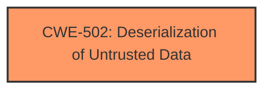

# Analysis Report for CVE-2025-5173

# Vulnerability Analysis Report: CVE-2025-5173

## Description

A vulnerability has been found in HumanSignal label-studio-ml-backend up to 9fb7f4aa186612806af2becfb621f6ed8d9fdbaf and classified as problematic. Affected by this vulnerability is the function load of the file label-studio-ml-backend/label_studio_ml/examples/yolo/utils/neural_nets.py of the component PT File Handler. The manipulation of the argument path leads to **deserialization**. An attack has to be approached locally. This product takes the approach of rolling releases to provide continious delivery. Therefore, version details for affected and updated releases are not available.

## Vulnerability Description Key Phrases

- **Weakness:** deserialization
- **Vector:** manipulation of the argument path
- **Product:** HumanSignal label-studio-ml-backend
- **Version:** up to 9fb7f4aa186612806af2becfb621f6ed8d9fdbaf
- **Component:** load of label-studio-ml-backend/label_studio_ml/examples/yolo/utils/neural_nets.py

## Analysis (with Relationship Data)

# Summary
| CWE ID | CWE Name | Confidence | CWE Abstraction Level | CWE Vulnerability Mapping Label | CWE-Vulnerability Mapping Notes |
|---|---|---|---|---|---|
| CWE-502 | Deserialization of Untrusted Data | 1.0 | Base | Primary | Allowed |

## Evidence and Confidence

*   **Confidence Score:** 1.0
*   **Evidence Strength:** HIGH

## Relationship Analysis
The primary CWE is CWE-502, which stands alone. There are no parent/child or chain relationships that seem directly applicable based on the information provided. The abstraction level is Base, which is the preferred level.



## Vulnerability Chain
The vulnerability chain is straightforward: the application deserializes untrusted data leading to potential remote code execution.

## Summary of Analysis
The analysis indicates a **deserialization** vulnerability due to the use of `torch.load` on untrusted data. The primary CWE is CWE-502 (Deserialization of Untrusted Data), which accurately describes the **weakness**. The evidence is strong, and the confidence is high.

The vulnerability description states: "The manipulation of the argument path leads to **deserialization**." The CVE Reference Links Content Summary states: "The `load` function uses `torch.load` to deserialize data from a specified path without validation. `torch.load` can execute arbitrary code when loading malicious pickle data." This confirms the presence of a **deserialization** vulnerability.

The Retriever Results list CWE-502 as a potential match, and its description aligns perfectly with the vulnerability. The other CWEs listed do not apply to this particular vulnerability.

The selected CWE is at the optimal level of specificity (Base).


## CWE Relationship Analysis

Current CWEs represent these abstraction levels: .


### Vulnerability Chain Analysis

**Chain starting from CWE-502:**
- 502 (Deserialization of Untrusted Data) - ROOT


### CWE Relationship Diagram

```mermaid
graph TD
    classDef primary fill:#f96,stroke:#333,stroke-width:2px
    classDef secondary fill:#69f,stroke:#333
    classDef tertiary fill:#9e9,stroke:#333
```


*Report generated on 2025-07-15 03:29:28*
