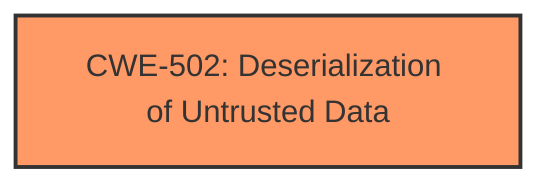

# Raw Analyzer Response for CVE-2025-5174

# Summary
| CWE ID | CWE Name | Confidence | CWE Abstraction Level | CWE Vulnerability Mapping Label | CWE-Vulnerability Mapping Notes |
|---|---|---|---|---|---|
| CWE-502 | Deserialization of Untrusted Data | 1.0 | Base | Allowed | Primary CWE: The vulnerability stems directly from **deserialization** of untrusted data without proper validation.|

## Evidence and Confidence

*   **Confidence Score:** 1.0
*   **Evidence Strength:** HIGH

## Relationship Analysis
The primary CWE is CWE-502, which is a Base level weakness. There are no direct parent-child relationships that significantly influence the selection, as CWE-502 is already at a suitable level of specificity. The retriever results included other potential CWEs like CWE-79 (Cross-Site Scripting) and CWE-89 (SQL Injection), but these are related to different attack vectors and do not accurately represent the root cause of this vulnerability, which is insecure deserialization.

## Vulnerability Chain
The vulnerability chain starts with the **deserialization** of untrusted data via the `load()` function. This lack of validation allows for arbitrary code execution.

Deserialization of Untrusted Data (CWE-502) -> Arbitrary Code Execution (Impact)

## Summary of Analysis
The analysis is based on the vulnerability description and the provided CVE reference summary, which explicitly mentions the use of `pickle.load()` without proper input validation as the root cause. The **deserialization** of untrusted data allows an attacker to execute arbitrary code. The primary CWE, CWE-502, accurately represents this root cause. The mitigation steps, such as validation checks and restrictions on saving pickle files, further support this classification.

The retriever results also listed CWE-502 as a potential match. While other CWEs were suggested, they did not align with the specific mechanism of the vulnerability.

The selection of CWE-502 is at the optimal level of specificity as it directly addresses the **deserialization** issue.

Relevant CWE Information:

# Enhanced Context (25 CWEs)
## CWE-502: Deserialization of Untrusted Data
**Abstraction Level**: Base
**Similarity Score**: 0.74
**Source**: dense

**Description**:
The product deserializes untrusted data without sufficiently ensuring that the resulting data will be valid.

**Mapping Guidance**:
- Usage: Allowed
- Rationale: This CWE entry is at the Base level of abstraction, which is a preferred level of abstraction for mapping to the root causes of vulnerabilities.