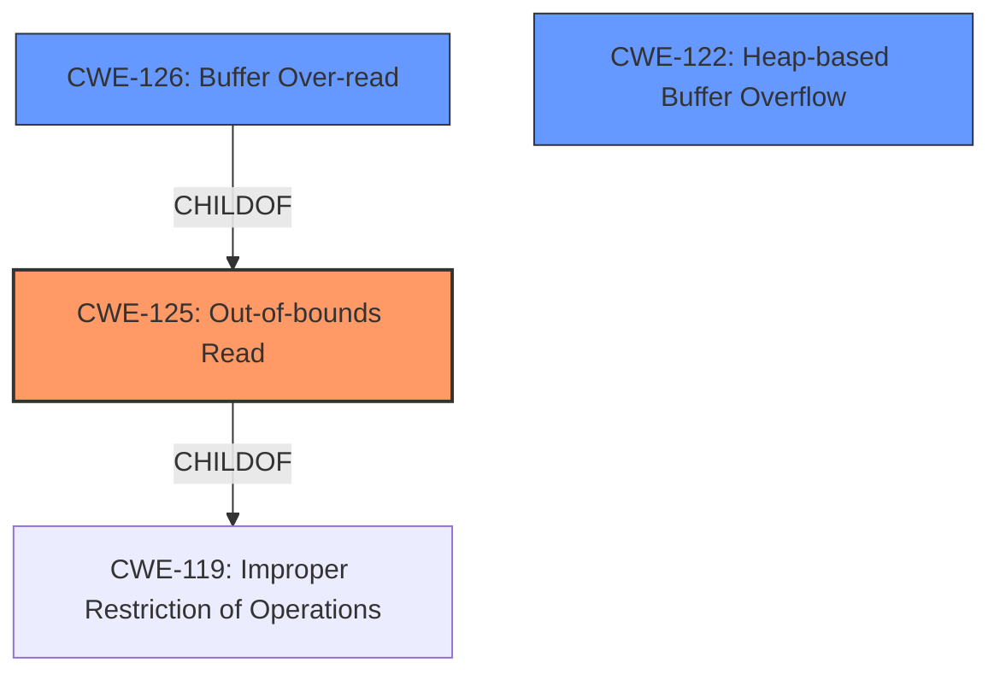

# Raw Analyzer Response for CVE-2025-5200

# Summary
| CWE ID | CWE Name | Confidence | CWE Abstraction Level | CWE Vulnerability Mapping Label | CWE-Vulnerability Mapping Notes |
|---|---|---|---|---|---|
| CWE-125 | Out-of-bounds Read | 1.0 | Base | Primary | Allowed |
| CWE-126 | Buffer Over-read | 0.7 | Variant | Secondary | Allowed |
| CWE-122 | Heap-based Buffer Overflow | 0.6 | Variant | Secondary | Allowed |

## Evidence and Confidence

*   **Confidence Score:** 0.9
*   **Evidence Strength:** HIGH

## Relationship Analysis
The primary CWE is CWE-125 (Out-of-bounds Read), which is a base-level CWE. CWE-126 (Buffer Over-read) is a variant of out-of-bounds read, providing a more specific classification. CWE-122 (Heap-based Buffer Overflow) is also related as the out-of-bounds read occurs in the heap.

## Vulnerability Chain
The vulnerability chain starts with the **out-of-bounds read** in the `MDLImporterInternReadFile_Quake1` function, potentially leading to a heap-buffer-overflow. The initial flaw is the **out-of-bounds read** (CWE-125), which is triggered due to **improper** handling of MDL file parsing. This can lead to reading beyond the intended buffer (CWE-126), and since this happens in the heap, it manifests as a heap-based buffer overflow (CWE-122).

## Summary of Analysis
The initial analysis clearly points to an **out-of-bounds read** vulnerability in the Assimp library. The evidence from the CVE reference link confirms this, specifically mentioning a heap-buffer-overflow due to **out-of-bounds reads** in the `MDLImporter::InternReadFile_Quake1` function. The retriever results also highlight CWE-125 (Out-of-bounds Read) as a highly relevant CWE.

The final decision is to classify the vulnerability as CWE-125 (Out-of-bounds Read) because the vulnerability description and reference links explicitly mention this weakness. CWE-126 (Buffer Over-read) and CWE-122 (Heap-based Buffer Overflow) are added as secondary classifications since the **out-of-bounds read** leads to reading beyond the allocated buffer in the heap memory.

Relevant CWE Information:

# Enhanced Context (25 CWEs)
The following CWEs were identified as potentially relevant to this vulnerability:

## CWE-125: Out-of-bounds Read
**Abstraction Level**: Base
**Similarity Score**: 0.75
**Source**: dense

**Description**:
The product reads data past the end, or before the beginning, of the intended buffer.

**Mapping Guidance**:
- Usage: Allowed
- Rationale: This CWE entry is at the Base level of abstraction, which is a preferred level of abstraction for mapping to the root causes of vulnerabilities.

**Technical Explanation:**
The vulnerability description mentions an **out-of-bounds read** in the `MDLImporterInternReadFile_Quake1` function. This aligns directly with the definition of CWE-125, where the product reads data beyond the intended buffer's boundaries.
**Security Implications:**
An out-of-bounds read can lead to information disclosure, denial of service (application crash), or, in some cases, arbitrary code execution.
**Relationship Analysis:**
CWE-125 is a base-level CWE.
**Mapping Guidance Analysis:**
The mapping guidance allows the use of CWE-125 and states that it is a preferred level of abstraction.
**Mitigation Analysis:**
Mitigation involves proper input validation and bounds checking to ensure that read operations do not exceed buffer boundaries.
**Evidence-Based Decision Making:**
The vulnerability description explicitly mentions **out-of-bounds read**, and the CVE reference confirms this.

## CWE-126: Buffer Over-read
**Abstraction Level**: Variant
**Similarity Score**: 0.72
**Source**: dense

**Description**:
The product reads from a buffer using buffer access mechanisms such as indexes or pointers that reference memory locations after the targeted buffer.

**Mapping Guidance**:
- Usage: Allowed
- Rationale: This CWE entry is at the Variant level of abstraction, which is a preferred level of abstraction for mapping to the root causes of vulnerabilities.

**Technical Explanation:**
CWE-126 is a variant of CWE-125 that is applicable when a buffer is read using an index or pointer past the end of the buffer. Given that the **out-of-bounds read** is confirmed, CWE-126 is likely to be relevant.
**Security Implications:**
Similar to CWE-125, this can lead to information disclosure or denial of service.
**Relationship Analysis:**
CWE-126 is a variant of CWE-125.
**Mapping Guidance Analysis:**
The mapping guidance allows the use of CWE-126 and states that it is a preferred level of abstraction.
**Mitigation Analysis:**
Similar to CWE-125, this involves bounds checking and proper input validation.
**Evidence-Based Decision Making:**
The vulnerability description and reference links confirm that the product reads past the end of the buffer.

## CWE-122: Heap-based Buffer Overflow
**Abstraction Level**: Variant
**Similarity Score**: 977.73
**Source**: sparse

**Description**:
A heap overflow condition is a buffer overflow, where the buffer that can be overwritten is allocated in the heap portion of memory, generally meaning that the buffer was allocated using a routine such as malloc().

**Mapping Guidance**:
- Usage: Allowed
- Rationale: This CWE entry is at the Variant level of abstraction, which is a preferred level of abstraction for mapping to the root causes of vulnerabilities.

**Technical Explanation:**
The CVE reference links content summary indicates that the vulnerability is a heap-buffer-overflow, suggesting that the buffer is allocated in the heap.
**Security Implications:**
Heap-based buffer overflows can lead to arbitrary code execution, denial of service, or information disclosure.
**Relationship Analysis:**
CWE-122 is a variant of buffer overflow that occurs on the heap.
**Mapping Guidance Analysis:**
The mapping guidance allows the use of CWE-122 and states that it is a preferred level of abstraction.
**Mitigation Analysis:**
Mitigation involves using safe memory allocation and deallocation practices, as well as bounds checking.
**Evidence-Based Decision Making:**
The CVE reference links content summary states that it is a heap-buffer-overflow.

CWE-787 (Out-of-bounds Write) was considered but not used because the primary vulnerability is an **out-of-bounds read**, not a write. While a write could potentially occur as a consequence, the initial flaw is the read operation.
CWE-190 (Integer Overflow or Wraparound) was considered but not used because there is no explicit evidence of integer overflow or wraparound in the vulnerability description or reference links.
CWE-131 (Incorrect Calculation of Buffer Size) was considered but not used because there is no evidence about the buffer size calculation.
CWE-129 (Improper Validation of Array Index) was considered but not used because there is no evidence about an array index being improperly validated.
CWE-193 (Off-by-one Error) was considered but not used because there is no specific evidence of an off-by-one error.
CWE-617 (Reachable Assertion) was considered but not used because there is no evidence about an assertion failure.
CWE-824 (Access of Uninitialized Pointer) was considered but not used because there is no evidence of an uninitialized pointer.
CWE-252 (Unchecked Return Value) was considered but not used because there is no evidence about an unchecked return value.
CWE-346 (Origin Validation Error) was considered but not used because there is no evidence about an origin validation error.
CWE-170 (Improper Null Termination) was considered but not used because there is no evidence about null termination.
CWE-825 (Expired Pointer Dereference) was considered but not used because there is no evidence about expired pointers.
CWE-823 (Use of Out-of-range Pointer Offset) was considered but not used because there is no evidence about pointer offsets.