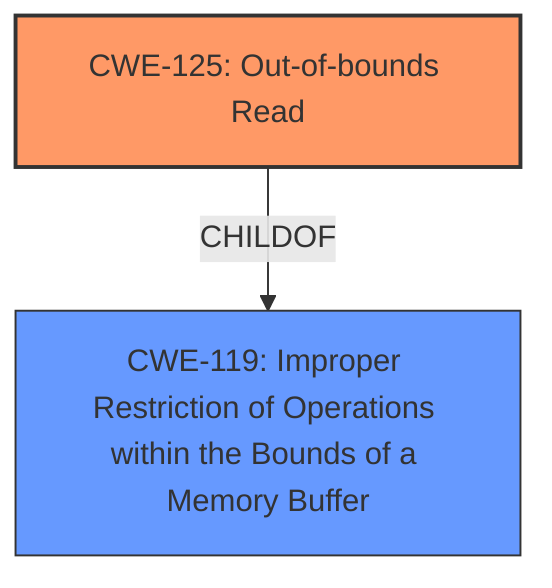

# Analysis Report for CVE-2025-5203

# Vulnerability Analysis Report: CVE-2025-5203

## Description

A vulnerability was found in Open Asset Import Library Assimp 5.4.3. It has been rated as problematic. Affected by this issue is the function SkipSpaces in the library assimp/include/assimp/ParsingUtils.h. The manipulation leads to **out-of-bounds read**. Local access is required to approach this attack. The exploit has been disclosed to the public and may be used. The project decided to collect all Fuzzer bugs in a main-issue to address them in the future.

## Vulnerability Description Key Phrases

- **Weakness:** out-of-bounds read
- **Product:** Open Asset Import Library Assimp
- **Version:** 5.4.3
- **Component:** assimp/include/assimp/ParsingUtils.h

## Analysis (with Relationship Data)

# Summary
| CWE ID | CWE Name | Confidence | CWE Abstraction Level | CWE Vulnerability Mapping Label | CWE-Vulnerability Mapping Notes |
|---|---|---|---|---|---|
| CWE-125 | Out-of-bounds Read | 1.0 | Base | Primary | Allowed |
| CWE-119 | Improper Restriction of Operations within the Bounds of a Memory Buffer | 0.7 | Class | Secondary | Discouraged |

## Evidence and Confidence

*   **Confidence Score:** 0.9
*   **Evidence Strength:** HIGH

## Relationship Analysis
The primary relationship is that CWE-125 is a child of CWE-119, indicating that out-of-bounds read is a specific case of improper memory boundary restriction. Selecting CWE-125 provides a more precise classification.



## Vulnerability Chain
The vulnerability chain starts with the **improper** handling of input within the `SkipSpaces` function, leading to an **out-of-bounds read**.

## Summary of Analysis
The vulnerability is clearly described as an **out-of-bounds read** in the `SkipSpaces` function within the Assimp library. The CVE Reference Links Content Summary confirms the root cause involves dereferencing a pointer before validating it, leading to memory access outside allocated bounds. The Retriever Results list CWE-125 as a highly relevant candidate. Given the specific nature of the weakness, CWE-125 is the most appropriate choice.

Relevant CWE Information:

# Enhanced Context (25 CWEs)
The following CWEs were identified as potentially relevant to this vulnerability:

## CWE-125: Out-of-bounds Read
**Abstraction Level**: Base
**Similarity Score**: 0.75
**Source**: dense

**Description**:
The product reads data past the end, or before the beginning, of the intended buffer.

**Mapping Guidance**:
- Usage: Allowed
- Rationale: This CWE entry is at the Base level of abstraction, which is a preferred level of abstraction for mapping to the root causes of vulnerabilities.

### Detailed Analysis
The vulnerability description explicitly states "**out-of-bounds read**", making CWE-125 the most direct and appropriate mapping. The CVE Reference Links Content Summary further supports this, detailing how the `while` loop condition in `SkipSpaces` dereferences a pointer before validating its validity, leading to the out-of-bounds read. The ASAN output also confirms a heap-buffer-overflow (read), reinforcing the relevance of CWE-125.

*   **CWE-125**: This is the most accurate representation of the vulnerability, as it directly describes the **out-of-bounds read** issue.
*   **CWE-119**: While CWE-119 (Improper Restriction of Operations within the Bounds of a Memory Buffer) is a parent of CWE-125 and broadly covers memory boundary issues, choosing the more specific CWE-125 provides a better characterization of the vulnerability.

I considered several other CWEs but did not use them:

*   **CWE-787 (Out-of-bounds Write)**: This CWE describes writing beyond buffer boundaries. However, the vulnerability is specifically about reading past the boundaries, not writing.
*   **CWE-190 (Integer Overflow or Wraparound)**, **CWE-197 (Numeric Truncation Error)**: These CWEs relate to arithmetic errors, which are not the primary cause of this vulnerability.
*   **CWE-122 (Heap-based Buffer Overflow)**: While the ASAN output indicates a heap-buffer-overflow, the fundamental issue is reading out of bounds, not necessarily overflowing a buffer during a copy operation.
*   **CWE-131 (Incorrect Calculation of Buffer Size)**: This is about errors in buffer size calculation, which is not indicated in the description.
*   **CWE-617 (Reachable Assertion)**: This relates to assert statements, which are not mentioned in the description.
*   **CWE-212 (Improper Removal of Sensitive Information Before Storage or Transfer)**, **CWE-116 (Improper Encoding or Escaping of Output)**, **CWE-138 (Improper Neutralization of Special Elements)**, **CWE-824 (Access of Uninitialized Pointer)**, **CWE-1286 (Improper Validation of Syntactic Correctness of Input)**: These CWEs don't align with the described vulnerability.


## CWE Relationship Analysis

Current CWEs represent these abstraction levels: .


### Vulnerability Chain Analysis

**Chain starting from CWE-116:**
- 116 (Improper Encoding or Escaping of Output) - ROOT


**Chain starting from CWE-125:**
- 125 (Out-of-bounds Read) - ROOT


### CWE Relationship Diagram

```mermaid
graph TD
    classDef primary fill:#f96,stroke:#333,stroke-width:2px
    classDef secondary fill:#69f,stroke:#333
    classDef tertiary fill:#9e9,stroke:#333
```


*Report generated on 2025-07-15 03:33:09*
