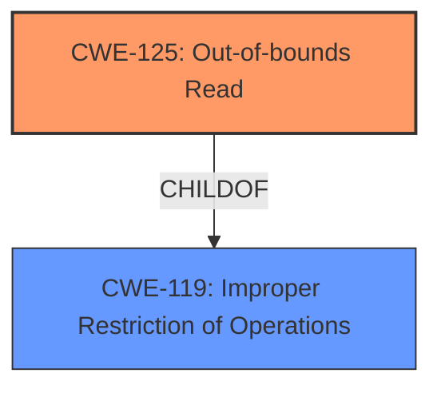

# Analysis Report for CVE-2025-5204

# Vulnerability Analysis Report: CVE-2025-5204

## Description

A vulnerability classified as problematic has been found in Open Asset Import Library Assimp 5.4.3. This affects the function MDLImporterParseSkinLump_3DGS_MDL7 of the file assimp/code/AssetLib/MDL/MDLMaterialLoader.cpp. The manipulation leads to **out-of-bounds read**. Attacking locally is a requirement. The exploit has been disclosed to the public and may be used. The project decided to collect all Fuzzer bugs in a main-issue to address them in the future.

## Vulnerability Description Key Phrases

- **Weakness:** out-of-bounds read
- **Product:** Open Asset Import Library Assimp
- **Version:** 5.4.3
- **Component:** MDLImporterParseSkinLump_3DGS_MDL7

## Analysis (with Relationship Data)

# Summary

| CWE ID  | CWE Name                                                                               | Confidence | CWE Abstraction Level | CWE Vulnerability Mapping Label | CWE-Vulnerability Mapping Notes |
| ------- | -------------------------------------------------------------------------------------- | ---------- | ----------------------- | ------------------------------- | ------------------------------- |
| CWE-125 | Out-of-bounds Read                                                                     | 1.0        | Base                    | Primary                         | Allowed                       |

## Evidence and Confidence

*   **Confidence Score:** 1.0
*   **Evidence Strength:** HIGH

## Relationship Analysis

The primary relationship influencing the CWE selection is the direct match of the vulnerability description to the definition of CWE-125. While other CWEs like CWE-119 (Improper Restriction of Operations within the Bounds of a Memory Buffer) are related, they are more general. The description explicitly states "**out-of-bounds read**," making CWE-125 the most specific and appropriate choice. No other relationships (Parent-Child, Peer, or Chain) strongly influence the primary selection.



## Vulnerability Chain

The vulnerability chain is relatively simple:

1.  **Root Cause:** A flaw in the code leads to an attempt to read data beyond the allocated buffer.
2.  **Weakness:** **Out-of-bounds read** (CWE-125).
3.  **Impact:** Application crash, potential information disclosure, or other undefined behavior.

## Summary of Analysis

The initial analysis and resulting conclusion are based strongly on the evidence provided in the vulnerability description, specifically the key phrase "**out-of-bounds read**". This phrase directly aligns with the definition of CWE-125. The detailed analysis from the "CVE Reference Links Content Summary" section further reinforces this conclusion, highlighting issues like "missing null termination" and "reading strings without proper null termination, leading to out-of-bounds reads."

The graph relationships, while showing connections to other CWEs like CWE-119, ultimately support the selection of CWE-125 due to its specificity. CWE-119 is a broader class, while CWE-125 directly describes the **weakness**.

The selected CWE (CWE-125) is at the optimal level of specificity (Base) because it accurately represents the **out-of-bounds read** condition described in the vulnerability.

# Enhanced Context (25 CWEs)
The following CWEs were identified as potentially relevant to this vulnerability:

## CWE-125: Out-of-bounds Read
**Abstraction Level**: Base
**Similarity Score**: 0.77
**Source**: dense

**Description**:
The product reads data past the end, or before the beginning, of the intended buffer.

**Mapping Guidance**:
- Usage: Allowed
- Rationale: This CWE entry is at the Base level of abstraction, which is a preferred level of abstraction for mapping to the root causes of vulnerabilities.


## CWE Relationship Analysis

Current CWEs represent these abstraction levels: .


### Vulnerability Chain Analysis

**Chain starting from CWE-119:**
- 119 (Improper Restriction of Operations within the Bounds of a Memory Buffer) - ROOT


**Chain starting from CWE-125:**
- 125 (Out-of-bounds Read) - ROOT


### CWE Relationship Diagram

```mermaid
graph TD
    classDef primary fill:#f96,stroke:#333,stroke-width:2px
    classDef secondary fill:#69f,stroke:#333
    classDef tertiary fill:#9e9,stroke:#333
```


*Report generated on 2025-07-15 03:33:24*
