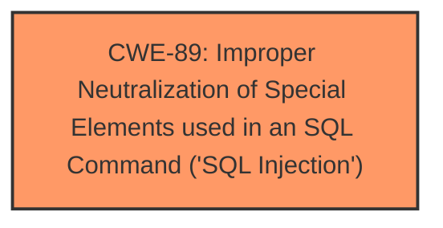

# Raw Analyzer Response for CVE-2025-5208

# Summary
| CWE ID | CWE Name | Confidence | CWE Abstraction Level | CWE Vulnerability Mapping Label | CWE-Vulnerability Mapping Notes |
|---|---|---|---|---|---|
| CWE-89 | Improper Neutralization of Special Elements used in an SQL Command ('SQL Injection') | 1.0 | Base | Allowed | Primary CWE |

## Evidence and Confidence

*   **Confidence Score:** 1.0
*   **Evidence Strength:** HIGH

## Relationship Analysis
The primary relationship considered was the parent-child relationship. While other CWEs were considered, CWE-89 was selected because it directly and specifically addresses the **SQL Injection** vulnerability described. The abstraction level is base, which is the preferred level. Other CWEs were considered, such as broader injection categories, but were deemed too general.

## Vulnerability Chain
The vulnerability chain consists of a single CWE:
1.  CWE-89: Improper Neutralization of Special Elements used in an SQL Command ('SQL Injection')

The root cause is the **improper neutralization** of input, which directly leads to the **SQL injection** vulnerability.

## Summary of Analysis
The vulnerability description clearly states that the vulnerability is an **SQL injection** in the `/admin/check_availability.php` file, caused by manipulating the `emailid` argument.

The Retriever Results strongly suggest CWE-89 as the primary candidate, with a score of 1.0.

The Complete CWE Specifications for CWE-89 describe the vulnerability precisely: "The product constructs all or part of an SQL command using externally-influenced input... but it does not neutralize or incorrectly neutralizes special elements that could modify the intended SQL command." This aligns perfectly with the vulnerability description.

Other CWEs were considered but ultimately deemed less relevant:

*   CWE-79 (Improper Neutralization of Input During Web Page Generation ('Cross-site Scripting')): While input neutralization is a factor, the specific issue is with SQL commands, not web page generation.
*   CWE-434 (Unrestricted Upload of File with Dangerous Type): This is not relevant to the described vulnerability, which involves **SQL injection**, not file uploads.
*   CWE-1336 (Improper Neutralization of Special Elements Used in a Template Engine): This is not relevant as the vulnerability isn't related to the improper neutralization of special elements in a Template Engine.
*   CWE-96 (Improper Neutralization of Directives in Statically Saved Code ('Static Code Injection')): This is not relevant as the vulnerability isn't related to code injection in statically saved code.

The analysis is based on the explicit mention of **SQL injection** in the vulnerability description: "The manipulation of the argument emailid leads to **sql injection**."

The selection of CWE-89 is at the optimal level of specificity, as it directly addresses the root cause and nature of the vulnerability.