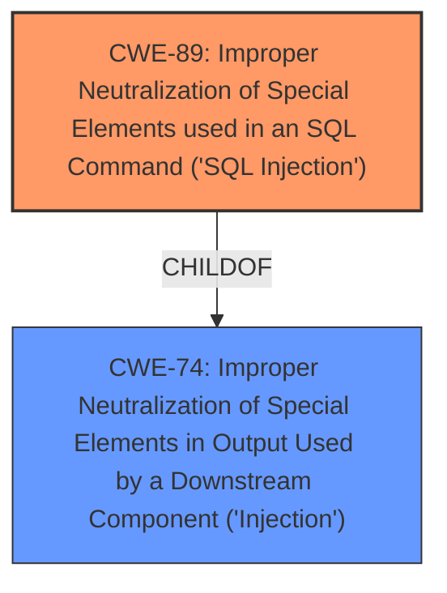

# Raw Analyzer Response for CVE-2025-5213

# Summary
| CWE ID | CWE Name | Confidence | CWE Abstraction Level | CWE Vulnerability Mapping Label | CWE-Vulnerability Mapping Notes |
|---|---|---|---|---|---|
| CWE-89 | Improper Neutralization of Special Elements used in an SQL Command ('SQL Injection') | 1.0 | Base | Primary | Allowed |

## Evidence and Confidence

*   **Confidence Score:** 1.0
*   **Evidence Strength:** HIGH

## Relationship Analysis
The primary relationship is that CWE-89 is a base-level weakness, providing a specific description of the **SQL injection** vulnerability. The other CWEs are either too general (like CWE-74) or represent different types of vulnerabilities that are not directly implicated by the description. The retriever results also strongly suggest CWE-89 as the primary mapping.

## Vulnerability Chain
The vulnerability chain is straightforward:

1.  **Root Cause:** **Improper neutralization** of special elements in SQL commands (CWE-89).
2.  Impact: **SQL Injection**, leading to unauthorized database access, sensitive data leakage, data tampering, system control, or service interruption.

## Summary of Analysis
The vulnerability description clearly indicates an **SQL injection** vulnerability in the `/admin/delete_file.php` component of the Projectworlds Responsive E-Learning System. The manipulation of the ID argument leads to the injection. The CVE Reference Links Content Summary confirms this by stating, "The vulnerability is due to the direct use of the 'id' parameter in SQL queries without proper cleaning or validation," which directly corresponds to CWE-89. The retriever results also strongly suggest CWE-89 as the primary mapping with a score of 1.0.

I considered CWE-74 "Improper Neutralization of Special Elements in Output Used by a Downstream Component ('Injection')", but it's a class-level CWE and CWE-89 is a more specific base-level CWE which is a better fit.

Relevant CWE Information:

# Enhanced Context (25 CWEs)
The following CWEs were identified as potentially relevant to this vulnerability:

## CWE-89: Improper Neutralization of Special Elements used in an SQL Command ('SQL Injection')
**Abstraction Level**: Base
**Similarity Score**: 1.00
**Source**: alternate_terms

**Description**:
The product constructs all or part of an SQL command using externally-influenced input from an upstream component, but it does not neutralize or incorrectly neutralizes special elements that could modify the intended SQL command when it is sent to a downstream component. Without sufficient removal or quoting of SQL syntax in user-controllable inputs, the generated SQL query can cause those inputs to be interpreted as SQL instead of ordinary user data.

**Mapping Guidance**:
- Usage: Allowed
- Rationale: This CWE entry is at the Base level of abstraction, which is a preferred level of abstraction for mapping to the root causes of vulnerabilities.