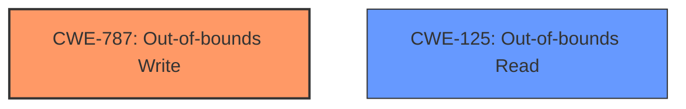

# Analysis for CVE-2025-5245

# Summary
| CWE ID | CWE Name | Confidence | CWE Abstraction Level | CWE Vulnerability Mapping Label | CWE-Vulnerability Mapping Notes |
|---|---|---|---|---|---|
| CWE-787 | Out-of-bounds Write | 0.9 | Base | Allowed | Primary CWE |
| CWE-125 | Out-of-bounds Read | 0.6 | Base | Allowed | Secondary Candidate |

## Evidence and Confidence

*   **Confidence Score:** 0.75
*   **Evidence Strength:** LOW

## Relationship Analysis
The primary relationship influencing the decision is the direct match of **memory corruption** to the effects of CWE-787 (Out-of-bounds Write). While other CWEs were considered, none aligned as directly with the vulnerability description. CWE-787 is a base level CWE, which is the preferred level of abstraction.

## Vulnerability Chain
The vulnerability chain starts with the **improper** handling of data within the `debug_type_samep` function, leading to an out-of-bounds write and resulting in **memory corruption**.

## Summary of Analysis
The initial assessment focused on identifying the root cause of the **memory corruption**. The retriever results pointed to CWE-787 (Out-of-bounds Write) as the most likely candidate, and the vulnerability description directly mentions **memory corruption**, which aligns with the typical consequences of an out-of-bounds write. The lack of specific details about the root cause within the `debug_type_samep` function makes it challenging to pinpoint a more precise CWE. Given the available information, CWE-787 appears to be the most appropriate and specific classification. The alternative CWEs considered, such as CWE-125 (Out-of-bounds Read), could be related but are less directly supported by the description, which explicitly mentions **memory corruption** (typically caused by writes, not reads).

Relevant CWE Information:

# Enhanced Context (25 CWEs)
The following CWEs were identified as potentially relevant to this vulnerability:

## CWE-787: Out-of-bounds Write
**Abstraction Level**: Base
**Similarity Score**: 1.00
**Source**: alternate_terms

**Description**:
CWE-787: Out-of-bounds Write

**Mapping Guidance**:
- Usage: Allowed
- Rationale: This CWE entry is at the Base level of abstraction, which is a preferred level of abstraction for mapping to the root causes of vulnerabilities.

**Relationships**:
- CANFOLLOW -> CWE-825
- CANFOLLOW -> CWE-824
- CANFOLLOW -> CWE-823
- CANFOLLOW -> CWE-822
- PARENTOF -> CWE-124

**Explanation:**
CWE-787 (Out-of-bounds Write) is the primary CWE because the vulnerability description explicitly states **memory corruption**, which is a direct consequence of writing data outside the intended memory boundaries. The function `debug_type_samep` is where the **improper** write operation occurs. This aligns directly with the CWE description. The security implication is that an attacker could overwrite critical data, potentially leading to arbitrary code execution.

## CWE-125: Out-of-bounds Read
**Abstraction Level**: Base
**Similarity Score**: 0.415
**Source**: sparse

**Description**:
The product reads data past the end, or before the beginning, of the intended buffer.

**Mapping Guidance**:
- Usage: Allowed
- Rationale: This CWE entry is at the Base level of abstraction, which is a preferred level of abstraction for mapping to the root causes of vulnerabilities.

**Explanation:**
CWE-125 (Out-of-bounds Read) was considered because out-of-bounds reads can sometimes precede or accompany out-of-bounds writes. However, the description focuses on **memory corruption**, making CWE-787 a more direct match. It's possible that an out-of-bounds read could occur as part of the vulnerability, but the primary effect described is **memory corruption**.