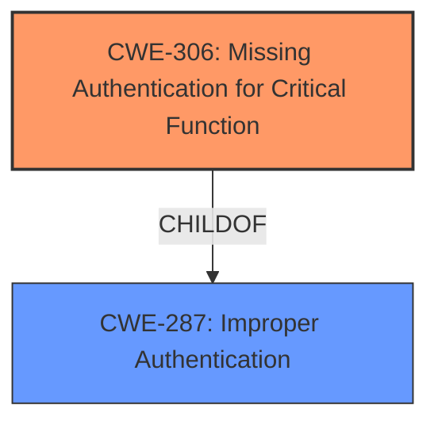

# Raw Analyzer Response for CVE-2025-5247

# Summary
| CWE ID | CWE Name | Confidence | CWE Abstraction Level | CWE Vulnerability Mapping Label | CWE-Vulnerability Mapping Notes |
|---|---|---|---|---|---|
| CWE-306 | Missing Authentication for Critical Function | 1.0 | Base | Allowed | Primary CWE: The application lacks authentication for a critical function, allowing unauthorized access. |
| CWE-287 | Improper Authentication | 0.7 | Class | Discouraged | Secondary Candidate: The vulnerability involves improper authentication, but CWE-306 is more specific as it highlights the absence of authentication. |

## Evidence and Confidence

*   **Confidence Score:** 1.0
*   **Evidence Strength:** HIGH

## Relationship Analysis
The primary relationship is between CWE-287 and CWE-306. CWE-306 is a child of CWE-287, indicating that the missing authentication is a specific type of improper authentication. Since the description highlights a **missing authentication** for a critical function, CWE-306 is more appropriate.

## Vulnerability Chain
The vulnerability chain starts with the **missing authentication** for the `LoadUrl` function. This allows an attacker to bypass authentication and access sensitive functionalities.

## Summary of Analysis
The initial analysis identified the **improper authentication** as a key weakness. The supporting evidence from the CVE reference links confirms that the `Jump` function is not properly authenticated, allowing for permission bypass by setting a specific cookie value. The retriever results also include CWE-306 (Missing Authentication for Critical Function) and CWE-287 (Improper Authentication), with CWE-306 being more relevant due to the explicit absence of authentication. The CWE classification guidance further supports this, emphasizing the distinction between missing authentication (CWE-306) and improper authorization (CWE-862, CWE-863).

The selection of CWE-306 is based on the explicit evidence of **missing authentication** for a critical function. The evidence from the github.com content clearly states that the `Jump` function under `hfish-master \view\login\ View.go` is not properly authenticated, leading to permission bypass. The attack involves setting the `is_login` cookie to "admin" to bypass authentication.

# Relevant CWE Information:

# Enhanced Context (25 CWEs)

## CWEs Considered But Not Used
*   CWE-287: Improper Authentication - While this is a parent of CWE-306, CWE-306 is more specific because the core issue is the complete absence of authentication, not merely an improperly implemented authentication mechanism.
*   CWE-862: Missing Authorization - The issue here is not about missing authorization checks after authentication, but the lack of authentication itself.
*   CWE-863: Incorrect Authorization - This is not applicable because there is no authorization check to be incorrect; authentication is entirely missing.
*   CWE-79, CWE-78, CWE-73, CWE-93, CWE-117, CWE-201, CWE-41: These are all injection-related or information leakage CWEs and are not relevant to the **missing authentication** issue described in the vulnerability.