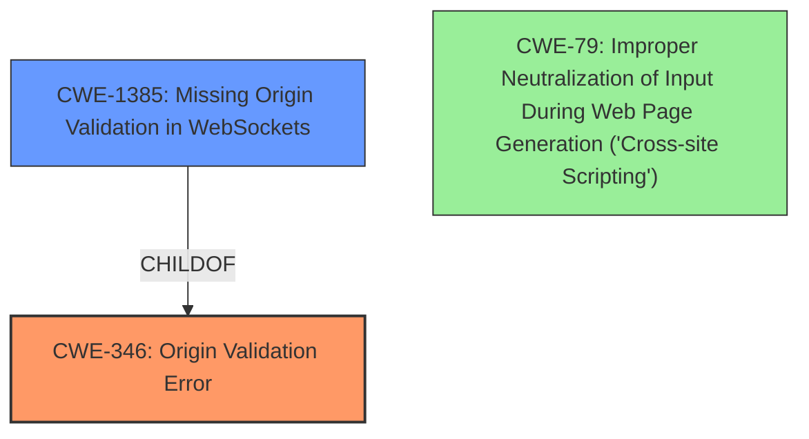

# Raw Analyzer Response for CVE-2025-5266

# Summary
| CWE ID | CWE Name | Confidence | CWE Abstraction Level | CWE Vulnerability Mapping Label | CWE-Vulnerability Mapping Notes |
|---|---|---|---|---|---|
| CWE-346 | Origin Validation Error | 0.8 | Class |  Primary | Allowed-with-Review |
| CWE-1385 | Missing Origin Validation in WebSockets | 0.7 | Variant | Secondary Candidate | Allowed |
| CWE-79 | Improper Neutralization of Input During Web Page Generation ('Cross-site Scripting') | 0.5 | Base | Secondary Candidate | Allowed |

## Evidence and Confidence

*   **Confidence Score:** 0.7
*   **Evidence Strength:** MEDIUM

## Relationship Analysis
The primary CWE is CWE-346 Origin Validation Error, which is a Class-level CWE. A more specific Variant, CWE-1385 Missing Origin Validation in WebSockets, was also considered and is a potential candidate. CWE-79 Improper Neutralization of Input During Web Page Generation ('Cross-site Scripting') was also considered because the vulnerability results in information leakage and XS-Leaks attacks, but is more of a result than a direct cause.

## Vulnerability Chain
The vulnerability chain starts with **missing origin validation**, leading to the loading of cross-origin resources, which then causes load and error events. These events leak information, ultimately enabling XS-Leaks attacks.
  - **Root Cause:** Missing Origin Validation (CWE-346)
  - **Weakness:** Loading of cross-origin resources
  - **Impact:** Information leakage, enabling XS-Leaks attacks

## Summary of Analysis
The initial analysis identified **cross-origin resource loading** as a **weakness**. The description points to an origin validation issue because the vulnerability involves script elements loading cross-origin resources, leading to information leakage.

The retriever results suggest several potential CWEs, including CWE-1385 (Missing Origin Validation in WebSockets), CWE-346 (Origin Validation Error), and CWE-79 (Improper Neutralization of Input During Web Page Generation ('Cross-site Scripting')).

CWE-346 (Origin Validation Error) is selected as the primary CWE because the **weakness** is in the **origin validation** of the resource loading. The description states "Script elements loading cross-origin resources generated load and error events which leaked information enabling XS-Leaks attacks.".

CWE-1385 (Missing Origin Validation in WebSockets) is a more specific variant of CWE-346, but it specifically refers to WebSockets. While the vulnerability involves web resources, it's not explicitly stated that WebSockets are involved. Thus, CWE-346 is more appropriate.

CWE-79 (Improper Neutralization of Input During Web Page Generation ('Cross-site Scripting')) relates to the impact of the vulnerability, i.e., enabling XS-Leaks attacks, rather than the root cause.

The selection of CWE-346 is at the Class level, however, there isn't sufficient evidence to make a more specific selection.

Relevant CWE Information:

# Enhanced Context (25 CWEs)
The following CWEs were identified as potentially relevant to this vulnerability:

## CWE-80: Improper Neutralization of Script-Related HTML Tags in a Web Page (Basic XSS)
**Abstraction Level**: Variant
**Similarity Score**: 0.76
**Source**: dense

**Description**:
The product receives input from an upstream component, but it does not neutralize or incorrectly neutralizes special characters such as "<", ">", and "&" that could be interpreted as web-scripting elements when they are sent to a downstream component that processes web pages.

**Mapping Guidance**:
- Usage: Allowed
- Rationale: This CWE entry is at the Variant level of abstraction, which is a preferred level of abstraction for mapping to the root causes of vulnerabilities.

## CWE-346: Origin Validation Error
**Abstraction Level**: Class
**Similarity Score**: 0.76
**Source**: dense

**Description**:
The product does not properly verify that the source of data or communication is valid.

**Mapping Guidance**:
- Usage: Allowed-with-Review
- Rationale: This CWE entry is a Class and might have Base-level children that would be more appropriate

## CWE-1385: Missing Origin Validation in WebSockets
**Abstraction Level**: Variant
**Similarity Score**: 0.75
**Source**: dense

**Description**:
The product uses a WebSocket, but it does not properly verify that the source of data or communication is valid.

**Mapping Guidance**:
- Usage: Allowed
- Rationale: This CWE entry is at the Variant level of abstraction, which is a preferred level of abstraction for mapping to the root causes of vulnerabilities.

## CWE-451: User Interface (UI) Misrepresentation of Critical Information
**Abstraction Level**: Class
**Similarity Score**: 0.75
**Source**: dense

**Description**:
The user interface (UI) does not properly represent critical information to the user, allowing the information - or its source - to be obscured or spoofed. This is often a component in phishing attacks.

**Mapping Guidance**:
- Usage: Allowed-with-Review
- Rationale: This CWE entry is a Class and might have Base-level children that would be more appropriate

## CWE-116: Improper Encoding or Escaping of Output
**Abstraction Level**: Class
**Similarity Score**: 0.74
**Source**: dense

**Description**:
The product prepares a structured message for communication with another component, but encoding or escaping of the data is either missing or done incorrectly. As a result, the intended structure of the message is not preserved.

**Mapping Guidance**:
- Usage: Allowed-with-Review
- Rationale: This CWE entry is a Class and might have Base-level children that would be more appropriate

## CWE-610: Externally Controlled Reference to a Resource in Another Sphere
**Abstraction Level**: Class
**Similarity Score**: 0.74
**Source**: dense

**Description**:
The product uses an externally controlled name or reference that resolves to a resource that is outside of the intended control sphere.

**Mapping Guidance**:
- Usage: Discouraged
- Rationale: This CWE entry is a level-1 Class (i.e., a child of a Pillar). It might have lower-level children that would be more appropriate

## CWE-923: Improper Restriction of Communication Channel to Intended Endpoints
**Abstraction Level**: Class
**Similarity Score**: 0.74
**Source**: dense

**Description**:
The product establishes a communication channel to (or from) an endpoint for privileged or protected operations, but it does not properly ensure that it is communicating with the correct endpoint.

**Mapping Guidance**:
- Usage: Allowed-with-Review
- Rationale: This CWE entry is a Class and might have Base-level children that would be more appropriate

## CWE-204: Observable Response Discrepancy
**Abstraction Level**: Base
**Similarity Score**: 0.72
**Source**: dense

**Description**:
The product provides different responses to incoming requests in a way that reveals internal state information to an unauthorized actor outside of the intended control sphere.

**Mapping Guidance**:
- Usage: Allowed
- Rationale: This CWE entry is at the Base level of abstraction, which is a preferred level of abstraction for mapping to the root causes of vulnerabilities.

## CWE-113: Improper Neutralization of CRLF Sequences in HTTP Headers ('HTTP Request/Response Splitting')
**Abstraction Level**: Variant
**Similarity Score**: 0.72
**Source**: dense

**Description**:
The product receives data from an HTTP agent/component (e.g., web server, proxy, browser, etc.), but it does not neutralize or incorrectly neutralizes CR and LF characters before the data is included in outgoing HTTP headers.

**Mapping Guidance**:
- Usage: Allowed
- Rationale: This CWE entry is at the Variant level of abstraction, which is a preferred level of abstraction for mapping to the root causes of vulnerabilities.

## CWE-942: Permissive Cross-domain Policy with Untrusted Domains
**Abstraction Level**: Variant
**Similarity Score**: 0.72
**Source**: dense

**Description**:
The product uses a cross-domain policy file that includes domains that should not be trusted.

**Mapping Guidance**:
- Usage: Allowed
- Rationale: This CWE entry is at the Variant level of abstraction, which is a preferred level of abstraction for mapping to the root causes of vulnerabilities.

## CWE-116: Improper Encoding or Escaping of Output