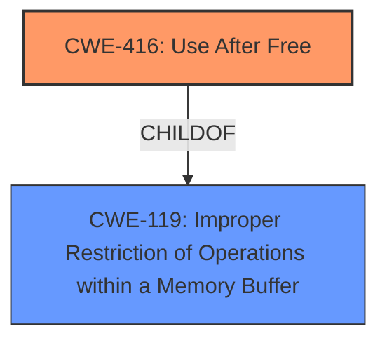

# Analysis for CVE-2025-5283

# Summary
| CWE ID | CWE Name | Confidence | CWE Abstraction Level | CWE Vulnerability Mapping Label | CWE-Vulnerability Mapping Notes |
|---|---|---|---|---|---|
| CWE-416 | Use After Free | 1.0 | Variant | Primary | Allowed |
| CWE-119 | Improper Restriction of Operations within a Memory Buffer | 0.5 | Class | Secondary | Allowed-with-Review |

## Evidence and Confidence

*   **Confidence Score:** 0.8
*   **Evidence Strength:** HIGH

## Relationship Analysis
The primary CWE is CWE-416, which is a variant of CWE-119. CWE-119 is a more general class of memory corruption vulnerabilities. The relationship between these CWEs is a parent-child relationship, where CWE-416 is a specific type of CWE-119.

## Vulnerability Chain
The vulnerability chain starts with a **use-after-free** (**CWE-416**), potentially leading to heap corruption. The root cause is the **improper** handling of memory, allowing access to freed memory locations. The impact is heap corruption, which can lead to arbitrary code execution.

## Summary of Analysis
The primary weakness is a **use-after-free** (**CWE-416**) vulnerability. This is supported by the vulnerability description that explicitly states "**Use after free** in libvpx...". The CVE Reference Links Content Summary also confirms the root cause as "**Use after free** in libvpx". The retriever results also list CWE-416 as the top candidate CWE.

CWE-119 (Improper Restriction of Operations within a Memory Buffer) is considered because CWE-416 is a variant of it. Given the specific nature of the vulnerability, CWE-416 is chosen as the primary CWE.

Relevant CWE Information:

# Enhanced Context (25 CWEs)
The following CWEs were identified as potentially relevant to this vulnerability:

## CWE-416: Use After Free
**Abstraction Level**: Variant
**Similarity Score**: 0.79
**Source**: dense

**Description**:
The product reuses or references memory after it has been freed. At some point afterward, the memory may be allocated again and saved in another pointer, while the original pointer references a location somewhere within the new allocation. Any operations using the original pointer are no longer valid because the memory "belongs" to the code that operates on the new pointer.

**Mapping Guidance**:
- Usage: Allowed
- Rationale: This CWE entry is at the Variant level of abstraction, which is a preferred level of abstraction for mapping to the root causes of vulnerabilities.
CWE-119: Improper Restriction of Operations within a Memory Buffer

# Enhanced Context (25 CWEs)
The following CWEs were identified as potentially relevant to this vulnerability:

## CWE-416: Use After Free
**Abstraction Level**: Variant
**Similarity Score**: 0.79
**Source**: dense

**Description**:
The product reuses or references memory after it has been freed. At some point afterward, the memory may be allocated again and saved in another pointer, while the original pointer references a location somewhere within the new allocation. Any operations using the original pointer are no longer valid because the memory "belongs" to the code that operates on the new pointer.

**Mapping Guidance**:
- Usage: Allowed
- Rationale: This CWE entry is at the Variant level of abstraction, which is a preferred level of abstraction for mapping to the root causes of vulnerabilities.