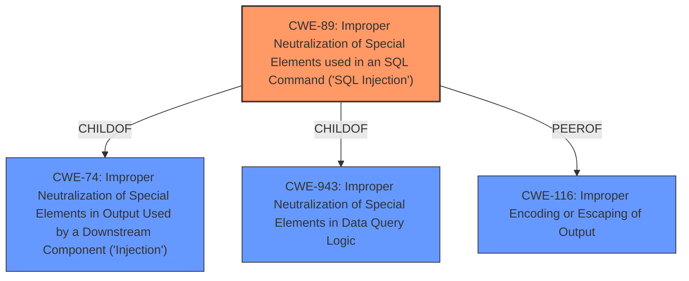

# Analysis Report for CVE-2025-5287

# Vulnerability Analysis Report: CVE-2025-5287

## Description

The Likes and Dislikes Plugin plugin for WordPress is vulnerable to SQL Injection via the post parameter in all versions up to, and including, 1.0.0 due to **insufficient escaping on the user supplied parameter and **lack of sufficient preparation** on the existing SQL query**. This makes it possible for unauthenticated attackers to append additional SQL queries into already existing queries that can be used to extract sensitive information from the database.

## Vulnerability Description Key Phrases

- **Rootcause:** ['insufficient escaping on the user supplied parameter and lack of sufficient preparation on the existing SQL query', 'insufficient escaping on user supplied parameter and lack of sufficient preparation on SQL query']
- **Weakness:** ['lack of sufficient preparation', 'improper escaping', 'SQL injection']
- **Impact:** ['append additional SQL queries into existing queries', 'extract sensitive information from the database']
- **Attacker:** unauthenticated attackers
- **Product:** Likes and Dislikes Plugin plugin for WordPress
- **Version:** up to and including 1.0.0

## Analysis (with Relationship Data)

# Summary
| CWE ID | CWE Name | Confidence | CWE Abstraction Level | CWE Vulnerability Mapping Label | CWE-Vulnerability Mapping Notes |
|---|---|---|---|---|---|
| CWE-89 | Improper Neutralization of Special Elements used in an SQL Command ('SQL Injection') | 1.0 | Base | Primary | Allowed |
| CWE-116 | Improper Encoding or Escaping of Output | 0.7 | Class | Secondary | Allowed-with-Review |

## Evidence and Confidence

*   **Confidence Score:** 0.9
*   **Evidence Strength:** HIGH

## Relationship Analysis
The primary CWE is CWE-89, which represents the **Improper Neutralization of Special Elements used in an SQL Command ('SQL Injection')**. This is a Base level CWE. CWE-89 is a child of CWE-74: Improper Neutralization of Special Elements in Output Used by a Downstream Component ('Injection') and CWE-943: Improper Neutralization of Special Elements in Data Query Logic. CWE-116, Improper Encoding or Escaping of Output, is a Class level CWE and a parent of more specific Base level CWEs related to encoding and escaping.



## Vulnerability Chain
The vulnerability chain starts with **insufficient escaping** and **lack of sufficient preparation** which leads to **SQL Injection**. This allows attackers to **append additional SQL queries** and **extract sensitive information**.

1.  Root Cause: **Insufficient Escaping** and **Lack of Sufficient Preparation**
2.  Weakness: **SQL Injection** (CWE-89)
3.  Impact: Appending SQL Queries, Extracting Sensitive Information

## Summary of Analysis
The vulnerability description clearly states that the Likes and Dislikes Plugin plugin for WordPress is vulnerable to SQL Injection due to **insufficient escaping** and **lack of sufficient preparation** on the existing SQL query. This allows unauthenticated attackers to append additional SQL queries and extract sensitive information.

The key phrases identified are:
*   **insufficient escaping on the user supplied parameter and lack of sufficient preparation on the existing SQL query**
*   **improper escaping**
*   **lack of sufficient preparation**
*   **SQL Injection**

The primary CWE is CWE-89 because the vulnerability description explicitly mentions "SQL Injection" and the root cause is directly related to **improper neutralization of special elements** in an SQL command. The description provides sufficient evidence to support this classification.

CWE-116 is considered a secondary CWE because the **insufficient escaping** contributes to the **Improper Encoding or Escaping of Output**. While the root cause is more specifically related to SQL injection, the lack of proper escaping is a contributing factor.

The other CWEs were considered but not selected because they were either too general (e.g., CWE-707), related to different types of injections (e.g., CWE-90, CWE-917), or not directly relevant to the root cause (e.g., CWE-352, CWE-425, CWE-472). CWE-89 provides the most specific and accurate classification of the vulnerability.

Relevant CWE Information:

# Enhanced Context (25 CWEs)
The following CWEs were identified as potentially relevant to this vulnerability:

## CWE-74: Improper Neutralization of Special Elements in Output Used by a Downstream Component ('Injection')
**Abstraction Level**: Class
**Similarity Score**: 0.73
**Source**: dense

**Description**:
The product constructs all or part of a command, data structure, or record using externally-influenced input from an upstream component, but it does not neutralize or incorrectly neutralizes special elements that could modify how it is parsed or interpreted when it is sent to a downstream component.

**Mapping Guidance**:
- Usage: Discouraged
- Rationale: CWE-74 is high-level and often misused when lower-level weaknesses are more appropriate.


## CWE-116: Improper Encoding or Escaping of Output
**Abstraction Level**: Class
**Similarity Score**: 0.72
**Source**: dense

**Description**:
The product prepares a structured message for communication with another component, but encoding or escaping of the data is either missing or done incorrectly. As a result, the intended structure of the message is not preserved.

**Mapping Guidance**:
- Usage: Allowed-with-Review
- Rationale: This CWE entry is a Class and might have Base-level children that would be more appropriate


## CWE-425: Direct Request ('Forced Browsing')
**Abstraction Level**: Base
**Similarity Score**: 0.72
**Source**: dense

**Description**:
The web application does not adequately enforce appropriate authorization on all restricted URLs, scripts, or files.

**Mapping Guidance**:
- Usage: Allowed
- Rationale: This CWE entry is at the Base level of abstraction, which is a preferred level of abstraction for mapping to the root causes of vulnerabilities.


## CWE-472: External Control of Assumed-Immutable Web Parameter
**Abstraction Level**: Base
**Similarity Score**: 0.72
**Source**: dense

**Description**:
The web application does not sufficiently verify inputs that are assumed to be immutable but are actually externally controllable, such as hidden form fields.

**Mapping Guidance**:
- Usage: Allowed
- Rationale: This CWE entry is at the Base level of abstraction, which is a preferred level of abstraction for mapping to the root causes of vulnerabilities.


## CWE-138: Improper Neutralization of Special Elements
**Abstraction Level**: Class
**Similarity Score**: 0.72
**Source**: dense

**Description**:
The product receives input from an upstream component, but it does not neutralize or incorrectly neutralizes special elements that could be interpreted as control elements or syntactic markers when they are sent to a downstream component.

**Mapping Guidance**:
- Usage: Discouraged
- Rationale: This CWE entry is a level-1 Class (i.e., a child of a Pillar). It might have lower-level children that would be more appropriate


## CWE-352: Cross-Site Request Forgery (CSRF)
**Abstraction Level**: Compound
**Similarity Score**: 0.72
**Source**: dense

**Description**:
The web application does not, or can not, sufficiently verify whether a well-formed, valid, consistent request was intentionally provided by the user who submitted the request.

**Mapping Guidance**:
- Usage: Allowed
- Rationale: This is a well-known Composite of multiple weaknesses that must all occur simultaneously, although it is attack-oriented in nature.


## CWE-184: Incomplete List of Disallowed Inputs
**Abstraction Level**: Base
**Similarity Score**: 0.72
**Source**: dense

**Description**:
The product implements a protection mechanism that relies on a list of inputs (or properties of inputs) that are not allowed by policy or otherwise require other action to neutralize before additional processing takes place, but the list is incomplete.

**Mapping Guidance**:
- Usage: Allowed
- Rationale: This CWE entry is at the Base level of abstraction, which is a preferred level of abstraction for mapping to the root causes of vulnerabilities.


## CWE-1390: Weak Authentication
**Abstraction Level**: Class
**Similarity Score**: 0.71
**Source**: dense

**Description**:
The product uses an authentication mechanism to restrict access to specific users or identities, but the mechanism does not sufficiently prove that the claimed identity is correct.

**Mapping Guidance**:
- Usage: Allowed-with-Review
- Rationale: This CWE entry is a Class and might have Base-level children that would be more appropriate


## CWE-212: Improper Removal of Sensitive Information Before Storage or Transfer
**Abstraction Level**: Base
**Similarity Score**: 0.71
**Source**: dense

**Description**:
The product stores, transfers, or shares a resource that contains sensitive information, but it does not properly remove that information before the product makes the resource available to unauthorized actors.

**Mapping Guidance**:
- Usage: Allowed
- Rationale: This CWE entry is at the Base level of abstraction, which is a preferred level of abstraction for mapping to the root causes of vulnerabilities.


## CWE-303: Incorrect Implementation of Authentication Algorithm
**Abstraction Level**: Base
**Similarity Score**: 0.71
**Source**: dense

**


## CWE Relationship Analysis

Current CWEs represent these abstraction levels: .


### Vulnerability Chain Analysis

**Chain starting from CWE-90:**
- 90 (Improper Neutralization of Special Elements used in an LDAP Query ('LDAP Injection')) - ROOT


**Chain starting from CWE-89:**
- 89 (Improper Neutralization of Special Elements used in an SQL Command ('SQL Injection')) - ROOT


### CWE Relationship Diagram

```mermaid
graph TD
    classDef primary fill:#f96,stroke:#333,stroke-width:2px
    classDef secondary fill:#69f,stroke:#333
    classDef tertiary fill:#9e9,stroke:#333
```


*Report generated on 2025-07-15 03:47:54*
