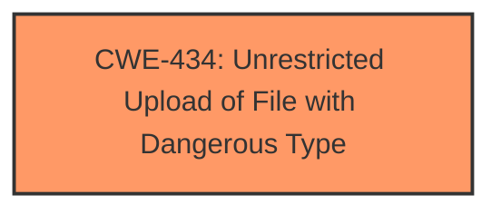

# Analysis Report for CVE-2025-5299

# Vulnerability Analysis Report: CVE-2025-5299

## Description

A vulnerability was found in SourceCodester Client Database Management System 1.0. It has been declared as critical. This vulnerability affects unknown code of the file /user_order_customer_update.php. The manipulation of the argument uploaded_file_cancelled leads to **unrestricted upload**. The attack can be initiated remotely. The exploit has been disclosed to the public and may be used.

## Vulnerability Description Key Phrases

- **Weakness:** unrestricted upload
- **Vector:** manipulation of the argument uploaded_file_cancelled
- **Product:** SourceCodester Client Database Management System
- **Version:** 1
- **Component:** /user_order_customer_update.php

## Analysis (with Relationship Data)

# Summary

| CWE ID | CWE Name | Confidence | CWE Abstraction Level | CWE Vulnerability Mapping Label | CWE-Vulnerability Mapping Notes |
|---|---|---|---|---|---|
| CWE-434 | Unrestricted Upload of File with Dangerous Type | 1.0 | Base | Allowed | Primary CWE |

## Evidence and Confidence

*   **Confidence Score:** 1.0
*   **Evidence Strength:** HIGH

## Relationship Analysis

The primary identified CWE is CWE-434. No direct parent-child or chain relationships appear crucial in this specific instance. The abstraction level (Base) is appropriate given the direct evidence of an unrestricted file upload.



## Vulnerability Chain

The vulnerability chain is straightforward:

1.  **Root Cause:** **Unrestricted upload** of a file due to missing or insufficient input validation on the `uploaded_file_cancelled` parameter. (CWE-434)
2.  **Impact:** Attackers can upload malicious PHP scripts, potentially leading to unauthorized database access, data leakage, system control, or service interruption.

## Summary of Analysis

The vulnerability description clearly states that the **weakness** is an **unrestricted upload** due to manipulation of the `uploaded_file_cancelled` argument in `/user_order_customer_update.php`. The CVE Reference Links Content Summary confirms this, stating: "The attacker can upload a malicious PHP script file in the "uploaded_file_cancelled" parameter" and that the vulnerability stems from insufficient user input validation.

The Retriever Results list CWE-434 as the second-highest match, supporting the initial assessment. The description of CWE-434, "The product allows the upload or transfer of dangerous file types that are automatically processed within its environment," aligns perfectly with the vulnerability.

CWE-434 is a Base-level CWE, which is the preferred level of abstraction. The usage is "Allowed," and the rationale provided by MITRE is that this level is preferred for mapping to the root causes of vulnerabilities.

Other CWEs were considered, but did not fit as well:

*   CWE-89 (Improper Neutralization of Special Elements used in an SQL Command ('SQL Injection')): While the impact could lead to database access, the root cause is file upload, not SQL injection.
*   CWE-79 (Improper Neutralization of Input During Web Page Generation ('Cross-site Scripting')): The root cause is file upload and not neutralization of input during web page generation.
*   CWE-73 (External Control of File Name or Path): While the attacker controls the file uploaded, the primary issue is the unrestricted upload of dangerous file types, not simply control over the file path.
*   CWE-94 (Improper Control of Generation of Code ('Code Injection')): This is more focused on code injection itself, whereas this vulnerability starts with a file upload.

The evidence strongly supports the selection of CWE-434 as the primary CWE.


## CWE Relationship Analysis

Current CWEs represent these abstraction levels: .


### Vulnerability Chain Analysis

**Chain starting from CWE-89:**
- 89 (Improper Neutralization of Special Elements used in an SQL Command ('SQL Injection')) - ROOT


**Chain starting from CWE-94:**
- 94 (Improper Control of Generation of Code ('Code Injection')) - ROOT


### CWE Relationship Diagram

```mermaid
graph TD
    classDef primary fill:#f96,stroke:#333,stroke-width:2px
    classDef secondary fill:#69f,stroke:#333
    classDef tertiary fill:#9e9,stroke:#333
```


*Report generated on 2025-07-15 03:49:11*
