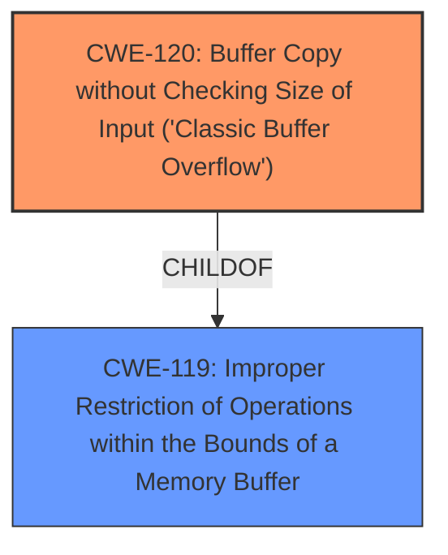

# Enhanced Analysis for CVE-2025-5331

# Summary
| CWE ID | CWE Name | Confidence | CWE Abstraction Level | CWE Vulnerability Mapping Label | CWE-Vulnerability Mapping Notes |
|---|---|---|---|---|---|
| CWE-120 | Buffer Copy without Checking Size of Input ('Classic Buffer Overflow') | 0.9 | Base | Allowed-with-Review | Primary CWE |
| CWE-119 | Improper Restriction of Operations within the Bounds of a Memory Buffer | 0.7 | Class | Discouraged | Secondary Candidate |

## Evidence and Confidence

*   **Confidence Score:** 0.8
*   **Evidence Strength:** MEDIUM

## Relationship Analysis
The primary CWE is CWE-120, which is a base-level CWE. CWE-119 is a class-level CWE and a parent of CWE-120. While CWE-119 is more general, CWE-120 is more specific to the vulnerability description involving a buffer copy without checking size, leading to a buffer overflow.



## Vulnerability Chain
The vulnerability chain starts with the **buffer overflow** due to the **lack of input size validation** during the buffer copy operation (CWE-120). This leads to memory corruption and potentially arbitrary code execution.

## Summary of Analysis
The vulnerability description explicitly states a **buffer overflow** in the NLST Command Handler of PCMan FTP Server 2.0.7. The most appropriate CWE is CWE-120, "Buffer Copy without Checking Size of Input ('Classic Buffer Overflow')", which directly reflects the described weakness.

The retriever results list CWE-119, "Improper Restriction of Operations within the Bounds of a Memory Buffer", as the top candidate. While this is a related CWE, it is a more general class of weakness. CWE-120 is a base CWE that is a child of CWE-119. Since the vulnerability description specifically mentions a **buffer overflow** due to copying without checking size, CWE-120 is a more precise match.

CWE-120 is appropriate because the description refers to an overflow due to the manipulation of the NLST Command Handler, leading to a **buffer overflow**. The key factor is that data is copied to a buffer without proper size validation.

Other CWEs considered but not used:

*   CWE-190 (Integer Overflow or Wraparound): This CWE is not applicable because the vulnerability is not related to integer overflows.
*   CWE-89 (Improper Neutralization of Special Elements used in an SQL Command ('SQL Injection')): This CWE is not applicable because the vulnerability is not related to SQL injection.
*   CWE-79 (Improper Neutralization of Input During Web Page Generation ('Cross-site Scripting')): This CWE is not applicable because the vulnerability is not related to cross-site scripting.
*   CWE-125 (Out-of-bounds Read): This CWE is not applicable because the vulnerability is not related to reading out-of-bounds.
*   CWE-434 (Unrestricted Upload of File with Dangerous Type): This CWE is not applicable because the vulnerability is not related to file uploads.
*   CWE-121 (Stack-based Buffer Overflow): This CWE is too specific, as the location of the **buffer overflow** (heap or stack) is not mentioned in the description.
*   CWE-128 (Wrap-around Error): This CWE is not applicable because the vulnerability is not related to wrap-around errors.


## CWE Relationship Analysis

Current CWEs represent these abstraction levels: .


### Vulnerability Chain Analysis

**Chain starting from CWE-89:**
- 89 (Improper Neutralization of Special Elements used in an SQL Command ('SQL Injection')) - ROOT


**Chain starting from CWE-121:**
- 121 (Stack-based Buffer Overflow) - ROOT


### CWE Relationship Diagram

```mermaid
graph TD
    classDef primary fill:#f96,stroke:#333,stroke-width:2px
    classDef secondary fill:#69f,stroke:#333
    classDef tertiary fill:#9e9,stroke:#333
```