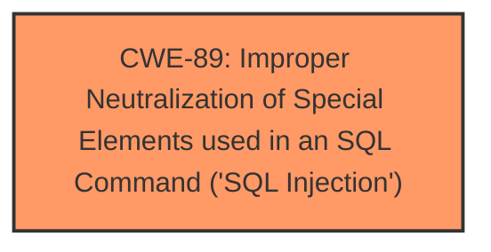

# Analysis Report for CVE-2025-5362

# Vulnerability Analysis Report: CVE-2025-5362

## Description

A vulnerability, which was classified as critical, was found in Campcodes Online Hospital Management System 1.0. Affected is an unknown function of the file /admin/doctor-specilization.php. The manipulation of the argument doctorspecilization leads to **sql injection**. It is possible to launch the attack remotely. The exploit has been disclosed to the public and may be used.

## Vulnerability Description Key Phrases

- **Weakness:** sql injection
- **Vector:** manipulation of argument doctorspecilization
- **Product:** Campcodes Online Hospital Management System
- **Version:** 1
- **Component:** /admin/doctor-specilization.php

## Analysis (with Relationship Data)

# Summary
| CWE ID | CWE Name | Confidence | CWE Abstraction Level | CWE Vulnerability Mapping Label | CWE-Vulnerability Mapping Notes |
|---|---|---|---|---|---|
| CWE-89 | Improper Neutralization of Special Elements used in an SQL Command ('SQL Injection') | 1.0 | Base | Allowed | Primary CWE. The **root cause** is the **improper neutralization** of special elements in an SQL command. |

## Evidence and Confidence

*   **Confidence Score:** 1.0
*   **Evidence Strength:** HIGH

## Relationship Analysis
The primary relationship that influenced the decision was the direct match of the vulnerability description to the CWE-89 description. There were no other relationships needed to arrive at this decision.



## Vulnerability Chain
The vulnerability chain consists of a single step:

1.  **Root Cause:** **Improper neutralization** of special elements used in an SQL command (CWE-89) leading directly to the **SQL Injection**.

## Summary of Analysis
The initial analysis strongly pointed towards CWE-89 due to the clear description of an **SQL injection vulnerability**. The CVE Reference Links Content Summary explicitly states that the **root cause** is the **lack of appropriate cleaning or validation** of the 'doctorspecilization' parameter, which is then directly used in SQL queries. The provided payload example further solidifies this assessment. The retriever results also listed CWE-89 as the top match. Therefore, CWE-89 is the most appropriate and specific classification.

Relevant CWE Information:

# Enhanced Context (25 CWEs)
The following CWEs were identified as potentially relevant to this vulnerability:

## CWE-89: Improper Neutralization of Special Elements used in an SQL Command ('SQL Injection')
**Abstraction Level**: Base
**Similarity Score**: 0.81
**Source**: dense

**Description**:
The product constructs all or part of an SQL command using externally-influenced input from an upstream component, but it does not neutralize or incorrectly neutralizes special elements that could modify the intended SQL command when it is sent to a downstream component. Without sufficient removal or quoting of SQL syntax in user-controllable inputs, the generated SQL query can cause those inputs to be interpreted as SQL instead of ordinary user data.

**Mapping Guidance**:
- Usage: Allowed
- Rationale: This CWE entry is at the Base level of abstraction, which is a preferred level of abstraction for mapping to the root causes of vulnerabilities.

## Vulnerability Description
A vulnerability, which was classified as critical, was found in Campcodes Online Hospital Management System 1.0. Affected is an unknown function of the file /admin/doctor-specilization.php. The manipulation of the argument doctorspecilization leads to **sql injection**. It is possible to launch the attack remotely. The exploit has been disclosed to the public and may be used.

### Vulnerability Description Key Phrases
- **weakness:** **sql injection**
- **vector:** manipulation of argument doctorspecilization
- **product:** Campcodes Online Hospital Management System
- **version:** 1
- **component:** /admin/doctor-specilization.php

## CVE Reference Links Content Summary
The content relates to CVE-2025-5362. Here's the extracted information:

**Root cause of vulnerability:**

*   A SQL injection vulnerability was found in the '/hms/admin/doctor-specilization.php' file of the 'Online Hospital Management System' project. The reason for this issue is that attackers inject malicious code from the parameter 'doctorspecilization' and use it directly in SQL queries without the need for appropriate cleaning or validation.

**Weaknesses/vulnerabilities present:**

*   SQL injection

**Impact of exploitation:**

*   Attackers can exploit this SQL injection vulnerability to achieve unauthorized database access, sensitive data leakage, data tampering, comprehensive system control, and even service interruption.

**Attack vectors:**

*   The '/hms/admin/doctor-specilization.php' file is vulnerable via the 'doctorspecilization' parameter.
*   No login or authorization is required to exploit this vulnerability.

**Required attacker capabilities/position:**

*   An attacker needs to be able to send crafted HTTP POST requests to the vulnerable file. No authentication is required.

**Mitigation or fix:**

*   Use prepared statements and parameter binding.
*   Input validation and filtering.
*   Minimize database user permissions.
*   Regular security audits.

**Payload Example:**

```
Parameter: doctorspecilization (POST)
    Type: time-based blind
    Title: MySQL >= 5.0.12 AND time-based blind (query SLEEP)
    Payload: doctorspecilization=111' AND (SELECT 4662 FROM (SELECT(SLEEP(5)))PFML) AND 'ziXa'='ziXa&submit=
```

**Additional Details (more than official CVE description):**

*   The vulnerable software is campcodes Online Hospital Management System V1.0.
*   A link to the software download is provided: <https://www.campcodes.com/downloads/complete-online-hospital-management-system-using-php-and-mysql-source-code/?wpdmdl=5553&ind=0>
*   The issue was reported by ASantsSec.
*   SQLmap was used to verify the vulnerability.
*   Screenshots of SQLmap output are included.

## Retriever Results

### Top Combined Results

| Rank | CWE ID | Name | Abstraction | Usage  | Retrievers | Individual Scores |
|------|--------|------|-------------|-------|------------|-------------------|
| 1 | 89 | Improper Neutralization of Special Elements used in an SQL Command ('SQL Injection') | Base | Allowed | alternate_terms | 1.000 |
| 2 | 79 | Improper Neutralization of Input During Web Page Generation ('Cross-site Scripting') | Base | Allowed | sparse | 0.421 |
| 3 | 434 | Unrestricted Upload of File with Dangerous Type | Base | Allowed | sparse | 0.360 |
| 4 | 1336 | Improper Neutralization of Special Elements Used in a Template Engine | Base | Allowed | sparse | 0.347 |
| 5 | 705 | Incorrect Control Flow Scoping | Class | Allowed-with-Review | sparse | 0.332 |
| 6 | 352 | Cross-Site Request Forgery (CSRF) | Compound | Allowed | sparse | 0.329 |
| 7 | 99 | Improper Control of Resource Identifiers ('Resource Injection') | Class | Allowed-with-Review | sparse | 0.325 |
| 8 | 117 | Improper Output Neutralization for Logs | Base | Allowed | sparse | 0.325 |
| 9 | 96 | Improper Neutralization of Directives in Statically Saved Code ('Static Code Injection') | Base | Allowed | dense | 0.597 |
| 10 | 425 | Direct Request ('Forced Browsing') | Base | Allowed | graph | 0.002 |


## CWE Relationship Analysis

Current CWEs represent these abstraction levels: .


### Vulnerability Chain Analysis

**Chain starting from CWE-89:**
- 89 (Improper Neutralization of Special Elements used in an SQL Command ('SQL Injection')) - ROOT


### CWE Relationship Diagram

```mermaid
graph TD
    classDef primary fill:#f96,stroke:#333,stroke-width:2px
    classDef secondary fill:#69f,stroke:#333
    classDef tertiary fill:#9e9,stroke:#333
```


*Report generated on 2025-07-15 03:53:52*
