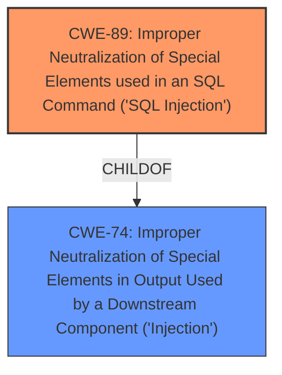

# Enhanced Analysis for CVE-2025-5364

# Summary

| CWE ID | CWE Name | Confidence | CWE Abstraction Level | CWE Vulnerability Mapping Label | CWE-Vulnerability Mapping Notes |
|---|---|---|---|---|---|
| CWE-89 | Improper Neutralization of Special Elements used in an SQL Command ('SQL Injection') | 1.0 | Base | Allowed | Primary CWE |

## Evidence and Confidence

*   **Confidence Score:** 1.0
*   **Evidence Strength:** HIGH

## Relationship Analysis
The primary relationship impacting the CWE selection is that CWE-89 is a base-level weakness that directly addresses the root cause described in the vulnerability. While CWE-74 is a parent class, CWE-89 provides a more specific and accurate representation of the **SQL Injection** vulnerability.



## Vulnerability Chain
The vulnerability chain consists of the following:
1.  **Root Cause:** Improper neutralization of special elements in SQL commands (CWE-89).
2.  **Impact:** Unauthorized database access, sensitive data leakage, data tampering, comprehensive system control, and even service interruption.

## Summary of Analysis
The analysis is based on direct evidence from the vulnerability description and CVE reference. The key phrase "**sql injection**" and the description of how the `patname` argument is manipulated to inject malicious code directly into SQL queries clearly indicate CWE-89. The CVE reference summary explicitly states the **root cause** as a SQL injection vulnerability due to the lack of proper input cleaning or validation. The recommended mitigations (prepared statements, input validation) further support this classification. The retriever results also strongly suggest CWE-89 as the primary weakness.

CWE-74 was considered but not selected as the primary CWE because it is a more general "Injection" class, while CWE-89 specifically addresses the SQL Injection vulnerability described. The MITRE mapping guidance discourages using CWE-74 when a lower-level weakness is more appropriate.
CWE-79 was considered as it is also a common web vulnerability, but is a "Cross-site Scripting" vulnerability, and does not fit the description.
CWE-434 was considered, but is an "Unrestricted Upload of File with Dangerous Type" vulnerability, and does not fit the description.

Relevant CWE Information:

# Enhanced Context (25 CWEs)
The following CWEs were identified as potentially relevant to this vulnerability:

## CWE-89: Improper Neutralization of Special Elements used in an SQL Command ('SQL Injection')
**Abstraction Level**: Base
**Similarity Score**: 0.79
**Source**: dense

**Description**:
The product constructs all or part of an SQL command using externally-influenced input from an upstream component, but it does not neutralize or incorrectly neutralizes special elements that could modify the intended SQL command when it is sent to a downstream component. Without sufficient removal or quoting of SQL syntax in user-controllable inputs, the generated SQL query can cause those inputs to be interpreted as SQL instead of ordinary user data.

**Mapping Guidance**:
- Usage: Allowed
- Rationale: This CWE entry is at the Base level of abstraction, which is a preferred level of abstraction for mapping to the root causes of vulnerabilities.

## Vulnerability Description
A vulnerability was found in Campcodes Online Hospital Management System 1.0 and classified as critical. Affected by this issue is some unknown functionality of the file /doctor/add-patient.php. The manipulation of the argument patname leads to **sql injection**. The attack may be launched remotely. The exploit has been disclosed to the public and may be used.

### Vulnerability Description Key Phrases
- **weakness:** **sql injection**
- **vector:** manipulation of patname argument
- **product:** Campcodes Online Hospital Management System
- **version:** 1
- **component:** /doctor/add-patient.php

## CVE Reference Links Content Summary
The content relates to CVE-2025-5364. Here's the extracted information:

**Root cause of vulnerability:**

*   A SQL injection vulnerability was found in the '/hms/doctor/add-patient.php' file of the 'Online Hospital Management System' project. The reason for this issue is that attackers inject malicious code from the parameter 'patname' and use it directly in SQL queries without the need for appropriate cleaning or validation.

**Weaknesses/vulnerabilities present:**

*   SQL injection

**Impact of exploitation:**

*   Attackers can exploit this SQL injection vulnerability to achieve unauthorized database access, sensitive data leakage, data tampering, comprehensive system control, and even service interruption.

**Attack vectors:**

*   The vulnerability exists in the `/hms/doctor/add-patient.php` file.
*   The 'patname' parameter is vulnerable.
*   No login or authorization is required to exploit this vulnerability.

**Required attacker capabilities/position:**

*   An attacker needs to be able to send a crafted POST request to `/hms/doctor/add-patient.php` with a malicious payload in the 'patname' parameter.

**Mitigation or fix:**

*   Use prepared statements and parameter binding.
*   Input validation and filtering.
*   Minimize database user permissions.
*   Regular security audits.

**Payload Example:**

```
Parameter: patname (POST)
    Type: time-based blind
    Title: MySQL >= 5.0.12 AND time-based blind (query SLEEP)
    Payload: patname=1' AND (SELECT 4228 FROM (SELECT(SLEEP(5)))akBg) AND 'hfBq'='hfBq&patcontact=1&patemail=111@qq.com&pataddress=1&patage=1&medhis=1&submit=
```

**Additional Details (more than official CVE description):**

*   The vulnerable software is campcodes Online Hospital Management System V1.0.
*   A link to the software download is provided: <https://www.campcodes.com/downloads/complete-online-hospital-management-system-using-php-and-mysql-source-code/?wpdmdl=5553&ind=0>
*   The issue was reported by 袁超 (Yuan Chao).
*   SQLmap was used to verify the vulnerability.
*   Screenshots of SQLmap output are included.


## CWE Relationship Analysis

Current CWEs represent these abstraction levels: .


### Vulnerability Chain Analysis

**Chain starting from CWE-89:**
- 89 (Improper Neutralization of Special Elements used in an SQL Command ('SQL Injection')) - ROOT


**Chain starting from CWE-79:**
- 79 (Improper Neutralization of Input During Web Page Generation ('Cross-site Scripting')) - ROOT


### CWE Relationship Diagram

```mermaid
graph TD
    classDef primary fill:#f96,stroke:#333,stroke-width:2px
    classDef secondary fill:#69f,stroke:#333
    classDef tertiary fill:#9e9,stroke:#333
```