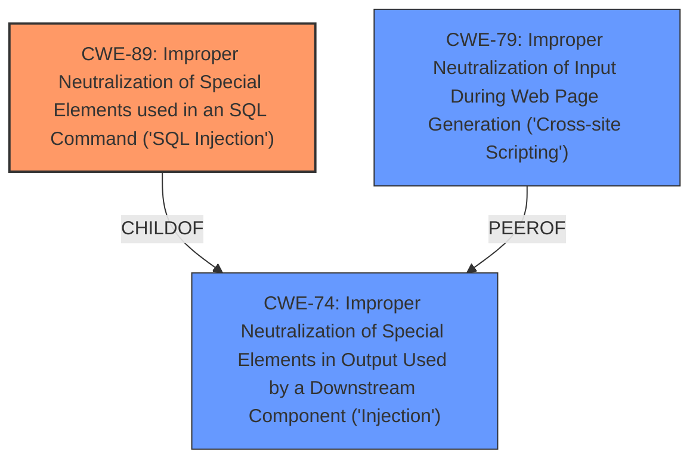

# Enhanced Analysis for CVE-2025-5370

# Summary
| CWE ID | CWE Name | Confidence | CWE Abstraction Level | CWE Vulnerability Mapping Label | CWE-Vulnerability Mapping Notes |
|---|---|---|---|---|---|
| CWE-89 | Improper Neutralization of Special Elements used in an SQL Command ('SQL Injection') | 1.0 | Base | Primary | Allowed |

## Evidence and Confidence

*   **Confidence Score:** 1.0
*   **Evidence Strength:** HIGH

## Relationship Analysis
The primary relationship identified is that CWE-89 stands as a base weakness, directly addressing the **SQL Injection** **weakness**. Other relationships, like those involving CWE-79 or CWE-74, are less directly applicable as they represent different forms of injection or neutralization failures. The abstraction levels were also considered, favoring the Base level of CWE-89 for its specificity.



## Vulnerability Chain
The vulnerability chain is straightforward: **Improper handling of the username parameter** leads directly to **SQL Injection**.

## Summary of Analysis
The analysis is strongly based on the evidence provided, specifically the **weakness** being an **SQL Injection** due to the manipulation of the Username argument. The CVE Reference Links Content Summary confirms the root cause as the lack of proper sanitization of the "username" parameter, leading to **SQL Injection**. The retriever results also strongly suggest CWE-89 as the primary candidate, with a score of 1.0. The other CWEs were considered but were not as specific to the described vulnerability. The selection of CWE-89 is at the optimal level of specificity, as it directly addresses the identified **SQL Injection** **weakness**.

Relevant CWE Information:

# Enhanced Context (25 CWEs)
The following CWEs were identified as potentially relevant to this vulnerability:

## CWE-89: Improper Neutralization of Special Elements used in an SQL Command ('SQL Injection')
**Abstraction Level**: Base
**Similarity Score**: 0.78
**Source**: dense

**Description**:
The product constructs all or part of an SQL command using externally-influenced input from an upstream component, but it does not neutralize or incorrectly neutralizes special elements that could modify the intended SQL command when it is sent to a downstream component. Without sufficient removal or quoting of SQL syntax in user-controllable inputs, the generated SQL query can cause those inputs to be interpreted as SQL instead of ordinary user data.

**Mapping Guidance**:
- Usage: Allowed
- Rationale: This CWE entry is at the Base level of abstraction, which is a preferred level of abstraction for mapping to the root causes of vulnerabilities.


## CWE Relationship Analysis

Current CWEs represent these abstraction levels: .


### Vulnerability Chain Analysis

**Chain starting from CWE-89:**
- 89 (Improper Neutralization of Special Elements used in an SQL Command ('SQL Injection')) - ROOT


**Chain starting from CWE-79:**
- 79 (Improper Neutralization of Input During Web Page Generation ('Cross-site Scripting')) - ROOT


### CWE Relationship Diagram

```mermaid
graph TD
    classDef primary fill:#f96,stroke:#333,stroke-width:2px
    classDef secondary fill:#69f,stroke:#333
    classDef tertiary fill:#9e9,stroke:#333
```