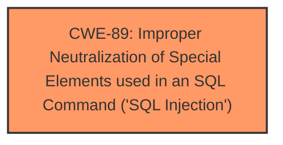

# Raw Analyzer Response for CVE-2025-5376

# Summary
| CWE ID | CWE Name | Confidence | CWE Abstraction Level | CWE Vulnerability Mapping Label | CWE-Vulnerability Mapping Notes |
|---|---|---|---|---|---|
| CWE-89 | Improper Neutralization of Special Elements used in an SQL Command ('SQL Injection') | 1.0 | Base | Allowed | Primary CWE. The manipulation of the argument itr_no leads to **sql injection**. |

## Evidence and Confidence

*   **Confidence Score:** 1.0
*   **Evidence Strength:** HIGH

## Relationship Analysis
The primary relationship that influenced my decision was the direct match of the vulnerability description to the definition and examples of CWE-89. There are no relevant parent-child or chain relationships to consider in this case, as the vulnerability is a straightforward instance of SQL Injection. The abstraction level is Base, which is appropriate for directly mapping the root cause.

## Vulnerability Chain
The vulnerability chain is straightforward:
1.  **Root Cause:** CWE-89 - Improper Neutralization of Special Elements used in an SQL Command ('SQL Injection') due to **lack of proper input validation** of the `itr_no` parameter.
2.  **Impact:** Unauthorized data access or modification in the database.

## Summary of Analysis
The vulnerability description clearly states that the manipulation of the argument itr\_no leads to **sql injection** in the file /patient.php. The evidence is strong, with the vulnerability explicitly identified as **SQL Injection**.

CWE-89 (Improper Neutralization of Special Elements used in an SQL Command ('SQL Injection')) is the most appropriate CWE because the vulnerability description explicitly mentions **SQL Injection**. This aligns perfectly with the CWE's description, which focuses on the failure to neutralize special elements in SQL commands, leading to unintended execution of malicious SQL code. The abstraction level (Base) is suitable, and the mapping guidance allows its use.

The other CWEs were considered but deemed less relevant:

*   CWE-79 (Improper Neutralization of Input During Web Page Generation ('Cross-site Scripting')) - While input neutralization is a concern, the specific vulnerability is related to SQL, not web page generation.
*   CWE-434 (Unrestricted Upload of File with Dangerous Type) - This is not related to file uploads.
*   CWE-74 (Improper Neutralization of Special Elements in Output Used by a Downstream Component ('Injection')) - This is a more general injection category, and CWE-89 is more specific to SQL Injection.
* CWE-1336: (Improper Neutralization of Special Elements Used in a Template Engine) - This is not related to template engines.
* CWE-96 (Improper Neutralization of Directives in Statically Saved Code ('Static Code Injection')) - This is related to code injection but it's not in dynamically evaluated code.
* CWE-73 (External Control of File Name or Path) - This is not related to file name or path issues.

The confidence level is high (1.0) because the evidence directly points to **SQL Injection**, making CWE-89 the most accurate classification.