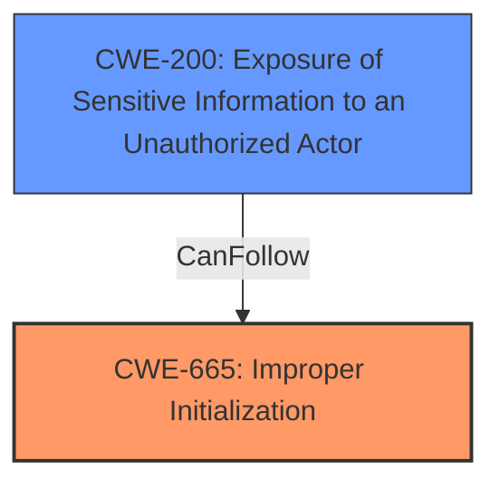

# Raw Analyzer Response for CVE-2024-0103

# Summary
| CWE ID | CWE Name | Confidence | CWE Abstraction Level | CWE Vulnerability Mapping Label | CWE-Vulnerability Mapping Notes |
|---|---|---|---|---|---|
| CWE-665 | Improper Initialization | 0.8 | Class | Primary | Allowed-with-Review |
| CWE-200 | Exposure of Sensitive Information to an Unauthorized Actor | 0.6 | Class | Secondary | Discouraged |

## Evidence and Confidence

*   **Confidence Score:** 0.7
*   **Evidence Strength:** MEDIUM

## Relationship Analysis
The primary CWE is CWE-665, which is a Class-level weakness. While there might be more specific Base-level children, the provided information is insufficient to determine the exact resource that wasn't initialized properly, making CWE-665 the most appropriate choice. CWE-200 is a potential impact of the **improper initialization**, where sensitive information is exposed due to the initial **incorrect state**.

## Vulnerability Chain
The vulnerability chain starts with the **incorrect initialization of a resource** (CWE-665) due to a network issue. This leads to a state where sensitive system information is exposed to unauthorized actors (CWE-200), resulting in information disclosure.

## Summary of Analysis
The vulnerability description explicitly mentions "**incorrect Initialization of resource**" as the root cause, making CWE-665 (Improper Initialization) the most relevant primary CWE. The CVE Reference Links Content Summary also confirms this root cause: "Incorrect initialization of resources due to network issues." The retriever results also list CWE-665 as a candidate CWE.

CWE-200 (Exposure of Sensitive Information to an Unauthorized Actor) is considered as a secondary CWE because the description states that a successful exploit "may lead to information disclosure." This is a potential impact of the **incorrect initialization** rather than the root cause itself.

I considered other CWEs, but didn't select them for the following reasons:

*   CWE-909 (Missing Initialization of Resource): While similar to CWE-665, "incorrect" initialization suggests that some initialization occurred, albeit improperly, making CWE-665 a better fit.
*   CWE-908 (Use of Uninitialized Resource): This CWE describes the *use* of an uninitialized resource. The initial problem is the **lack of correct initialization**.
*   CWE-1284 (Improper Validation of Specified Quantity in Input): This is not relevant as it is about improper validation of input quantities.
*   CWE-415 (Double Free): This is a memory management issue and doesn't align with the vulnerability description.
*   CWE-1188 (Initialization of a Resource with an Insecure Default): The description does not specify that an insecure default was used, only that the initialization was incorrect.

The selection of CWE-665 is at the optimal level of specificity, as it captures the core weakness of **incorrectly initializing a resource**. While a more specific CWE might exist, the provided information is insufficient to pinpoint the exact nature of the initialization error.

Relevant CWE Information:

# Enhanced Context (25 CWEs)
The following CWEs were identified as potentially relevant to this vulnerability:

## CWE-665: Improper Initialization
**Abstraction Level**: Class
**Similarity Score**: 0.70
**Source**: dense

**Description**:
The product does not initialize or incorrectly initializes a resource, which might leave the resource in an unexpected state when it is accessed or used.

**Mapping Guidance**:
- Usage: Discouraged
- Rationale: This CWE entry is a level-1 Class (i.e., a child of a Pillar). It might have lower-level children that would be more appropriate

## CWE-200: Exposure of Sensitive Information to an Unauthorized Actor
**Abstraction Level**: Class
**Similarity Score**: 0.68
**Source**: dense

**Description**:
The product does not properly prevent sensitive system-level information from being accessed by unauthorized actors who do not have the same level of access to the underlying system as the product does.

**Mapping Guidance**:
- Usage: Discouraged
- Rationale: This CWE entry is a level-1 Class (i.e., a child of a Pillar). It might have lower-level children that would be more appropriate