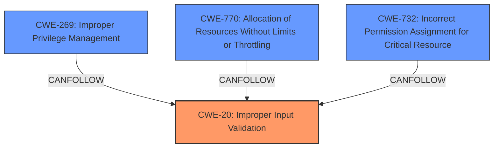

# Analysis for CVE-2024-0158

# Summary
| CWE ID    | CWE Name                                                                                     | Confidence | CWE Abstraction Level | CWE Vulnerability Mapping Label | CWE-Vulnerability Mapping Notes |
| :---------- | :------------------------------------------------------------------------------------------- | :--------- | :---------------------- | :------------------------------ | :-------------------------------- |
| CWE-20      | CWE-20: Improper Input Validation                                                            | 0.9        | Class                   | Primary CWE                    | Discouraged                       |
| CWE-269     | CWE-269: Improper Privilege Management                                                       | 0.7        | Base                    | Secondary Candidate             | Allowed                           |
| CWE-770     | CWE-770: Allocation of Resources Without Limits or Throttling                                | 0.6        | Base                    | Secondary Candidate             | Allowed                           |
| CWE-732     | CWE-732: Incorrect Permission Assignment for Critical Resource                               | 0.6        | Base                    | Secondary Candidate             | Allowed                           |

## Evidence and Confidence

*   **Confidence Score:** 0.8
*   **Evidence Strength:** MEDIUM

## Relationship Analysis

The primary weakness is **CWE-20 Improper Input Validation**. This is a class-level CWE, but it is the most appropriate based on the provided information. The vulnerability description explicitly mentions **improper input validation**, which aligns directly with CWE-20's definition. It is the first in the Vulnerability Chain.

CWE-20 has child CWEs that could potentially be more specific, but there isn't enough information to determine which child CWE would be most appropriate. CWE-20 is related to other CWEs through "CanPrecede" relationships, such as **CWE-22: Improper Limitation of a Pathname to a Restricted Directory ('Path Traversal')** and **CWE-74: Improper Neutralization of Special Elements in Output Used by a Downstream Component ('Injection')**, but the description doesn't provide enough information to determine if those are present.

CWE-269, CWE-770, and CWE-732 are secondary candidates, representing the potential consequences of the **improper input validation**.

## Vulnerability Chain

The vulnerability chain starts with **CWE-20 Improper Input Validation**. A local authenticated malicious user with admin privileges exploits this weakness to modify a UEFI variable. This leads to a denial of service and escalation of privileges.

The chain: **CWE-20** -> **Modification of UEFI Variable** -> **Denial of Service & Escalation of Privileges**.

## Summary of Analysis

The primary **root cause** of this vulnerability is **CWE-20: Improper Input Validation**. The vulnerability description explicitly states that the Dell BIOS contains an **improper input validation** vulnerability. This aligns perfectly with the definition of CWE-20, which describes a product that receives input but does not validate or incorrectly validates that input. The **improper input validation** allows a local authenticated malicious user with admin privileges to modify a UEFI variable, leading to denial of service and escalation of privileges.

The other CWEs considered, like **CWE-119 Improper Restriction of Operations within the Bounds of a Memory Buffer**, and **CWE-269 Improper Privilege Management**, could be consequences of the **improper input validation** but are not the **root cause** as described in the vulnerability. **CWE-1284: Improper Validation of Specified Quantity in Input** was also considered, but it is less applicable since the vulnerability description doesn't explicitly mention issues related to quantity or size.

The choice of CWE-20 is based on the direct evidence from the vulnerability description and the high relevance score provided. While CWE-20 is a class-level CWE, the lack of specific details in the vulnerability description prevents a more precise mapping to a base or variant-level CWE.

Relevant CWE Information:
*   **CWE-20: Improper Input Validation**: The product receives input or data, but it does not validate or incorrectly validates that the input has the properties that are required to process the data safely and correctly. In this case, the Dell BIOS **does not properly** validate the input used to modify UEFI variables, allowing for malicious modification.
*   **CWE-269: Improper Privilege Management**: The product does not properly assign, modify, track, or check privileges for an actor, creating an unintended sphere of control for that actor. In this case a local authenticated malicious user with admin privileges may be able to exploit the **improper input validation** to escalate privileges.
*   **CWE-770: Allocation of Resources Without Limits or Throttling**: The description mentions a potential denial-of-service.
*   **CWE-732: Incorrect Permission Assignment for Critical Resource**: The product specifies permissions for a security-critical resource in a way that allows that resource to be read or modified by unintended actors. In this case a local authenticated malicious user with admin privileges may be able to modify a UEFI variable