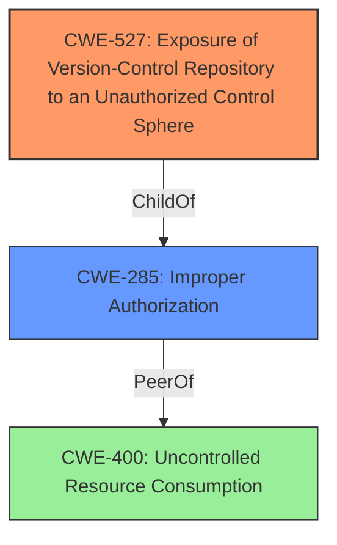

# Analysis Report for CVE-2024-0231

# Vulnerability Analysis Report: CVE-2024-0231

## Description

A **resource misdirection vulnerability** in GitLab CE/EE versions 12.0 prior to 17.0.5, 17.1 prior to 17.1.3, and 17.2 prior to 17.2.1 allows an attacker to craft a repository import in such a way as to misdirect commits.

## Vulnerability Description Key Phrases

- **Rootcause:** resource misdirection vulnerability
- **Impact:** misdirect commits
- **Vector:** craft a repository import
- **Attacker:** attacker
- **Product:** GitLab CE/EE
- **Version:** 12.0 prior to 17.0.5, 17.1 prior to 17.1.3, and 17.2 prior to 17.2.1

## Analysis (with Relationship Data)

# Summary
| CWE ID | CWE Name | Confidence | CWE Abstraction Level | CWE Vulnerability Mapping Label | CWE-Vulnerability Mapping Notes |
|---|---|---|---|---|---|
| CWE-527 | Exposure of Version-Control Repository to an Unauthorized Control Sphere | 0.8 | Variant | Allowed | Primary CWE |
| CWE-285 | Improper Authorization | 0.6 | Class | Discouraged | Secondary Candidate |

## Evidence and Confidence

*   **Confidence Score:** 0.7
*   **Evidence Strength:** MEDIUM

## Relationship Analysis
The primary relationship impacting the decision is the hierarchical structure. CWE-527 is a Variant, offering a more specific description than its parent classes. CWE-285 is a Class, and considered because the vulnerability involves a bypass of a security check, related to authorization.



## Vulnerability Chain
The vulnerability chain starts with the **resource misdirection vulnerability**, leading to the ability to misdirect commits. This is due to the bypass of a security check during repository import, which allows an attacker to create tags or branches with names that match SHA1 or SHA256 commit hashes.

## Summary of Analysis
The primary CWE selected is CWE-527 (Exposure of Version-Control Repository to an Unauthorized Control Sphere). This selection is based on the vulnerability description and the CVE reference summary, which details how an attacker can **misdirect commits** by exploiting a bypass in GitLab's security check during repository import. The vulnerability specifically allows the creation of tags or branches with names that match commit hashes, leading to potential manipulation of code in CI/CD pipelines or local user checkouts.

The supporting evidence comes from the "CVE Reference Links Content Summary," which states: "The primary weakness is the failure to apply the SHA hash name check during the repository import process, leading to a security bypass." This directly relates to the exposure of the repository to unauthorized control because the expected security measures are not in place during the import.

CWE-285 (Improper Authorization) was considered as a secondary CWE because the vulnerability involves a bypass of a security check which can be seen as an authorization issue. However, CWE-527 is a more specific and accurate representation of the vulnerability because it directly addresses the exposure of the version control repository.

Other CWEs considered but not selected:

*   CWE-400 (Uncontrolled Resource Consumption): While resource misdirection could potentially lead to resource consumption issues, it is not the primary characteristic of this vulnerability. The core issue is the exposure of the repository due to the security bypass.
*   CWE-770 (Allocation of Resources Without Limits or Throttling): This CWE is not applicable because the vulnerability does not directly involve the allocation of resources without limits or throttling.
* CWE-789: Memory Allocation with Excessive Size Value. This is not a memory allocation vulnerability.

Relevant CWE Information:

# Enhanced Context (25 CWEs)
The following CWEs were identified as potentially relevant to this vulnerability:

## CWE-1286: Improper Validation of Syntactic Correctness of Input
**Abstraction Level**: Base
**Similarity Score**: 0.74
**Source**: dense

**Description**:
The product receives input that is expected to be well-formed - i.e., to comply with a certain syntax - but it does not validate or incorrectly validates that the input complies with the syntax.

**Mapping Guidance**:
- Usage: Allowed
- Rationale: This CWE entry is at the Base level of abstraction, which is a preferred level of abstraction for mapping to the root causes of vulnerabilities.

## CWE-88: Improper Neutralization of Argument Delimiters in a Command ('Argument Injection')
**Abstraction Level**: Base
**Similarity Score**: 0.73
**Source**: dense

**Description**:
The product constructs a string for a command to be executed by a separate component
in another control sphere, but it does not properly delimit the
intended arguments, options, or switches within that command string.

**Mapping Guidance**:
- Usage: Allowed
- Rationale: This CWE entry is at the Base level of abstraction, which is a preferred level of abstraction for mapping to the root causes of vulnerabilities.

## CWE-212: Improper Removal of Sensitive Information Before Storage or Transfer
**Abstraction Level**: Base
**Similarity Score**: 0.73
**Source**: dense

**Description**:
The product stores, transfers, or shares a resource that contains sensitive information, but it does not properly remove that information before the product makes the resource available to unauthorized actors.

**Mapping Guidance**:
- Usage: Allowed
- Rationale: This CWE entry is at the Base level of abstraction, which is a preferred level of abstraction for mapping to the root causes of vulnerabilities.

## CWE-639: Authorization Bypass Through User-Controlled Key
**Abstraction Level**: Base
**Similarity Score**: 0.71
**Source**: dense

**Description**:
The system's authorization functionality does not prevent one user from gaining access to another user's data or record by modifying the key value identifying the data.

**Mapping Guidance**:
- Usage: Allowed
- Rationale: This CWE entry is at the Base level of abstraction, which is a preferred level of abstraction for mapping to the root causes of vulnerabilities.

## CWE-267: Privilege Defined With Unsafe Actions
**Abstraction Level**: Base
**Similarity Score**: 0.71
**Source**: dense

**Description**:
A particular privilege, role, capability, or right can be used to perform unsafe actions that were not intended, even when it is assigned to the correct entity.

**Mapping Guidance**:
- Usage: Allowed
- Rationale: This CWE entry is at the Base level of abstraction, which is a preferred level of abstraction for mapping to the root causes of vulnerabilities.

## CWE-538: Insertion of Sensitive Information into Externally-Accessible File or Directory
**Abstraction Level**: Base
**Similarity Score**: 0.71
**Source**: dense

**Description**:
The product places sensitive information into files or directories that are accessible to actors who are allowed to have access to the files, but not to the sensitive information.

**Mapping Guidance**:
- Usage: Allowed
- Rationale: This CWE entry is at the Base level of abstraction, which is a preferred level of abstraction for mapping to the root causes of vulnerabilities.

## CWE-209: Generation of Error Message Containing Sensitive Information
**Abstraction Level**: Base
**Similarity Score**: 0.70
**Source**: dense

**Description**:
The product generates an error message that includes sensitive information about its environment, users, or associated data.

**Mapping Guidance**:
- Usage: Allowed
- Rationale: This CWE entry is at the Base level of abstraction, which is a preferred level of abstraction for mapping to the root causes of vulnerabilities.

## CWE-116: Improper Encoding or Escaping of Output
**Abstraction Level**: Class
**Similarity Score**: 0.70
**Source**: dense

**Description**:
The product prepares a structured message for communication with another component, but encoding or escaping of the data is either missing or done incorrectly. As a result, the intended structure of the message is not preserved.

**Mapping Guidance**:
- Usage: Allowed-with-Review
- Rationale: This CWE entry is a Class and might have Base-level children that would be more appropriate

## CWE-93: Improper Neutralization of CRLF Sequences ('CRLF Injection')
**Abstraction Level**: Base
**Similarity Score**: 0.70
**Source**: dense

**Description**:
The product uses CRLF (carriage return line feeds) as a special element, e.g. to separate lines or records, but it does not neutralize or incorrectly neutralizes CRLF sequences from inputs.

**Mapping Guidance**:
- Usage: Allowed
- Rationale: This CWE entry is at the Base level of abstraction, which is a preferred level of abstraction for mapping to the root causes of vulnerabilities.

## CWE-285: Improper Authorization
**Abstraction Level**: Class
**Similarity Score**: 0.69
**Source**: dense

**Description**:
The product does not perform or incorrectly performs an authorization check when an actor attempts to access a resource or perform an action.

**Mapping Guidance**:
- Usage: Discouraged
- Rationale: CWE-285 is high-level and lower-level CWEs can frequently be used instead. It is a level-1 Class (i.e., a child of a Pillar).

## CWE-285: Improper Authorization
**Abstraction Level**: Class
**Similarity Score**: 1007.36
**Source**: sparse


## CWE Relationship Analysis

Current CWEs represent these abstraction levels: .


### Vulnerability Chain Analysis

**Chain starting from CWE-400:**
- 400 (Uncontrolled Resource Consumption) - ROOT


**Chain starting from CWE-116:**
- 116 (Improper Encoding or Escaping of Output) - ROOT


### CWE Relationship Diagram

```mermaid
graph TD
    classDef primary fill:#f96,stroke:#333,stroke-width:2px
    classDef secondary fill:#69f,stroke:#333
    classDef tertiary fill:#9e9,stroke:#333
```


*Report generated on 2025-07-12 23:45:18*
