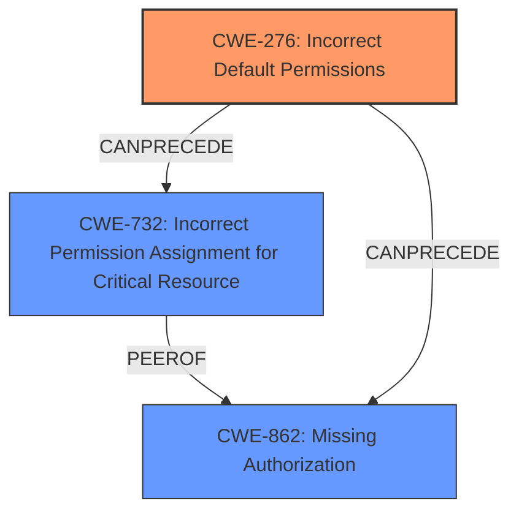

# Analysis for CVE-2024-0245

# Summary
| CWE ID | CWE Name | Confidence | CWE Abstraction Level | CWE Vulnerability Mapping Label | CWE-Vulnerability Mapping Notes |
|---|---|---|---|---|---|
| CWE-276 | Incorrect Default Permissions | 0.75 | Base | Allowed | Primary CWE |
| CWE-732 | Incorrect Permission Assignment for Critical Resource | 0.6 | Class | Allowed-with-Review | Secondary Candidate |
| CWE-862 | Missing Authorization | 0.5 | Class | Allowed-with-Review | Secondary Candidate |

## Evidence and Confidence

*   **Confidence Score:** 0.7
*   **Evidence Strength:** MEDIUM

## Relationship Analysis
The primary CWE is CWE-276, which directly addresses the **incorrect permission assignment** during installation. CWE-732 is a Class-level CWE that is more general but still applicable, while CWE-862 is relevant due to the potential for missing authorization checks after the misconfiguration. The relationship between these CWEs suggests a chain where the **incorrect default permissions** (CWE-276) can lead to broader authorization issues (CWE-862) and resource access problems (CWE-732). The abstraction level influenced the selection, favoring the Base-level CWE-276 when supported by the evidence.

## Vulnerability Chain
The vulnerability chain starts with a **misconfiguration in the AndroidManifest.xml file** (CWE-276) leading to the application having **incorrect default permissions**. This can then lead to **missing authorization checks** (CWE-862) for certain functionalities or resources. Consequently, it leads to **incorrect permission assignment for critical resources** (CWE-732), finally resulting in **exposure of sensitive information** and **task hijacking**.

## Summary of Analysis
The initial analysis focused on the **misconfiguration in the AndroidManifest.xml file**, which directly points to a permission-related issue. The Retriever Results suggested several relevant CWEs, including CWE-732 and CWE-862. However, the root cause evidence specifically mentions a **misconfiguration**, aligning well with CWE-276 (Incorrect Default Permissions). This CWE is at the Base level of abstraction, which is preferable.

The graph relationships highlight that while CWE-732 and CWE-862 are related, they are more consequences of the initial **incorrect default permissions**. Therefore, CWE-276 is the most accurate primary CWE.

The provided evidence is sufficient to justify this classification, with a confidence score of 0.7. The selected CWEs are at the optimal level of specificity, representing both the root cause and potential impacts of the vulnerability.

Relevant CWE Information:

# Enhanced Context (25 CWEs)
The following CWEs were identified as potentially relevant to this vulnerability:

## CWE-276: Incorrect Default Permissions
**Abstraction Level**: Base
**Similarity Score**: 0.75
**Source**: dense

**Description**:
During installation, installed file permissions are set to allow anyone to modify those files.

**Mapping Guidance**:
- Usage: Allowed
- Rationale: This CWE entry is at the Base level of abstraction, which is a preferred level of abstraction for mapping to the root causes of vulnerabilities.

## CWE-732: Incorrect Permission Assignment for Critical Resource
**Abstraction Level**: Class
**Similarity Score**: 1286.49
**Source**: sparse

**Description**:
The product specifies permissions for a security-critical resource in a way that allows that resource to be read or modified by unintended actors.

**Mapping Guidance**:
- Usage: Allowed-with-Review
- Rationale: While the name itself indicates an assignment of permissions for resources, this is often misused for vulnerabilities in which "permissions" are not checked, which is an "authorization" weakness (CWE-285 or descendants) within CWE's model [REF-1287].

## CWE-862: Missing Authorization
**Abstraction Level**: Class
**Similarity Score**: 0.397
**Source**: sparse

**Description**:
The product does not perform an authorization check when an actor attempts to access a resource or perform an action.

**Mapping Guidance**:
- Usage: Allowed-with-Review
- Rationale: This CWE entry is a Class and might have Base-level children that would be more appropriate

**CWE-276** (Incorrect Default Permissions) is selected because the vulnerability description explicitly mentions a **misconfiguration in the AndroidManifest.xml file**, which directly relates to how permissions are set during installation. This allows malicious apps to inherit permissions. Security implications include unauthorized access to sensitive data and potential task hijacking.

**CWE-732** (Incorrect Permission Assignment for Critical Resource) was considered because the **misconfiguration** could lead to incorrect permissions being assigned to critical resources. However, it's a more general consequence of the root cause (CWE-276).

**CWE-862** (Missing Authorization) was also considered, as the **incorrect permissions** might result in missing authorization checks for certain actions. This is also a consequence of the initial **misconfiguration** rather than the root cause itself.

Other CWEs considered but not used:

*   CWE-285 (Improper Authorization): While related to authorization issues, it is more about flawed authorization logic rather than missing or **incorrect default permissions**.
*   CWE-269 (Improper Privilege Management): This is a broader category and less specific than CWE-276.
*   CWE-200 (Exposure of Sensitive Information to an Unauthorized Actor): This is an impact of the vulnerability, not the root cause.
*   CWE-306 (Missing Authentication for Critical Function): Not applicable since the issue is about permissions, not authentication.