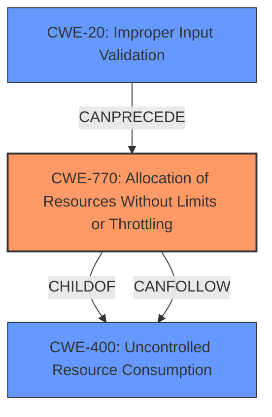

# Analysis Report for CVE-2024-10051

# Vulnerability Analysis Report: CVE-2024-10051

## Description

Realchar version v0.0.4 is vulnerable to an **unauthenticated denial of service (DoS)** attack. The vulnerability exists in the file upload request handling, where appending characters, such as dashes (-), to the end of a multipart boundary in an HTTP request causes the server to continuously process each character. This leads to excessive resource consumption and renders the service unavailable. The issue is unauthenticated and does not require any user interaction, impacting all users of the service.

## Vulnerability Description Key Phrases

- **Component:** file upload request handling
- **Weakness:** unauthenticated denial of service (DoS)
- **Product:** Realchar
- **Impact:** denial of service, excessive resource consumption
- **Version:** v0.0.4

## Analysis (with Relationship Data)

# Summary
| CWE ID | CWE Name | Confidence | CWE Abstraction Level | CWE Vulnerability Mapping Label | CWE-Vulnerability Mapping Notes |
|---|---|---|---|---|---|
| CWE-770 | Allocation of Resources Without Limits or Throttling | 0.8 | Base | Allowed | Primary CWE - The server allocates resources without limiting the number or size. |
| CWE-400 | Uncontrolled Resource Consumption | 0.6 | Class | Discouraged | Secondary Candidate - This is a high-level consequence of the resource allocation issue. |
| CWE-20 | Improper Input Validation | 0.5 | Class | Discouraged | Secondary Candidate - Input is not properly validated which allows the attack, but this is a general CWE. |

## Evidence and Confidence

*   **Confidence Score:** 0.7
*   **Evidence Strength:** MEDIUM

## Relationship Analysis
The primary CWE is CWE-770, which is a base-level weakness describing the allocation of resources without limits. CWE-400 is a class-level CWE that describes the uncontrolled consumption of resources, which is a consequence of CWE-770. CWE-20 is also a class-level CWE that describes improper input validation, a potential cause of the primary weakness.



## Vulnerability Chain
The vulnerability chain starts with the **improper handling of multipart boundaries** in the file upload request (**weakness**). Specifically, the server **fails to limit or throttle the allocation of resources** (CWE-770) when processing an HTTP request with a crafted multipart boundary. This leads to **excessive resource consumption** and ultimately results in a **denial of service** (CWE-400). There might be **improper input validation** (CWE-20) involved, but the description primarily highlights the lack of resource control.

## Summary of Analysis
The primary weakness is the **unauthenticated denial of service (DoS)** due to the server's behavior of continuously processing each character in a crafted multipart boundary. The best fit for this vulnerability is CWE-770, Allocation of Resources Without Limits or Throttling, because the root cause is the server allocating resources without imposing any restrictions on the size or number of resources that can be allocated. This leads directly to the denial-of-service condition.

The evidence from the vulnerability description is: "appending characters, such as dashes (-), to the end of a multipart boundary in an HTTP request causes the server to continuously process each character. This leads to excessive resource consumption and renders the service unavailable."

CWE-400, Uncontrolled Resource Consumption, is a related CWE, but it represents the impact rather than the root cause. CWE-20, Improper Input Validation, is a more general weakness and while it may be present, the description focuses on the resource allocation issue.

I considered CWE-789 Memory Allocation with Excessive Size Value, CWE-1333: Inefficient Regular Expression Complexity, CWE-1284: Improper Validation of Specified Quantity in Input but these were not as good a fit as CWE-770.

# Relevant CWE Information:

# Enhanced Context (25 CWEs)
The following CWEs were identified as potentially relevant to this vulnerability:

## CWE-434: Unrestricted Upload of File with Dangerous Type
**Abstraction Level**: Base
**Similarity Score**: 0.69
**Source**: dense

**Description**:
The product allows the upload or transfer of dangerous file types that are automatically processed within its environment.

**Mapping Guidance**:
- Usage: Allowed
- Rationale: This CWE entry is at the Base level of abstraction, which is a preferred level of abstraction for mapping to the root causes of vulnerabilities.


## CWE-789: Memory Allocation with Excessive Size Value
**Abstraction Level**: Variant
**Similarity Score**: 0.68
**Source**: dense

**Description**:
The product allocates memory based on an untrusted, large size value, but it does not ensure that the size is within expected limits, allowing arbitrary amounts of memory to be allocated.

**Mapping Guidance**:
- Usage: Allowed
- Rationale: This CWE entry is at the Variant level of abstraction, which is a preferred level of abstraction for mapping to the root causes of vulnerabilities.


## CWE-113: Improper Neutralization of CRLF Sequences in HTTP Headers ('HTTP Request/Response Splitting')
**Abstraction Level**: Variant
**Similarity Score**: 0.68
**Source**: dense

**Description**:
The product receives data from an HTTP agent/component (e.g., web server, proxy, browser, etc.), but it does not neutralize or incorrectly neutralizes CR and LF characters before the data is included in outgoing HTTP headers.

**Mapping Guidance**:
- Usage: Allowed
- Rationale: This CWE entry is at the Variant level of abstraction, which is a preferred level of abstraction for mapping to the root causes of vulnerabilities.


## CWE-134: Use of Externally-Controlled Format String
**Abstraction Level**: Base
**Similarity Score**: 0.68
**Source**: dense

**Description**:
The product uses a function that accepts a format string as an argument, but the format string originates from an external source.

**Mapping Guidance**:
- Usage: Allowed
- Rationale: This CWE entry is at the Base level of abstraction, which is a preferred level of abstraction for mapping to the root causes of vulnerabilities.


## CWE-472: External Control of Assumed-Immutable Web Parameter
**Abstraction Level**: Base
**Similarity Score**: 0.67
**Source**: dense

**Description**:
The web application does not sufficiently verify inputs that are assumed to be immutable but are actually externally controllable, such as hidden form fields.

**Mapping Guidance**:
- Usage: Allowed
- Rationale: This CWE entry is at the Base level of abstraction, which is a preferred level of abstraction for mapping to the root causes of vulnerabilities.


## CWE-918: Server-Side Request Forgery (SSRF)
**Abstraction Level**: Base
**Similarity Score**: 0.67
**Source**: dense

**Description**:
The web server receives a URL or similar request from an upstream component and retrieves the contents of this URL, but it does not sufficiently ensure that the request is being sent to the expected destination.

**Mapping Guidance**:
- Usage: Allowed
- Rationale: This CWE entry is at the Base level of abstraction, which is a preferred level of abstraction for mapping to the root causes of vulnerabilities.


## CWE-1289: Improper Validation of Unsafe Equivalence in Input
**Abstraction Level**: Base
**Similarity Score**: 0.67
**Source**: dense

**Description**:
The product receives an input value that is used as a resource identifier or other type of reference, but it does not validate or incorrectly validates that the input is equivalent to a potentially-unsafe value.

**Mapping Guidance**:
- Usage: Allowed
- Rationale: This CWE entry is at the Base level of abstraction, which is a preferred level of abstraction for mapping to the root causes of vulnerabilities.


## CWE-407: Inefficient Algorithmic Complexity
**Abstraction Level**: Class
**Similarity Score**: 0.67
**Source**: dense

**Description**:
An algorithm in a product has an inefficient worst-case computational complexity that may be detrimental to system performance and can be triggered by an attacker, typically using crafted manipulations that ensure that the worst case is being reached.

**Mapping Guidance**:
- Usage: Allowed-with-Review
- Rationale: This CWE entry is a Class and might have Base-level children that would be more appropriate


## CWE-425: Direct Request ('Forced Browsing')
**Abstraction Level**: Base
**Similarity Score**: 0.67
**Source**: dense

**Description**:
The web application does not adequately enforce appropriate authorization on all restricted URLs, scripts, or files.

**Mapping Guidance**:
- Usage: Allowed
- Rationale: This CWE entry is at the Base level of abstraction, which is a preferred level of abstraction for mapping to the root causes of vulnerabilities.


## CWE-138: Improper Neutralization of Special Elements
**Abstraction Level**: Class
**Similarity Score**: 0.66
**Source**: dense

**Description**:
The product receives input from an upstream component, but it does not neutralize or incorrectly neutralizes special elements that could be interpreted as control elements or syntactic markers when they are sent to a downstream component.

**Mapping Guidance**:
- Usage: Discouraged
- Rationale: This CWE entry is a level-1


## CWE Relationship Analysis

Current CWEs represent these abstraction levels: .


### Vulnerability Chain Analysis

**Chain starting from CWE-1284:**
- 1284 (Improper Validation of Specified Quantity in Input) - ROOT


**Chain starting from CWE-400:**
- 400 (Uncontrolled Resource Consumption) - ROOT


### CWE Relationship Diagram

```mermaid
graph TD
    classDef primary fill:#f96,stroke:#333,stroke-width:2px
    classDef secondary fill:#69f,stroke:#333
    classDef tertiary fill:#9e9,stroke:#333
```


*Report generated on 2025-07-12 23:51:36*
