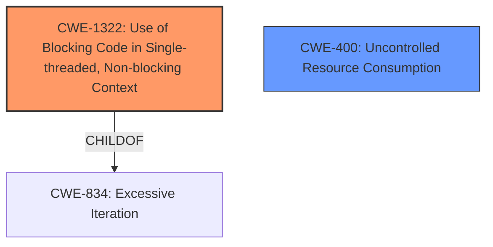

# Enhanced Analysis for CVE-2024-10110

# Summary
| CWE ID | CWE Name | Confidence | CWE Abstraction Level | CWE Vulnerability Mapping Label | CWE-Vulnerability Mapping Notes |
|---|---|---|---|---|---|
| CWE-1322 | Use of Blocking Code in Single-threaded, Non-blocking Context | 0.9 | Base | Primary CWE | Allowed |
| CWE-400 | Uncontrolled Resource Consumption | 0.7 | Class | Secondary Candidate | Allowed-with-Review |

## Evidence and Confidence

*   **Confidence Score:** 0.8
*   **Evidence Strength:** MEDIUM

## Relationship Analysis
The primary CWE is CWE-1322, which describes the use of blocking code in a single-threaded, non-blocking context. This aligns with the vulnerability description, where the `ScheduledStatusReporter` blocks the main thread. A related CWE is CWE-400, which represents uncontrolled resource consumption, as the blocked thread makes the server unable to respond to other requests, leading to a denial of service. CWE-1322 is a child of CWE-834 (Exposure of Resource to Wrong Sphere), while CWE-400 is a class-level CWE.



## Vulnerability Chain
The vulnerability chain starts with the **root cause**: the `ScheduledStatusReporter` running on the main thread (CWE-1322). This leads to the main thread being blocked indefinitely. The impact of the blocked thread causes the server to become unresponsive, ultimately resulting in a denial of service (CWE-400).

## Summary of Analysis
The analysis is based on the provided vulnerability description, which states that the `ScheduledStatusReporter` object, when instantiated, runs on the main thread, leading to the main thread being blocked indefinitely, causing a denial of service.

The primary CWE, CWE-1322, is selected because the **root cause** is the use of blocking code (`ScheduledStatusReporter`) in a single-threaded, non-blocking context (the main thread of the tracking server). This directly matches the CWE's description.

CWE-400 is considered as a secondary CWE because the blocking of the main thread leads to uncontrolled resource consumption, manifesting as a denial of service. While the vulnerability description highlights the denial of service, the underlying **root cause** is the blocking code.

The retriever results also suggest CWE-1322.

The chosen CWEs are at the optimal level of specificity. CWE-1322 is a Base-level CWE, which is preferred for mapping root causes. CWE-400 is a Class-level CWE and could have more specific children, however, it is kept due to the DoS implication.

CWEs considered but not used:

*   CWE-470: Use of Externally-Controlled Input to Select Classes or Code ('Unsafe Reflection'): This CWE does not apply as there is no external control of code selection involved.
*   CWE-617: Reachable Assertion: This CWE does not apply as there is no assertion being triggered.
*   CWE-835: Loop with Unreachable Exit Condition ('Infinite Loop'): This CWE doesn't match the description of the vulnerability. The issue is not an infinite loop, but a blocking operation.
*   CWE-401: Missing Release of Memory after Effective Lifetime: There is no memory leak involved.
*   CWE-193: Off-by-one Error: This CWE is not relevant to the vulnerability.


## CWE Relationship Analysis

Current CWEs represent these abstraction levels: .


### Vulnerability Chain Analysis

**Chain starting from CWE-400:**
- 400 (Uncontrolled Resource Consumption) - ROOT


**Chain starting from CWE-834:**
- 834 (Excessive Iteration) - ROOT


### CWE Relationship Diagram

```mermaid
graph TD
    classDef primary fill:#f96,stroke:#333,stroke-width:2px
    classDef secondary fill:#69f,stroke:#333
    classDef tertiary fill:#9e9,stroke:#333
```