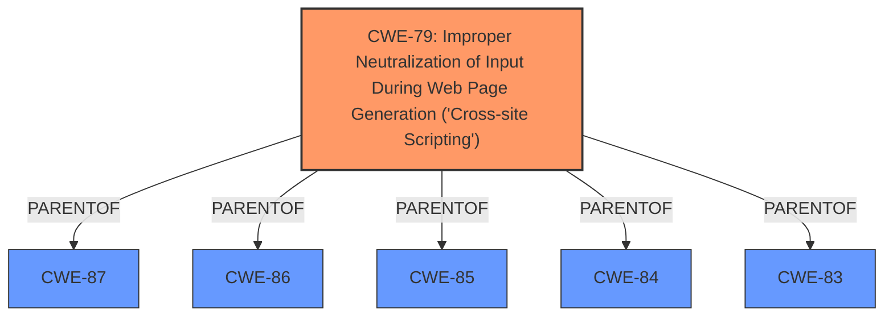

# Analysis Report for CVE-2024-10143

# Vulnerability Analysis Report: CVE-2024-10143

## Description

The MB Custom Post Types & Custom Taxonomies WordPress plugin before 2.7.7 **does not sanitise and escape some of its settings**, which could allow high privilege users such as admin to perform Stored Cross-Site Scripting attacks even when the unfiltered_html capability is disallowed (for example in multisite setup).

## Vulnerability Description Key Phrases

- **Rootcause:** does not sanitise and escape some of its settings
- **Weakness:** Stored cross-site scripting
- **Impact:** ['perform cross-site scripting attacks', 'Stored Cross-Site Scripting attacks']
- **Attacker:** high privilege users
- **Product:** MB Custom Post Types & Custom Taxonomies WordPress plugin
- **Version:** before 2.7.7

## Analysis (with Relationship Data)

# Summary

| CWE ID   | CWE Name                                                                     | Confidence | CWE Abstraction Level | CWE Vulnerability Mapping Label | CWE-Vulnerability Mapping Notes |
| -------- | ---------------------------------------------------------------------------- | ---------- | --------------------- | ------------------------------- | ------------------------------- |
| CWE-79   | Improper Neutralization of Input During Web Page Generation ('Cross-site Scripting') | 1.0        | Base                  | Primary CWE                   | Allowed                         |

## Evidence and Confidence

*   **Confidence Score:** 1.0
*   **Evidence Strength:** HIGH

## Relationship Analysis

The primary relationship considered was the parent-child relationship between CWE-79 and its parents and children. Since the vulnerability specifically involves improper neutralization of input during web page generation, CWE-79 at the Base level is the most accurate and specific representation. The other relationships such as CanPrecede, CanFollow, and PeerOf were considered for potential secondary weaknesses or related vulnerabilities, but they were not directly applicable to the root cause described.



## Vulnerability Chain

The vulnerability chain begins with the **failure to sanitize and escape settings**, leading directly to the **Stored Cross-Site Scripting** vulnerability. The lack of proper input handling (sanitization and escaping) is the **root cause** (CWE-79), which then results in the ability to inject malicious scripts into web pages viewed by other users.

## Summary of Analysis

The analysis is based on the vulnerability description, which clearly states that the MB Custom Post Types & Custom Taxonomies WordPress plugin before version 2.7.7 **does not sanitise and escape some of its settings**. The CVE reference links content summary confirms the **root cause of the vulnerability** is that the plugin **does not sanitize and escape some of its settings, allowing for XSS attacks**. The **weakness/vulnerability present** is **Stored Cross-Site Scripting (XSS)**.

The retriever results also list CWE-79 as a potential match.

The decision to assign CWE-79 is strongly supported by the evidence. The failure to sanitize and escape settings directly leads to the XSS vulnerability. This aligns perfectly with the definition of CWE-79: "The product does not neutralize or incorrectly neutralizes user-controllable input before it is placed in output that is used as a web page that is served to other users."

CWE-79 is at the optimal level of specificity (Base) because it directly describes the **root cause** of the vulnerability (improper neutralization of input) and the context (web page generation).

**CWEs considered but not used:**

*   **CWE-352: Cross-Site Request Forgery (CSRF):** While CSRF is a web application vulnerability, it does not directly relate to the described issue of improper input neutralization.
*   **CWE-116: Improper Encoding or Escaping of Output:** Although related to output handling, CWE-79 is more specific to the context of web page generation and XSS, making it a better fit.
*   **CWE-862: Missing Authorization:** This CWE is not relevant because the vulnerability is due to **improper input handling**, not a **missing authorization check**.
*   **CWE-434: Unrestricted Upload of File with Dangerous Type:** Not applicable as the vulnerability does not involve file uploads.
*   **CWE-89: Improper Neutralization of Special Elements used in an SQL Command ('SQL Injection'):** This relates to SQL injection, which is not the vulnerability described.
*   **CWE-863: Incorrect Authorization:** As with CWE-862, the issue isn't about authorization.
*   **CWE-138: Improper Neutralization of Special Elements:** This is a more general case of improper neutralization. CWE-79 is more specific to XSS.
*   **CWE-96: Improper Neutralization of Directives in Statically Saved Code ('Static Code Injection'):** The vulnerability doesn't involve static code injection.
*   **CWE-471: Modification of Assumed-Immutable Data (MAID):** This CWE doesn't fit the description of the vulnerability.


## CWE Relationship Analysis

Current CWEs represent these abstraction levels: .


### Vulnerability Chain Analysis

**Chain starting from CWE-87:**
- 87 (Improper Neutralization of Alternate XSS Syntax) - ROOT


**Chain starting from CWE-89:**
- 89 (Improper Neutralization of Special Elements used in an SQL Command ('SQL Injection')) - ROOT


### CWE Relationship Diagram

```mermaid
graph TD
    classDef primary fill:#f96,stroke:#333,stroke-width:2px
    classDef secondary fill:#69f,stroke:#333
    classDef tertiary fill:#9e9,stroke:#333
```


*Report generated on 2025-07-12 23:55:01*
