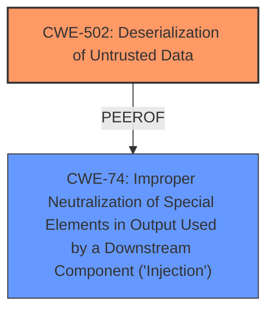

# Analysis Report for CVE-2024-10190

# Vulnerability Analysis Report: CVE-2024-10190

## Description

Horovod versions up to and including v0.28.1 are vulnerable to unauthenticated remote code execution. The vulnerability is due to **improper handling of base64-encoded data** in the `ElasticRendezvousHandler`, a subclass of `KVStoreHandler`. Specifically, the `_put_value` method in `ElasticRendezvousHandler` calls `codec.loads_base64(value)`, which eventually invokes `cloudpickle.loads(decoded)`. This allows an attacker to send a malicious pickle object via a PUT request, leading to arbitrary code execution on the server.

## Vulnerability Description Key Phrases

- **Rootcause:** improper handling of base64-encoded data
- **Impact:** ['unauthenticated remote code execution', 'arbitrary code execution']
- **Vector:** malicious pickle object via a PUT request
- **Attacker:** attacker
- **Product:** Horovod
- **Version:** up to and including v0.28.1
- **Component:** ElasticRendezvousHandler

## Analysis (with Relationship Data)

# Summary
| CWE ID | CWE Name | Confidence | CWE Abstraction Level | CWE Vulnerability Mapping Label | CWE-Vulnerability Mapping Notes |
|---|---|---|---|---|---|
| CWE-502 | Deserialization of Untrusted Data | 1.0 | Base | Allowed | Primary CWE |
| CWE-74 | Improper Neutralization of Special Elements in Output Used by a Downstream Component ('Injection') | 0.5 | Class | Discouraged | Secondary Candidate |

## Evidence and Confidence

*   **Confidence Score:** 0.8
*   **Evidence Strength:** MEDIUM

## Relationship Analysis
The primary CWE selected is CWE-502, which is a Base level CWE. CWE-502 is the root cause because **improper handling of base64-encoded data** leads to deserialization of untrusted data. The Retriever also provided CWE-74, which is a Class level CWE. CWE-74 is a more general form of injection, but the root cause is more specifically related to deserialization. Therefore, the more specific CWE-502 is preferred.



## Vulnerability Chain
The vulnerability chain starts with the **improper handling of base64-encoded data**, which leads to deserialization of untrusted data (CWE-502), and subsequently to arbitrary code execution.

## Summary of Analysis
The analysis is based on the vulnerability description, which states that the vulnerability is due to **improper handling of base64-encoded data** in the `ElasticRendezvousHandler`. This leads to deserialization of a malicious pickle object, resulting in arbitrary code execution.

The primary CWE selected is CWE-502, which is a Base level CWE and aligns with the **root cause** of the vulnerability. The retriever results also included CWE-74, which is a Class level CWE. However, CWE-502 is more specific and better represents the vulnerability.

The selection is based on the evidence provided in the vulnerability description and the retriever results. The confidence level is high because the vulnerability description clearly states the **root cause** and the impact of the vulnerability.
The evidence is that "The vulnerability is due to **improper handling of base64-encoded data** in the `ElasticRendezvousHandler`".

Relevant CWE Information:
# Enhanced Context (25 CWEs)
The following CWEs were identified as potentially relevant to this vulnerability:

## CWE-502: Deserialization of Untrusted Data
**Abstraction Level**: Base
**Similarity Score**: 0.71
**Source**: dense

**Description**:
The product deserializes untrusted data without sufficiently ensuring that the resulting data will be valid.

**Mapping Guidance**:
- Usage: Allowed
- Rationale: This CWE entry is at the Base level of abstraction, which is a preferred level of abstraction for mapping to the root causes of vulnerabilities.


## CWE Relationship Analysis

Current CWEs represent these abstraction levels: .


### Vulnerability Chain Analysis

**Chain starting from CWE-502:**
- 502 (Deserialization of Untrusted Data) - ROOT


**Chain starting from CWE-74:**
- 74 (Improper Neutralization of Special Elements in Output Used by a Downstream Component ('Injection')) - ROOT


### CWE Relationship Diagram

```mermaid
graph TD
    classDef primary fill:#f96,stroke:#333,stroke-width:2px
    classDef secondary fill:#69f,stroke:#333
    classDef tertiary fill:#9e9,stroke:#333
```


*Report generated on 2025-07-12 23:56:49*
