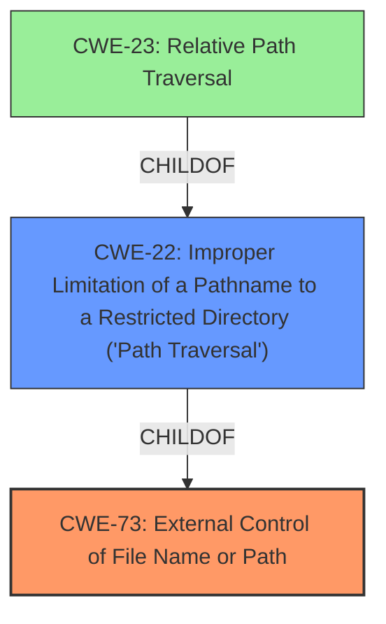

# Analysis Report for CVE-2024-10203

# Vulnerability Analysis Report: CVE-2024-10203

## Description

Zohocorp ManageEngine EndPoint Central versions 11.3.2416.21 and below, 11.3.2428.9 and below are vulnerable to Arbitrary File Deletion in the agent installed machines.

## Vulnerability Description Key Phrases

- **Impact:** Arbitrary File Deletion
- **Product:** Zohocorp ManageEngine EndPoint Central
- **Version:** 11.3.2416.21 and below, 11.3.2428.9 and below
- **Component:** agent installed machines

## Analysis (with Relationship Data)

# Summary
| CWE ID | CWE Name | Confidence | CWE Abstraction Level | CWE Vulnerability Mapping Label | CWE-Vulnerability Mapping Notes |
|---|---|---|---|---|---|
| CWE-73 | External Control of File Name or Path | 0.8 | Base | Allowed | Primary CWE: The product allows user input to control or influence paths or file names that are used in filesystem operations. |
| CWE-22 | Improper Limitation of a Pathname to a Restricted Directory ('Path Traversal') | 0.7 | Base | Allowed | Secondary Candidate: The product uses external input to construct a pathname that is intended to identify a file or directory that is located underneath a restricted parent directory, but the product does not properly neutralize special elements within the pathname that can cause the pathname to resolve to a location that is outside of the restricted directory. |

## Evidence and Confidence

*   **Confidence Score:** 0.75
*   **Evidence Strength:** MEDIUM

## Relationship Analysis
The primary weakness is CWE-73, which indicates that user input influences file paths. A related weakness, CWE-22, describes path traversal, a specific case where the input allows accessing files outside the intended directory. CWE-22 is a parent of CWE-23 (Relative Path Traversal) which was also in the results. The base level of abstraction is appropriate for both selected CWEs, as they directly describe the **root cause** of the vulnerability.



## Vulnerability Chain
The vulnerability chain begins with CWE-73 where external input is used to control file names or paths, leading to CWE-22, path traversal, which then results in arbitrary file deletion.

## Summary of Analysis
The analysis is primarily based on the vulnerability description and the CVE Reference Links Content Summary. The key evidence is the **ability to delete files from directories that the user should not have access to** via the "archive logs feature". This points towards CWE-73 (External Control of File Name or Path) as the primary **root cause**, because user input influences the file path being manipulated. CWE-22 (Improper Limitation of a Pathname to a Restricted Directory ('Path Traversal')) is included as a secondary CWE because it describes a specific type of uncontrolled path that allows the user to move outside the intended directory and therefore delete arbitrary files.

The relationship graph influenced the selection by illustrating how CWE-22 is more specific than CWE-73 and how CWE-23 is more specific than CWE-22. Given the information about the vulnerability, CWE-22 is the best fit here.

The selected CWEs are at an appropriate level of specificity, as they describe the technical weakness that leads to the arbitrary file deletion. Other CWEs, such as CWE-269 (Improper Privilege Management) and CWE-285 (Improper Authorization), are more general and don't capture the specific flaw related to path handling.

CWE-285, CWE-269, CWE-732, CWE-425, CWE-276, CWE-59, CWE-668, CWE-497, CWE-267, CWE-471, CWE-78, CWE-602, CWE-1282, CWE-1272, CWE-434, CWE-41, and CWE-184 were considered but not selected. Most of these describe privilege management or access control issues but not the specific weakness of path manipulation.


## CWE Relationship Analysis

Current CWEs represent these abstraction levels: .


### Vulnerability Chain Analysis

**Chain starting from CWE-471:**
- 471 (Modification of Assumed-Immutable Data (MAID)) - ROOT


**Chain starting from CWE-269:**
- 269 (Improper Privilege Management) - ROOT


### CWE Relationship Diagram

```mermaid
graph TD
    classDef primary fill:#f96,stroke:#333,stroke-width:2px
    classDef secondary fill:#69f,stroke:#333
    classDef tertiary fill:#9e9,stroke:#333
```


*Report generated on 2025-07-12 23:57:23*
