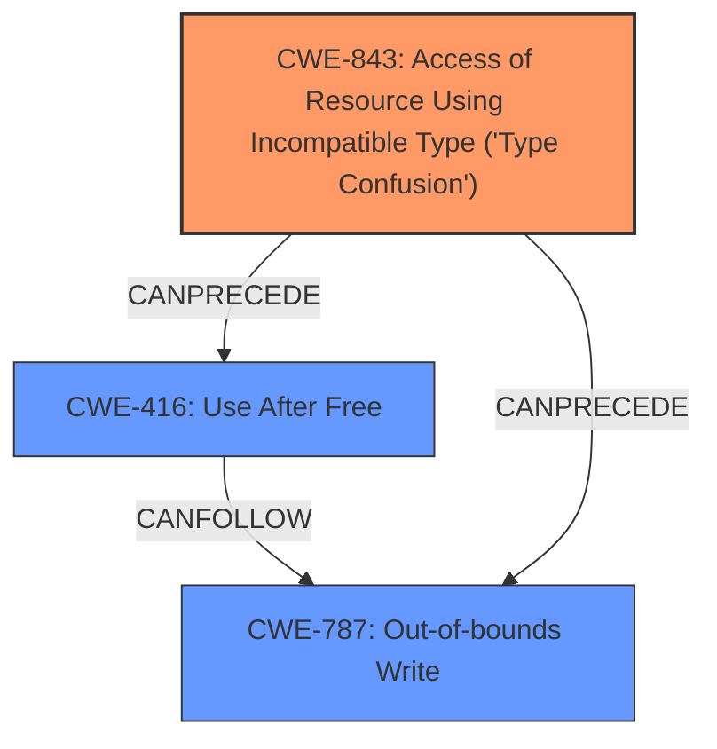

# Analysis for CVE-2024-10230

# Summary

| CWE ID  | CWE Name                                                                      | Confidence | CWE Abstraction Level | CWE Vulnerability Mapping Label | CWE-Vulnerability Mapping Notes |
| :-------- | :---------------------------------------------------------------------------- | :--------- | :-------------------- | :------------------------------ | :------------------------------ |
| CWE-843   | Access of Resource Using Incompatible Type ('**Type Confusion**')                   | 1.0        | Base                  | Primary                         | Allowed                         |
| CWE-416   | Use After Free                                                              | 0.5        | Variant               | Secondary                       | Allowed                         |
| CWE-787   | Out-of-bounds Write                                                         | 0.5        | Base                  | Secondary                       | Allowed                         |

## Evidence and Confidence

*   **Confidence Score:** 0.8
*   **Evidence Strength:** HIGH

## Relationship Analysis

The primary relationship is that CWE-843 [Access of Resource Using Incompatible Type ('**Type Confusion**')] can lead to memory corruption vulnerabilities such as CWE-416 (Use After Free) and CWE-787 (Out-of-bounds Write). The vulnerability description mentions "**Type Confusion**" directly, and the impact is "potentially exploit heap corruption". CWE-843 is a Base level CWE, which is the preferred level. While other CWEs like CWE-704 (Incorrect Type Conversion or Cast) are related to type issues, they are at a higher abstraction level (Class) than CWE-843, which is more specific.

## Vulnerability Chain

The vulnerability chain starts with **Type Confusion** (CWE-843), which leads to heap corruption. Heap corruption can be exploited through Use After Free (CWE-416) or Out-of-bounds Write (CWE-787).

## Summary of Analysis

The vulnerability description clearly states that the root cause is **Type Confusion** in V8, which could lead to heap corruption. The primary CWE, CWE-843 (Access of Resource Using Incompatible Type ('**Type Confusion**')), accurately reflects this root cause. The "CWE for similar CVE Descriptions" lists CWE-843 as the Primary CWE Match. The secondary CWEs, CWE-416 (Use After Free) and CWE-787 (Out-of-bounds Write), reflect potential consequences of the type confusion leading to memory corruption.

The evidence for CWE-843 is strong, as the vulnerability description explicitly mentions "**Type Confusion**". The other CWEs are speculative since the description only mentions "potentially exploit heap corruption"

The retriever results also support CWE-843 as the top candidate.

CWEs considered but not used:

*   CWE-704 (Incorrect Type Conversion or Cast): While related to type issues, it's a more general Class-level CWE. CWE-843 is more specific and directly reflects "**Type Confusion**".
*   CWE-122 (Heap-based Buffer Overflow): This could be a consequence of the type confusion, but it is not the root cause.
*   CWE-125 (Out-of-bounds Read): Similar to CWE-122, this could be a consequence, but not the root cause.
*   CWE-366 (Race Condition within a Thread): This is not directly related to the **type confusion** issue.
*   CWE-911 (Improper Update of Reference Count): This is not directly related to the **type confusion** issue.
*   CWE-451 (User Interface (UI) Misrepresentation of Critical Information): This is not related to the vulnerability description.
*   CWE-129 (Improper Validation of Array Index): This is not directly related to the **type confusion** issue.
*   CWE-123 (Write-what-where Condition): This could be a consequence, but not the root cause.
*   CWE-120 (Buffer Copy without Checking Size of Input ('Classic Buffer Overflow')): This is a specific type of buffer overflow and is not directly related to the **type confusion** issue.
*   CWE-823 (Use of Out-of-range Pointer Offset): This could be a consequence, but not the root cause.
*   CWE-825 (Expired Pointer Dereference): This could be a consequence, but not the root cause.